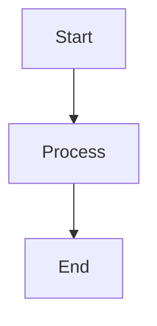

# Mermaid Integration Complete

## ✅ Setup Complete

Mermaid diagram rendering has been fully configured for the project documentation. All ````mermaid` code blocks in MDX files will now automatically render as interactive diagrams.

## What Was Configured

### 1. Dependencies Added to `package.json`
- `mermaid`: ^10.9.1 - Core Mermaid library for diagram rendering
- `@theguild/remark-mermaid`: ^1.0.0 - Remark plugin to convert code blocks to components

### 2. Source Configuration (`source.config.ts`)
- Added `remarkMermaid` plugin to MDX remark plugins
- Automatically converts ````mermaid` code blocks to `<Mermaid>` components

### 3. Mermaid Component (`components/mdx/mermaid.tsx`)
- Client-side React component for rendering diagrams
- Supports light/dark theme switching
- Includes caching for performance
- Shows loading states during rendering
- Responsive design with overflow handling

### 4. MDX Components Registration (`mdx-components.tsx`)
- Registered `Mermaid` component for use in MDX files
- Available globally across all MDX files

## Installation Required

**Before building, install the new dependencies:**

```bash
cd project-documentation
pnpm install
```

Or if using npm:

```bash
npm install
```

## Usage

### Standard Code Block Syntax (Recommended)

All existing ````mermaid` code blocks will automatically work:

````markdown

````

### Component Syntax (Alternative)

You can also use the component directly:

```mdx
<Mermaid chart="
graph TB
    A[Start] --> B[Process]
    B --> C[End]
" />
```

## Features

✅ **Automatic Conversion**: ````mermaid` code blocks automatically converted  
✅ **Theme Support**: Diagrams adapt to light/dark mode automatically  
✅ **Performance**: Caching prevents unnecessary re-renders  
✅ **Loading States**: Shows loading indicator while rendering  
✅ **Responsive**: Diagrams scroll horizontally on small screens  
✅ **Accessible**: Proper semantic HTML structure  

## Files Modified

1. ✅ `package.json` - Added mermaid dependencies
2. ✅ `source.config.ts` - Added remarkMermaid plugin
3. ✅ `mdx-components.tsx` - Registered Mermaid component
4. ✅ `components/mdx/mermaid.tsx` - Created Mermaid component (NEW)

## Next Steps

1. **Install Dependencies**:
   ```bash
   pnpm install
   ```

2. **Rebuild Documentation**:
   ```bash
   pnpm build
   ```

3. **Test in Development**:
   ```bash
   pnpm dev
   ```

4. **Verify Diagrams**: Check any page with Mermaid diagrams to ensure they render correctly

## Testing

To verify Mermaid is working, check these pages which contain diagrams:
- `/docs/backend/architecture/recommendation-engine`
- `/docs/backend/architecture/experience-app`
- `/docs/backend/architecture/search-engine`
- `/docs/backend/architecture/service-integration`

## Troubleshooting

### Diagrams Not Showing

1. **Install dependencies**: Run `pnpm install`
2. **Rebuild**: Run `pnpm build` or restart dev server
3. **Check console**: Look for JavaScript errors in browser console
4. **Verify syntax**: Ensure Mermaid syntax is correct

### Theme Issues

- Diagrams automatically match current theme
- If theme doesn't update, clear browser cache
- Check that `next-themes` is properly configured

### Performance

- Large diagrams may take a moment to render
- Loading indicator shows during rendering
- Diagrams are cached per theme for better performance

## References

- [Mermaid Documentation](https://mermaid.js.org/)
- [Fumadocs Mermaid Guide](https://fumadocs.dev/docs/ui/markdown/mermaid)
- [@theguild/remark-mermaid](https://github.com/the-guild-org/remark-mermaid)
- [Mermaid Integrations](https://mermaid.ai/open-source/ecosystem/integrations-create.html)

---

**Status**: ✅ Configuration Complete  
**Next**: Install dependencies and rebuild
