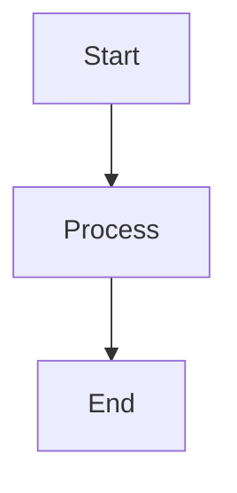

# Mermaid Diagram Setup

## Overview

Mermaid diagrams are now configured to render automatically in MDX files. This setup uses the `@theguild/remark-mermaid` plugin to convert ````mermaid` code blocks into rendered diagrams.

## Installation

Install the required dependencies:

```bash
pnpm add mermaid @theguild/remark-mermaid
```

Or with npm:

```bash
npm install mermaid @theguild/remark-mermaid
```

## Configuration

### 1. Source Config (`source.config.ts`)

The `remarkMermaid` plugin has been added to the MDX configuration:

```typescript
import { remarkMermaid } from '@theguild/remark-mermaid';

export default defineConfig({
  mdxOptions: {
    remarkPlugins: [remarkMermaid],
  },
});
```

### 2. MDX Components (`mdx-components.tsx`)

The Mermaid component has been registered:

```typescript
import { Mermaid } from '@/components/mdx/mermaid';

export function getMDXComponents(components?: MDXComponents): MDXComponents {
  return {
    ...defaultMdxComponents,
    Mermaid,
    ...components,
  };
}
```

### 3. Mermaid Component (`components/mdx/mermaid.tsx`)

A custom React component handles Mermaid rendering with:
- Theme support (light/dark mode)
- Client-side rendering
- Caching for performance
- Loading states

## Usage

### Code Block Syntax (Recommended)

Use standard Mermaid code blocks in your MDX files:

````markdown

````

### Component Syntax (Alternative)

You can also use the Mermaid component directly:

```mdx
<Mermaid chart="
graph TB
    A[Start] --> B[Process]
    B --> C[End]
" />
```

## Features

- ✅ **Automatic Rendering**: ````mermaid` code blocks are automatically converted
- ✅ **Theme Support**: Diagrams adapt to light/dark mode
- ✅ **Performance**: Caching prevents re-rendering
- ✅ **Loading States**: Shows loading indicator while rendering
- ✅ **Responsive**: Diagrams scale properly on all devices

## Supported Diagram Types

Mermaid supports many diagram types:
- Flowcharts
- Sequence Diagrams
- Class Diagrams
- State Diagrams
- Entity Relationship Diagrams
- Gantt Charts
- Pie Charts
- And more...

See [Mermaid Documentation](https://mermaid.js.org/) for complete syntax reference.

## Troubleshooting

### Diagrams Not Rendering

1. **Check Dependencies**: Ensure `mermaid` and `@theguild/remark-mermaid` are installed
2. **Rebuild**: Run `pnpm build` or `pnpm dev` to regenerate MDX files
3. **Check Syntax**: Verify Mermaid syntax is correct
4. **Browser Console**: Check for JavaScript errors in browser console

### Theme Issues

- Diagrams automatically use the current theme
- If theme doesn't match, clear browser cache and rebuild

### Performance

- Diagrams are cached per theme
- Large diagrams may take a moment to render
- Loading indicator shows during rendering

## References

- [Mermaid Documentation](https://mermaid.js.org/)
- [Fumadocs Mermaid Integration](https://fumadocs.dev/docs/ui/markdown/mermaid)
- [@theguild/remark-mermaid](https://github.com/the-guild-org/remark-mermaid)
