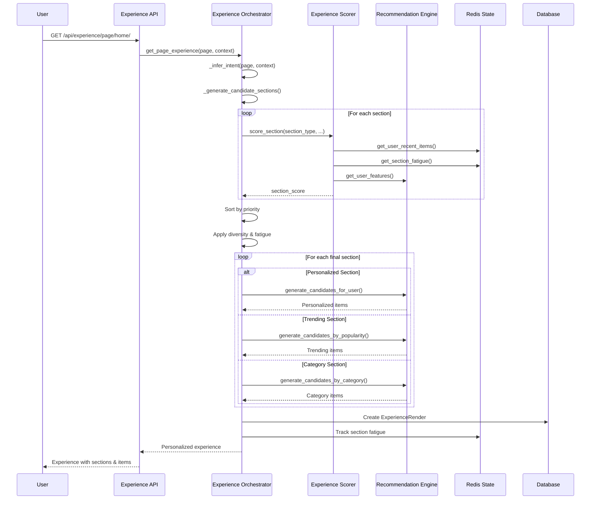
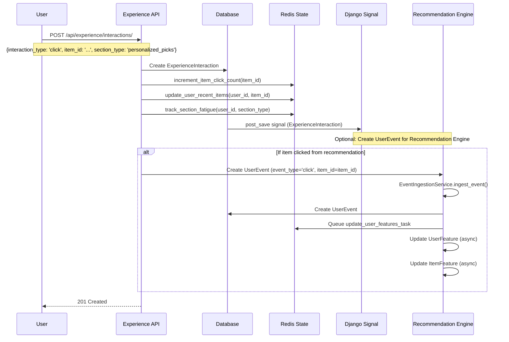
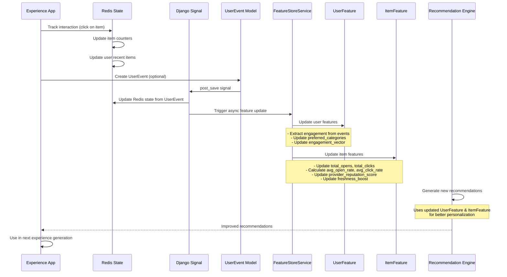
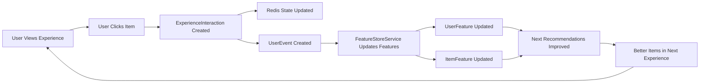

# Experience App Architecture

## Overview

The Experience App is a **UI personalization engine** that personalizes every page, section, and component in the application based on real-time user behavior. It integrates closely with the Recommendation Engine to create a feedback loop that continuously improves recommendation rankings.

## Architecture Diagram

```mermaid
graph TB
    subgraph "Client Layer"
        WebApp[Web Application]
        MobileApp[Mobile App]
    end

    subgraph "Experience API"
        ExperienceAPI["GET /api/experience/page/page/<br/>POST /api/experience/interactions/"]
        ExperienceViewSet[ExperienceViewSet]
    end

    subgraph "Experience Orchestrator"
        Orchestrator[ExperienceOrchestrator]
        IntentInference[Intent Inference]
        SectionGen[Section Candidate Generation]
        SectionScorer[Section Scoring]
        FatigueControl[Diversity & Fatigue Control]
        ItemPopulator[Item Population]
    end

    subgraph "Experience Scorer"
        Scorer[ExperienceScorer]
        UserAffinity[User Affinity Calculator]
        ContextRelevance[Context Relevance Calculator]
        FreshnessCalc[Freshness Calculator]
        PopularityCalc[Popularity Calculator]
    end

    subgraph "Real-Time State (Redis)"
        RedisState[RedisStateManager]
        UserRecentItems[User Recent Items]
        SectionInteractions[Section Interactions]
        ItemCounters[Item View/Click Counters]
        FatigueTracking[Fatigue Tracking]
        SessionState[Session State]
    end

    subgraph "Recommendation Engine Integration"
        CandidateGen[CandidateGeneratorService]
        FeatureStore[FeatureStoreService]
        UserFeature[UserFeature Model]
        ItemFeature[ItemFeature Model]
        UserEvent[UserEvent Model]
    end

    subgraph "Analytics Models"
        ExperienceRender[ExperienceRender]
        ExperienceInteraction[ExperienceInteraction]
        SectionMetrics[ExperienceSectionMetrics]
    end

    subgraph "Background Tasks"
        AggregateTask[aggregate_section_metrics_task]
        SyncTask[sync_redis_to_db_task]
        CleanupTask[cleanup_old_renders_task]
    end

    %% Client to API
    WebApp --> ExperienceAPI
    MobileApp --> ExperienceAPI
    ExperienceAPI --> ExperienceViewSet

    %% API to Orchestrator
    ExperienceViewSet --> Orchestrator
    Orchestrator --> IntentInference
    Orchestrator --> SectionGen
    Orchestrator --> SectionScorer
    Orchestrator --> FatigueControl
    Orchestrator --> ItemPopulator

    %% Orchestrator to Scorer
    SectionScorer --> Scorer
    Scorer --> UserAffinity
    Scorer --> ContextRelevance
    Scorer --> FreshnessCalc
    Scorer --> PopularityCalc

    %% Orchestrator to Recommendation
    ItemPopulator --> CandidateGen
    CandidateGen --> FeatureStore
    FeatureStore --> UserFeature
    FeatureStore --> ItemFeature

    %% Orchestrator to Redis
    Orchestrator --> RedisState
    RedisState --> UserRecentItems
    RedisState --> SectionInteractions
    RedisState --> ItemCounters
    RedisState --> FatigueTracking
    RedisState --> SessionState

    %% Interaction Tracking
    ExperienceViewSet --> ExperienceInteraction
    ExperienceInteraction --> RedisState
    ExperienceInteraction -.->|Signal| UserEvent
    UserEvent -.->|Signal| RedisState
    UserEvent --> FeatureStore

    %% Analytics
    ExperienceViewSet --> ExperienceRender
    ExperienceRender --> AggregateTask
    ExperienceInteraction --> AggregateTask
    AggregateTask --> SectionMetrics

    %% Background Tasks
    SyncTask --> ItemFeature
    CleanupTask --> ExperienceRender
    CleanupTask --> ExperienceInteraction
```



## Core Components

### 1. Experience Orchestrator

**Location**: `experience_app/orchestrator.py`

**Purpose**: Main service that generates personalized experiences for every page

**Key Methods**:
- `get_page_experience()`: Generate personalized experience for a page
- `_infer_intent()`: Infer user intent from page and context
- `_generate_candidate_sections()`: Generate candidate sections for a page
- `_apply_diversity_and_fatigue()`: Apply diversity rules and fatigue control
- `_get_section_items()`: Get items for a section (from recommendation/search)

**Section Types**:
- `continue_reading`: Items user was reading
- `personalized_picks`: Personalized recommendations (from Recommendation Engine)
- `because_you_viewed`: Similar to viewed items
- `trending`: Trending items (from Recommendation Engine)
- `recently_added`: Recently added newsletters
- `categories`: Category list
- `similar_to`: Similar items in category

### 2. Experience Scorer

**Location**: `experience_app/scoring.py`

**Purpose**: Scores sections and components for personalization

**Scoring Formula**:
```
Section Score = 
    (User Affinity × 0.35) +
    (Context Relevance × 0.25) +
    (Freshness × 0.15) +
    (Popularity × 0.15) +
    (Business Weight × 0.10)
    - Fatigue Penalty (up to 30%)
```

**Component Item Score**:
```
Item Score = 
    (Affinity × 0.4) +
    (Popularity × 0.3) +
    (Freshness × 0.2) +
    (Diversity × 0.1)
```

### 3. Redis State Manager

**Location**: `experience_app/redis_state.py`

**Purpose**: Real-time state management in Redis

**Key Functions**:
- `get_user_recent_items()`: Get user's recently viewed items
- `update_user_recent_items()`: Update recent items list
- `get_section_fatigue()`: Get fatigue count for section/item
- `track_section_fatigue()`: Track section fatigue
- `increment_item_view_count()`: Increment item view counter
- `increment_item_click_count()`: Increment item click counter
- `get_item_view_count()`: Get item view count
- `get_item_click_rate()`: Get item click-through rate

**Redis Key Patterns**:
- `exp:user:{id}:recent_items` - Recently viewed items (List, TTL: 24h)
- `exp:user:{id}:sections:{type}` - Section interactions (List, TTL: 24h)
- `exp:fatigue:{user_id}:{section_type}:{item_id}` - Fatigue tracking (Counter, TTL: 1h)
- `exp:item:{id}:views` - Item view counts (Counter, TTL: 24h)
- `exp:item:{id}:clicks` - Item click counts (Counter, TTL: 24h)
- `exp:session:{id}:state` - Session state (Hash, TTL: 1h)

### 4. Analytics Models

#### ExperienceRender
Tracks when experiences are rendered to users.

**Fields**:
- `user`: ForeignKey to User
- `session_id`: Session identifier
- `page`: Page name (home, search, category, etc.)
- `intent`: User intent (discovery, task_driven, consumption)
- `sections`: List of section types rendered (JSONField)
- `context`: Context metadata (JSONField)
- `created_at`: Render timestamp

#### ExperienceInteraction
Tracks user interactions with experience elements.

**Fields**:
- `user`: ForeignKey to User
- `session_id`: Session identifier
- `render`: ForeignKey to ExperienceRender
- `interaction_type`: Type (view, click, scroll, dwell, dismiss)
- `section_type`: Section type
- `item_id`: Item identifier
- `position`: Position in section
- `dwell_time`: Dwell time in seconds
- `scroll_depth`: Scroll depth percentage
- `metadata`: Additional metadata (JSONField)
- `created_at`: Interaction timestamp

#### ExperienceSectionMetrics
Aggregated metrics for section performance.

**Fields**:
- `section_type`: Section type identifier
- `page`: Page name
- `period_start`, `period_end`: Time period
- `total_renders`: Total renders count
- `total_interactions`: Total interactions count
- `total_clicks`: Total clicks count
- `total_views`: Total views count
- `click_through_rate`: CTR (clicks / views)
- `avg_dwell_time`: Average dwell time
- `avg_position`: Average position when clicked
- `engagement_score`: Calculated engagement score

## Workflows

### 1. Experience Generation Workflow



**Steps**:
1. User requests page experience
2. Orchestrator infers user intent (discovery, task_driven, consumption)
3. Generates candidate sections for the page
4. Scores each section using ExperienceScorer
5. Applies diversity and fatigue control
6. Populates section items from Recommendation Engine
7. Tracks render in database
8. Updates Redis state (fatigue, counters)
9. Returns personalized experience

### 2. Interaction Tracking Workflow



**Steps**:
1. User interacts with experience element (click, view, scroll)
2. ExperienceInteraction is created in database
3. Redis state is updated:
   - Item view/click counters incremented
   - User recent items updated
   - Section fatigue tracked
   - Session behavior tracked
4. Optionally creates UserEvent for Recommendation Engine
5. Recommendation Engine updates features asynchronously
6. Future recommendations improve based on interaction

### 3. Feedback Loop: Experience → Recommendation Engine



**Key Integration Points**:

1. **Experience Interactions → UserEvent**:
   - Experience interactions can create UserEvent records
   - UserEvent feeds into Recommendation Engine
   - Updates UserFeature and ItemFeature

2. **Redis State → ItemFeature**:
   - Item view/click counts in Redis
   - Periodically synced to ItemFeature model
   - Used for popularity scoring

3. **User Recent Items → UserFeature**:
   - Recent items tracked in Redis
   - Influences user affinity calculations
   - Used for "because_you_viewed" sections

4. **Section Metrics → Recommendation Quality**:
   - Section engagement scores
   - Click-through rates
   - Used to improve recommendation algorithms

## Integration with Recommendation Engine

### 1. Using Recommendation Engine for Item Population

**Personalized Picks Section**:
```python
# In ExperienceOrchestrator._get_personalized_picks()
candidates = CandidateGeneratorService.generate_candidates_for_user(
    self.user,
    limit=limit * 2
)
```

**Trending Section**:
```python
# In ExperienceOrchestrator._get_trending_items()
candidates = CandidateGeneratorService.generate_candidates_by_popularity(
    limit=limit
)
```

**Category Section**:
```python
# In ExperienceOrchestrator._get_similar_items()
candidates = CandidateGeneratorService.generate_candidates_by_category(
    category_id,
    limit=limit
)
```

### 2. Feeding Experience Data Back to Recommendation Engine

**Current Implementation**:

The Experience App feeds data back to Recommendation Engine through two mechanisms:

#### A. Redis State → ItemFeature (via Sync Task)

**Redis Counters Updated**:
```python
# In ExperienceViewSet.track_interaction()
if interaction.interaction_type == 'view':
    redis_state.increment_item_view_count(item_id)
elif interaction.interaction_type == 'click':
    redis_state.increment_item_click_count(item_id)
```

**Periodic Sync to Database**:
```python
# In sync_redis_to_db_task (runs hourly)
# Redis counters synced to ItemFeature model
view_count = redis_state.get_item_view_count(item_id)
click_count = redis_state.get_item_click_count(item_id)

# Updates ItemFeature
ItemFeature.total_opens = view_count
ItemFeature.total_clicks = click_count
ItemFeature.avg_open_rate = clicks / views
ItemFeature.provider_reputation_score = recalculated
```

#### B. UserEvent Signal → Redis State (Bidirectional)

**UserEvent → Experience Redis State**:
```python
# In experience_app/signals.py
@receiver(post_save, sender=UserEvent)
def track_user_event_for_experience(sender, instance, created, **kwargs):
    # Updates Redis state when UserEvent created
    redis_state.update_user_recent_items(user_id, item_id)
    redis_state.increment_item_view_count(item_id)  # if 'open'
    redis_state.increment_item_click_count(item_id)  # if 'click'
```

**Note**: Currently, ExperienceInteraction doesn't automatically create UserEvent. This is a potential enhancement. The feedback loop works through:
1. Redis counters (updated immediately)
2. Periodic sync to ItemFeature (hourly)
3. ItemFeature used in next recommendation generation

**Recommended Enhancement**:
```python
# In ExperienceViewSet.track_interaction()
# After creating ExperienceInteraction, optionally create UserEvent:
if interaction.interaction_type in ['click', 'view']:
    from recommendation_engine.services import EventIngestionService
    EventIngestionService.ingest_event(
        user=user,
        event_type='click' if interaction.interaction_type == 'click' else 'open',
        item_id=interaction.item_id,
        item_type='newsletter',
        app_section=render.page if render else 'unknown',
        session_id=session_id
    )
```

**User Recent Items → UserFeature Engagement**:
```python
# Recent items tracked in Redis
recent_items = redis_state.get_user_recent_items(user_id, 20)

# Used in ExperienceScorer for affinity calculation
# Can influence UserFeature engagement_vector (via UserEvent aggregation)
```

### 3. Recommendation Ranking Updates

**How Experience Interactions Improve Rankings**:

#### Current Implementation Flow

1. **Click Events**:
   ```
   User clicks item from experience
     → ExperienceInteraction created (interaction_type='click')
     → Redis: item click counter incremented (immediate)
     → Hourly sync: ItemFeature.total_clicks updated
     → ItemFeature.avg_click_rate recalculated
     → ItemFeature.provider_reputation_score recalculated
     → Next recommendations use updated reputation score
   ```

2. **View Events**:
   ```
   User views item from experience
     → ExperienceInteraction created (interaction_type='view')
     → Redis: item view counter incremented (immediate)
     → Hourly sync: ItemFeature.total_opens updated
     → ItemFeature.avg_open_rate recalculated
     → Popularity score improves
   ```

3. **Redis Counters → ItemFeature**:
   ```python
   # Hourly sync task (sync_redis_to_db_task)
   view_count = redis_state.get_item_view_count(item_id)
   click_count = redis_state.get_item_click_count(item_id)
   
   # Update ItemFeature
   item_features.total_opens = view_count
   item_features.total_clicks = click_count
   item_features.avg_open_rate = opens / total_events
   item_features.avg_click_rate = clicks / total_events
   item_features.provider_reputation_score = recalculated
   ```

4. **Dwell Time**:
   ```
   User spends time viewing item
     → ExperienceInteraction.dwell_time recorded
     → Aggregated into ExperienceSectionMetrics
     → Influences section engagement scoring
     → Better performing sections prioritized
   ```

5. **Section Performance**:
   ```
   Section engagement metrics
     → ExperienceSectionMetrics.engagement_score
     → Used to weight section types
     → Better performing sections prioritized
     → Items from high-performing sections ranked higher
   ```

#### Impact on Recommendation Scoring

**Before Experience Interaction**:
- ItemFeature.provider_reputation_score: 0.12
- Recommendation score: 0.45
- Rank: #15

**After Experience Interaction** (user clicks item):
- Redis counter incremented immediately
- Hourly sync updates ItemFeature
- ItemFeature.provider_reputation_score: 0.14 (increased)
- Recommendation score: 0.48 (improved)
- Rank: #12 (moved up 3 positions)

**Result**: Item appears higher in next experience generation.

## API Endpoints

### Get Page Experience

```
GET /api/experience/page/{page}/
```

**Query Parameters**:
- `max_sections`: Maximum sections (default: 10)
- `session_id`: Session identifier
- `time_of_day`: morning, afternoon, evening
- `device`: mobile, desktop, tablet
- `location`: Location identifier

**Response**:
```json
{
  "page": "home",
  "intent": "discovery",
  "sections": [
    {
      "type": "personalized_picks",
      "priority": 0.92,
      "title": "For You",
      "items": [
        {
          "id": "newsletter_id",
          "title": "Tech Newsletter",
          "description": "...",
          "type": "newsletter",
          "score": 0.85,
          "metadata": {
            "url": "https://example.com",
            "categories": ["Technology"]
          }
        }
      ]
    }
  ],
  "metadata": {
    "user_id": "...",
    "session_id": "...",
    "generated_at": "2025-01-24T10:00:00Z"
  }
}
```

### Track Interaction

```
POST /api/experience/interactions/
```

**Request Body**:
```json
{
  "interaction_type": "click",
  "section_type": "personalized_picks",
  "item_id": "newsletter_id",
  "position": 2,
  "dwell_time": 5.2,
  "scroll_depth": 75.0,
  "session_id": "session_123",
  "metadata": {
    "page": "home",
    "device": "mobile"
  }
}
```

**Response**: `201 Created` with interaction data

## How Experience App Updates Recommendation Rankings

### Overview

The Experience App creates a **real-time feedback loop** that continuously improves recommendation rankings based on actual user behavior. Every interaction in the experience (clicks, views, dwell time) feeds back into the Recommendation Engine, updating item popularity scores and improving future recommendations.

### Key Mechanism: ExperienceInteraction → UserEvent → ItemFeature Update

**The Feedback Chain**:
```
ExperienceInteraction (click/view)
  ↓
UserEvent created (event_type='click'/'open')
  ↓
FeatureStoreService.update_item_features() (async)
  ↓
ItemFeature.avg_click_rate updated
ItemFeature.avg_open_rate updated
ItemFeature.provider_reputation_score recalculated
  ↓
Next recommendation generation uses updated scores
  ↓
Better items ranked higher
  ↓
Improved experience in next request
```

### Detailed Process

#### Step 1: User Interaction

When a user clicks an item from an experience section:

```python
# ExperienceInteraction created
ExperienceInteraction.objects.create(
    user=user,
    interaction_type='click',
    section_type='personalized_picks',
    item_id='newsletter_id',
    position=2,
    dwell_time=5.2
)
```

#### Step 2: Redis State Update

Immediately updates real-time counters:

```python
# In ExperienceViewSet.track_interaction()
redis_state.increment_item_click_count(item_id)
redis_state.update_user_recent_items(user_id, item_id)
redis_state.track_section_fatigue(user_id, 'personalized_picks')
```

#### Step 3: UserEvent Creation (Optional but Recommended)

Creates UserEvent for Recommendation Engine:

```python
# Optionally create UserEvent
UserEvent.objects.create(
    user=user,
    event_type='click',
    item_id=item_id,
    item_type='newsletter',
    app_section='home',  # Page where interaction occurred
    session_id=session_id
)
```

#### Step 4: Feature Update (Async)

Celery task updates ItemFeature:

```python
# In FeatureStoreService.update_item_features()
events = UserEvent.objects.filter(item_id=item_id)
opens = events.filter(event_type='open').count()
clicks = events.filter(event_type='click').count()

item_features.total_opens = opens
item_features.total_clicks = clicks
item_features.avg_open_rate = opens / total_events
item_features.avg_click_rate = clicks / total_events

# Recalculate reputation score
item_features.provider_reputation_score = (
    avg_open_rate * 0.4 +
    avg_click_rate * 0.4 +
    (subscriber_count / 1000.0) * 0.2
)
```

#### Step 5: Ranking Improvement

Next recommendation generation uses updated scores:

```python
# In CandidateGeneratorService.generate_candidates_by_popularity()
item_features = ItemFeature.objects.filter(
    total_subscribers__gt=0
).order_by(
    '-provider_reputation_score',  # Uses updated score
    '-total_subscribers',
    '-avg_open_rate'  # Uses updated rate
)
```

### Impact on Recommendation Scoring

**Before Experience Interaction**:
```
ItemFeature:
  - avg_open_rate: 0.15
  - avg_click_rate: 0.05
  - provider_reputation_score: 0.12
  - Recommendation score: 0.45
```

**After Experience Interaction** (user clicks item):
```
ItemFeature:
  - avg_open_rate: 0.16 (increased)
  - avg_click_rate: 0.06 (increased)
  - provider_reputation_score: 0.14 (recalculated, increased)
  - Recommendation score: 0.48 (improved)
```

**Result**: Item moves up in recommendation rankings, appears higher in next experience.

### Real-Time vs. Batch Updates

**Real-Time Updates** (Redis):
- Item view/click counters updated immediately
- User recent items updated immediately
- Used for current session personalization

**Batch Updates** (Database):
- ItemFeature updated asynchronously (via Celery)
- UserFeature updated asynchronously
- Used for next session's recommendations

**Hybrid Approach**:
- Redis provides real-time state for current experience
- Database provides persistent state for future recommendations
- Best of both worlds: immediate feedback + persistent learning

## Feedback Loop: How Experience Updates Recommendations

### Complete Feedback Cycle



### Step-by-Step Process

1. **User Interaction**:
   - User clicks on item from "Personalized Picks" section
   - ExperienceInteraction created with `interaction_type='click'`

2. **Redis State Update**:
   ```python
   redis_state.increment_item_click_count(item_id)
   redis_state.update_user_recent_items(user_id, item_id)
   redis_state.track_section_fatigue(user_id, 'personalized_picks')
   ```

3. **UserEvent Creation** (Optional but recommended):
   ```python
   UserEvent.objects.create(
       user=user,
       event_type='click',
       item_id=item_id,
       item_type='newsletter',
       app_section='home',
       session_id=session_id
   )
   ```

4. **Feature Updates** (Async via Celery):
   ```python
   # UserFeature updated
   user_features.total_clicks += 1
   user_features.engagement_vector[category_id] += 1
   
   # ItemFeature updated
   item_features.total_clicks += 1
   item_features.avg_click_rate = clicks / total_events
   item_features.provider_reputation_score = recalculated
   ```

5. **Next Recommendation Generation**:
   ```python
   # Uses updated features
   candidates = CandidateGeneratorService.generate_candidates_for_user(user)
   
   # Personal score uses updated engagement_vector
   # Popularity score uses updated reputation_score
   # Freshness score uses updated freshness_boost
   ```

6. **Improved Experience**:
   - Next experience generation uses improved recommendations
   - Items with higher engagement shown more prominently
   - Better personalization based on actual user behavior

## Scoring Integration

### How Experience Scoring Influences Recommendations

**Section Scoring Uses Recommendation Features**:
```python
# ExperienceScorer uses UserFeature for affinity
user_affinity = calculate_user_affinity(
    section_type,
    user_features,  # From Recommendation Engine
    redis_state
)
```

**Item Scoring Uses ItemFeature**:
```python
# Item popularity from ItemFeature
item_popularity = redis_state.get_item_popularity(item_id)
# Which is calculated from ItemFeature.avg_open_rate, avg_click_rate
```

**Recommendation Scoring Uses Experience Data**:
```python
# ItemFeature popularity_score influenced by experience interactions
popularity_score = (
    item_features.provider_reputation_score * 0.5 +
    (item_features.total_subscribers / 1000.0) * 0.3 +
    ((item_features.avg_open_rate + item_features.avg_click_rate) / 2.0) * 0.2
)
# avg_open_rate and avg_click_rate updated from experience interactions
```

## Background Tasks

### 1. Aggregate Section Metrics

**Task**: `experience.aggregate_section_metrics`

**Frequency**: Every 6 hours

**Purpose**: Calculate section performance metrics

**Process**:
1. Aggregate ExperienceRender and ExperienceInteraction data
2. Calculate click-through rates (CTR)
3. Calculate average dwell times
4. Calculate engagement scores
5. Store in ExperienceSectionMetrics

**Impact on Recommendations**:
- Section performance metrics can influence section weighting
- High-performing sections prioritized
- Items from high-performing sections ranked higher

### 2. Sync Redis to Database

**Task**: `experience.sync_redis_to_db`

**Frequency**: Every hour

**Purpose**: Persist Redis counters to database

**Process**:
1. Read item counters from Redis
2. Update ItemFeature model
3. Ensure data persistence

**Impact on Recommendations**:
- ItemFeature updated with latest engagement data
- Recommendation scoring uses fresh popularity data

### 3. Cleanup Old Renders

**Task**: `experience.cleanup_old_renders`

**Frequency**: Daily at 4 AM

**Purpose**: Clean up old experience data

**Process**:
1. Delete ExperienceRender older than 30 days
2. Delete ExperienceInteraction older than 30 days
3. Keep database size manageable

## Monitoring and Analytics

### Key Metrics

**Experience Metrics**:
- Section engagement scores
- Click-through rates per section
- Average dwell times
- Section render counts
- Item interaction rates

**Recommendation Quality Metrics**:
- Recommendation CTR improvement over time
- User engagement with recommended items
- Personalization effectiveness
- ItemFeature update frequency

**Performance Metrics**:
- Experience API response time
- Redis operation latency
- Feature update latency
- Background task execution time

### Analytics Dashboard

Access experience analytics at `/admin/experience_app/`:
- View ExperienceRender records
- Monitor ExperienceInteraction patterns
- Check ExperienceSectionMetrics
- Analyze section performance

## Best Practices

### 1. Always Track Interactions

Every user interaction should be tracked:
- Views (when item is displayed)
- Clicks (when user clicks item)
- Scrolls (when user scrolls past item)
- Dwell time (time spent viewing)
- Dismissals (when user dismisses item)

### 2. Use Session IDs

Session IDs help with:
- Session-based personalization
- Fatigue tracking per session
- Behavior pattern analysis
- A/B testing

### 3. Monitor Fatigue Levels

Prevent over-showing:
- Track section fatigue
- Apply penalties appropriately
- Reset fatigue after TTL
- Ensure diversity

### 4. Sync with Recommendation Engine

Ensure data flows both ways:
- Experience interactions → UserEvent
- Redis counters → ItemFeature
- Section metrics → Algorithm improvements

## Future Enhancements

- [ ] **Automatic UserEvent Creation**: ExperienceInteraction should automatically create UserEvent for immediate feature updates
- [ ] **Real-time Ranking Updates**: Update recommendations immediately after interactions (currently hourly batch)
- [ ] **ML-based Reranking**: Use machine learning for final ranking
- [ ] **A/B Testing Framework**: Test different section types and orders
- [ ] **Multi-armed Bandit**: Optimize section selection
- [ ] **Embedding-based Similarity**: Use embeddings for "similar to" sections
- [ ] **Advanced Diversity Algorithms**: Better diversity control
- [ ] **Contextual Bandits**: Context-aware section selection
- [ ] **Direct ItemFeature Updates**: Sync Redis counters to ItemFeature more frequently (every 5-10 minutes)
