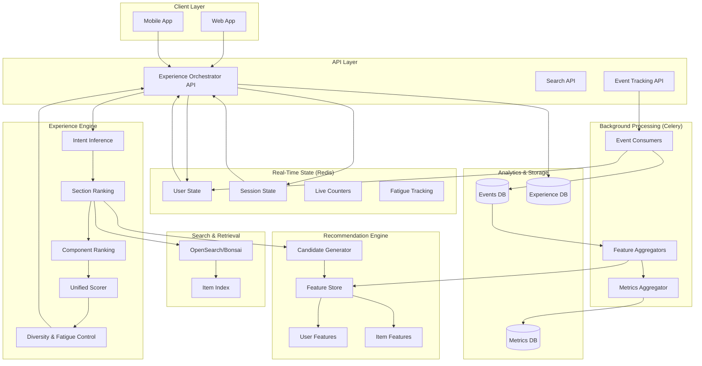

# Experience Orchestration System - Complete Architecture

## 🎯 Overview

This document describes the **Forever-Live Recommendation System** with **Experience Orchestration** that personalizes every page, section, and component in your application based on real-time user behavior.

## 🏗️ System Architecture

### High-Level Architecture



## 📊 Data Flow

### 1. Experience Generation Flow

```
User Request
    ↓
GET /api/experience/page/home/
    ↓
Experience Orchestrator
    ├─ Infer Intent (discovery/task_driven/consumption)
    ├─ Generate Candidate Sections
    ├─ Score Sections (user affinity + context + freshness + popularity)
    ├─ Apply Diversity & Fatigue Control
    ├─ Populate Items (from recommendation/search)
    └─ Return Personalized Experience
    ↓
Track Render (ExperienceRender model)
    ↓
Update Redis State (fatigue, counters)
```

### 2. Interaction Tracking Flow

```
User Interaction (click, view, scroll)
    ↓
POST /api/experience/interactions/
    ↓
Save Interaction (ExperienceInteraction model)
    ↓
Update Redis State
    ├─ Increment item view/click counts
    ├─ Update user recent items
    ├─ Track section interaction
    └─ Update session behavior
    ↓
Trigger Celery Task (update features)
    ↓
Update UserFeature/ItemFeature
```

### 3. Analytics Aggregation Flow

```
Periodic Task (every 6 hours)
    ↓
Aggregate Section Metrics
    ├─ Calculate CTR (clicks / views)
    ├─ Calculate avg dwell time
    ├─ Calculate engagement score
    └─ Store in ExperienceSectionMetrics
    ↓
Used for:
    ├─ Section performance monitoring
    ├─ A/B testing
    └─ Model improvement
```

## 🔑 Key Concepts

### 1. Intent Inference

Different pages have different user intents:

| Page | Intent | Focus |
|------|--------|-------|
| home | discovery | Exploration, variety |
| search | task_driven | Relevance, speed |
| category | exploration | Similar items |
| reading | consumption | Continue reading, related |
| profile | retention | Personalized picks |

### 2. Section Scoring

Every section gets a score based on:

- **User Affinity (35%)**: How much user likes this section type
- **Context Relevance (25%)**: How relevant to current page/intent
- **Freshness (15%)**: How new/recent the content is
- **Popularity (15%)**: How popular the section is
- **Business Weight (10%)**: Business-defined priority

### 3. Fatigue Control

Prevents over-showing same sections:

- Track how many times user saw section
- Apply penalty: `score *= (1.0 - fatigue_penalty)`
- Max penalty: 30%
- Reset after TTL expires (1 hour)

### 4. Diversity Control

Ensures variety:

- Don't repeat same section type
- Reduce priority for duplicates
- Skip if priority too low after penalty

## 🗄️ Database Schema

### Experience Models

```python
ExperienceRender
├─ user (FK)
├─ session_id
├─ page
├─ intent
├─ sections (JSON)
├─ context (JSON)
└─ created_at

ExperienceInteraction
├─ user (FK)
├─ session_id
├─ render (FK)
├─ interaction_type
├─ section_type
├─ item_id
├─ position
├─ dwell_time
├─ scroll_depth
└─ created_at

ExperienceSectionMetrics
├─ section_type
├─ page
├─ period_start
├─ period_end
├─ total_renders
├─ total_interactions
├─ click_through_rate
├─ avg_dwell_time
├─ engagement_score
└─ updated_at
```

## 🔴 Redis State Schema

### Key Patterns

```
# User State
exp:user:{user_id}:recent_items          # List of recent item IDs
exp:user:{user_id}:sections:{type}        # Section interactions
exp:user:{user_id}:interests              # Category interest scores

# Fatigue Control
exp:fatigue:{user_id}:{section_type}:{item_id}  # Fatigue count

# Item Counters
exp:item:{item_id}:views                  # View count
exp:item:{item_id}:clicks                 # Click count

# Session State
exp:session:{session_id}:state            # Session state
exp:session:{session_id}:behavior         # Session behaviors

# Search Trends
exp:search:query:{query}                  # Query popularity
exp:search:user:{user_id}:{query}         # User query history
```

### TTLs

- User state: 24 hours
- Session state: 1 hour
- Item counters: 24 hours
- Fatigue: 1 hour
- Recent items: 24 hours

## 🔄 Integration Points

### 1. Recommendation Engine

**Usage:**
- `CandidateGeneratorService.generate_candidates_for_user()` - Personalized picks
- `CandidateGeneratorService.generate_candidates_by_popularity()` - Trending
- `FeatureStoreService.get_or_create_user_features()` - User features

**Data Flow:**
```
Experience Orchestrator
    → Candidate Generator
    → UserFeature/ItemFeature
    → Scored Recommendations
```

### 2. Search App

**Usage:**
- OpenSearch for candidate retrieval
- Search results can be re-ranked by experience scorer
- Search queries tracked for trends

**Data Flow:**
```
Experience Orchestrator
    → OpenSearch Query
    → Candidate Items
    → Re-rank by Experience Scorer
    → Final Items
```

### 3. Event Tracking

**Usage:**
- `UserEvent` model tracks all interactions
- Signals update Redis state automatically
- Celery tasks update features

**Data Flow:**
```
UserEvent Created
    → Signal Handler
    → Update Redis State
    → Trigger Celery Task
    → Update Features
```

## 📈 Performance Considerations

### Caching Strategy

1. **Experience API**: Cache per user/session (5 minutes)
2. **Section Items**: Cache in Redis (1-5 minutes)
3. **User Features**: Cache in Redis (15 minutes)
4. **Item Features**: Cache in Redis (30 minutes)

### Redis Memory

- Monitor Redis memory usage
- Set appropriate TTLs
- Cleanup old keys periodically
- Use Redis eviction policies

### Database Queries

- Use `select_related` and `prefetch_related`
- Index frequently queried fields
- Batch operations where possible
- Use database connection pooling

## 🚀 Scaling Considerations

### Horizontal Scaling

- **API Layer**: Stateless, can scale horizontally
- **Celery Workers**: Add more workers for task processing
- **Redis**: Use Redis Cluster for high availability

### Vertical Scaling

- **Database**: Optimize queries, add indexes
- **Redis**: Increase memory for larger state
- **OpenSearch**: Scale cluster for more data

### Performance Targets

- Experience API: < 200ms (p95)
- Redis operations: < 10ms
- Database queries: < 50ms
- Celery tasks: < 5s

## Related Documentation

- [Experience App Documentation](/docs/backend/apps/experience-app)
- [Recommendation Engine Architecture](/docs/backend/architecture/recommendation-engine)
- [Architecture Overview](/docs/backend/architecture/overview)
