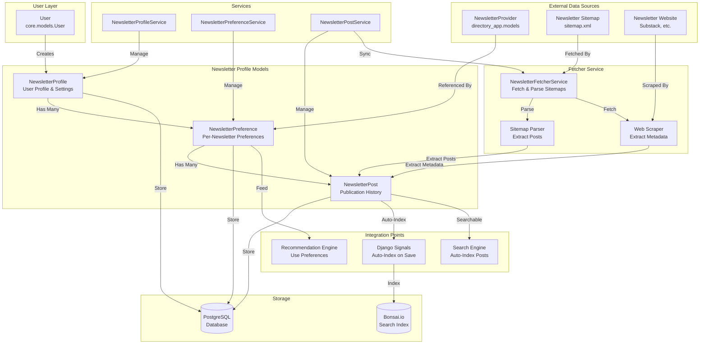
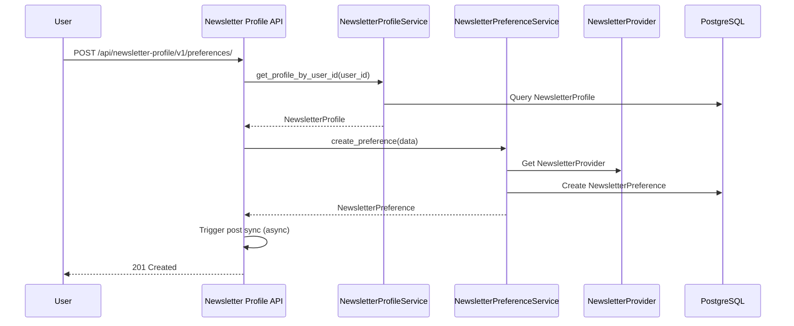
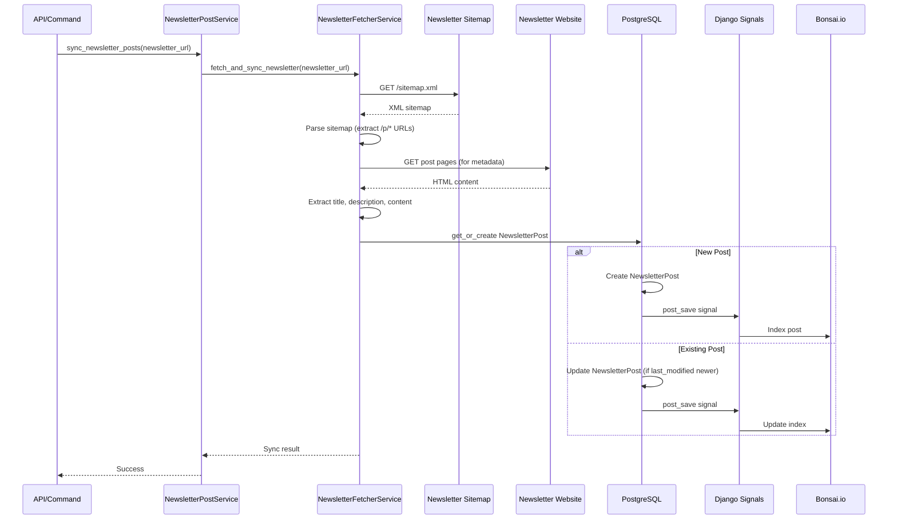
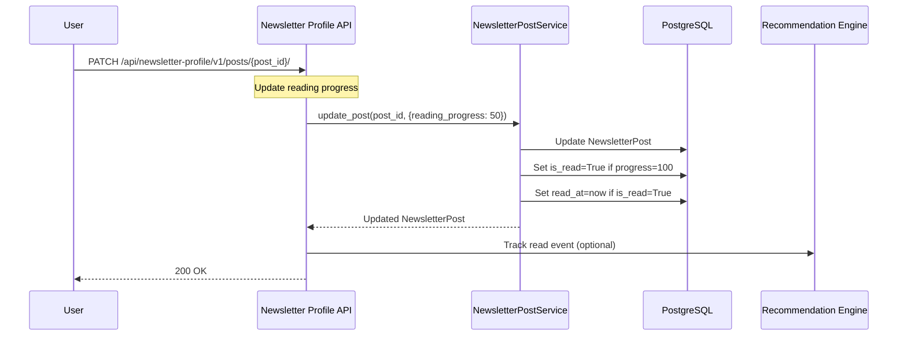
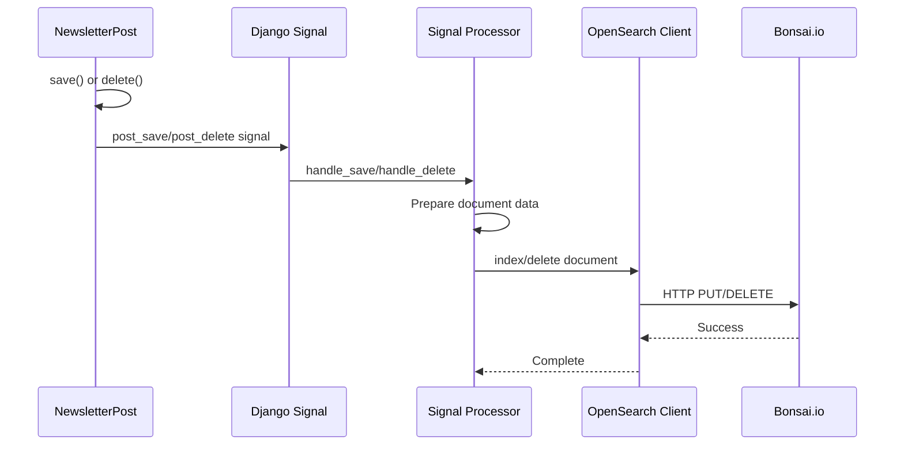

# Newsletter Profile with Publication History

## Overview

The Newsletter Profile system manages user newsletter preferences, subscriptions, and publication history. It fetches and stores newsletter posts from sitemaps, tracks reading progress, and integrates with search and recommendation engines.

## Architecture Diagram



## Core Components

### 1. Data Models

#### NewsletterProfile
User newsletter profile with preferences and settings.

**Purpose**: Central profile for user's newsletter consumption preferences

**Key Fields**:
- `user`: ForeignKey to User (one profile per user)
- `email`: Profile email address
- `display_name`: Display name
- `bio`: User bio
- `avatar_url`: Avatar URL
- `preferred_categories`: List of category IDs (JSONField)
- `preferred_frequency`: Preferred frequency (daily, weekly, bi-weekly, monthly)
- `preferred_language`: Preferred language code
- `timezone_field`: User timezone
- `email_notifications`: Email notifications enabled
- `push_notifications`: Push notifications enabled
- `digest_enabled`: Digest enabled
- `total_subscriptions`: Total newsletter subscriptions count
- `total_read`: Total posts read count
- `total_saved`: Total posts saved count
- `is_active`: Active status
- `created_at`, `updated_at`: Timestamps

**Relationships**:
- One-to-Many: `preferences` → NewsletterPreference

#### NewsletterPreference
User preferences for individual newsletters.

**Purpose**: Per-newsletter subscription and preference settings

**Key Fields**:
- `profile`: ForeignKey to NewsletterProfile
- `newsletter_provider`: ForeignKey to NewsletterProvider (from directory)
- `newsletter_id`: Newsletter identifier (CharField, for compatibility)
- `newsletter_name`: Newsletter name
- `newsletter_url`: Newsletter URL (base URL)
- `is_subscribed`: Subscription status
- `is_favorite`: Favorite status
- `is_muted`: Muted status
- `auto_mark_read`: Auto-mark read preference
- `send_digest`: Send digest preference
- `reading_position`: Reading position (JSONField)
- `custom_tags`: Custom tags (JSONField)
- `notes`: User notes
- `subscribed_at`: Subscription timestamp
- `last_read_at`: Last read timestamp
- `created_at`, `updated_at`: Timestamps

**Relationships**:
- Many-to-One: `profile` → NewsletterProfile
- Many-to-One: `newsletter_provider` → NewsletterProvider
- One-to-Many: `posts` → NewsletterPost

**Integration Points**:
- Feeds Recommendation Engine (UserFeature.preferred_categories)
- Used by Search Engine (user-scoped post searches)

#### NewsletterPost
Individual newsletter posts/articles from publication history.

**Purpose**: Store newsletter posts fetched from sitemaps for offline reading and tracking

**Key Fields**:
- `preference`: ForeignKey to NewsletterPreference (optional - posts can exist without preference)
- `newsletter_url`: Base newsletter URL (links to NewsletterProvider)
- `post_url`: Full post URL (unique)
- `post_slug`: Post slug extracted from URL (e.g., "how-announce-fundraise")
- `title`: Post title (fetched from post page)
- `description`: Post description/summary
- `content_preview`: Full post content preview
- `last_modified`: Last modified date from sitemap
- `published_at`: Publication date from sitemap
- `is_read`: Read status
- `read_at`: Read timestamp
- `reading_progress`: Reading progress (0-100)
- `word_count`: Word count
- `read_time_minutes`: Estimated read time in minutes
- `author`: Post author
- `fetched_at`: When post was fetched from sitemap
- `updated_at`: Last update timestamp

**Relationships**:
- Many-to-One: `preference` → NewsletterPreference (optional)
- Linked via `newsletter_url` to NewsletterProvider

**Important Notes**:
- Posts can exist without a `preference` (stored at provider level, available to all users)
- Posts are automatically indexed in search engine on save
- Posts are used by recommendation engine for freshness signals

### 2. Services

#### NewsletterProfileService
Manages newsletter profile operations.

**Methods**:
- `create_profile()`: Create a new newsletter profile
- `get_profile_by_id()`: Get profile by ID
- `get_profile_by_user_id()`: Get profile by user ID
- `get_profile_by_email()`: Get profile by email
- `update_profile()`: Update profile
- `delete_profile()`: Delete profile
- `list_profiles()`: List all active profiles with pagination

#### NewsletterPreferenceService
Manages newsletter preference operations.

**Methods**:
- `create_preference()`: Create a new preference
- `get_preference_by_id()`: Get preference by ID
- `get_preference_by_profile_and_newsletter()`: Get preference by profile and newsletter
- `get_preferences_by_profile()`: Get all preferences for a profile
- `get_subscribed_preferences()`: Get all subscribed preferences
- `update_preference()`: Update preference
- `delete_preference()`: Delete preference

#### NewsletterPostService
Manages newsletter post operations.

**Methods**:
- `get_post_by_id()`: Get post by ID
- `get_posts_by_newsletter()`: Get all posts for a newsletter URL
- `get_posts_by_preference()`: Get all posts for a preference
- `update_post()`: Update post (including read status)
- `delete_post()`: Delete post
- `sync_newsletter_posts()`: Sync posts from newsletter (calls NewsletterFetcherService)

#### NewsletterFetcherService
Fetches and parses newsletter data from websites.

**Purpose**: Extract newsletter posts from sitemaps and websites

**Methods**:
- `get_newsletter_name()`: Fetch newsletter name from website
- `parse_sitemap()`: Parse sitemap.xml and extract posts
- `fetch_newsletter_data()`: Fetch complete newsletter data
- `fetch_and_sync_newsletter()`: Fetch and sync posts to database

**Supported Platforms**:
- Substack (primary)
- Generic sitemap.xml format
- Custom newsletter websites

## Workflows

### 1. Newsletter Subscription Workflow



**Steps**:
1. User subscribes to newsletter via API
2. System gets or creates NewsletterProfile for user
3. NewsletterPreference is created linking profile to NewsletterProvider
4. Post sync is triggered (async) to fetch publication history
5. Preference is returned to user

### 2. Publication History Fetching Workflow



**Steps**:
1. Sync request initiated (API or management command)
2. NewsletterFetcherService fetches sitemap.xml from newsletter URL
3. Sitemap is parsed to extract post URLs (matching `/p/*` pattern)
4. For each post URL:
   - Extract slug from URL
   - Get last_modified date from sitemap
   - Optionally fetch post page for title/description
5. NewsletterPost is created or updated in database
6. Django signal triggers auto-indexing in search engine
7. Post becomes searchable and available for recommendations

### 3. Post Reading Tracking Workflow



**Steps**:
1. User reads a post and updates reading progress
2. PostService updates NewsletterPost with new progress
3. If progress reaches 100%, post is marked as read
4. Read timestamp is recorded
5. Optionally, read event is sent to recommendation engine
6. Updated post is returned

### 4. Auto-Indexing Workflow



**Steps**:
1. NewsletterPost is saved or deleted
2. Django signal fires (post_save/post_delete)
3. CustomSignalProcessor handles the signal
4. Document is prepared for indexing (title, description, metadata)
5. OpenSearch client sends request to Bonsai.io
6. Post is indexed/removed from search index
7. Post becomes searchable via search API

## API Endpoints

### Newsletter Profile

#### Get User Profile
```
GET /api/newsletter-profile/v1/profiles/{profile_id}/
```

#### Create/Update Profile
```
POST /api/newsletter-profile/v1/profiles/
PUT /api/newsletter-profile/v1/profiles/{profile_id}/
```

### Newsletter Preferences

#### List Preferences
```
GET /api/newsletter-profile/v1/preferences/?profile_id={profile_id}
```

#### Create Preference (Subscribe)
```
POST /api/newsletter-profile/v1/preferences/
```

**Request Body**:
```json
{
  "profile_id": "...",
  "newsletter_id": "newsletter_provider_id",
  "newsletter_url": "https://example.substack.com",
  "is_subscribed": true
}
```

#### Update Preference
```
PUT /api/newsletter-profile/v1/preferences/{preference_id}/
PATCH /api/newsletter-profile/v1/preferences/{preference_id}/
```

#### Delete Preference (Unsubscribe)
```
DELETE /api/newsletter-profile/v1/preferences/{preference_id}/
```

### Newsletter Posts

#### List Posts
```
GET /api/newsletter-profile/v1/posts/?newsletter_url={url}&is_read={bool}
```

#### Get Post
```
GET /api/newsletter-profile/v1/posts/{post_id}/
```

#### Update Post (Reading Progress)
```
PATCH /api/newsletter-profile/v1/posts/{post_id}/
```

**Request Body**:
```json
{
  "reading_progress": 75,
  "is_read": false
}
```

#### Sync Newsletter Posts
```
POST /api/newsletter-profile/v1/posts/sync/
```

**Request Body**:
```json
{
  "newsletter_url": "https://example.substack.com",
  "preference_id": "...",
  "force_refresh": false
}
```

## Management Commands

### Extract Newsletter Posts
```bash
python manage.py extract_newsletter_posts \
  --extract-posts \
  --update-logos \
  --limit 100
```

**Options**:
- `--extract-posts`: Extract posts from sitemaps
- `--update-logos`: Update newsletter logos/icons
- `--limit`: Limit number of newsletters to process

### Sync Newsletter Posts
```bash
python manage.py sync_newsletter_posts \
  --newsletter-url https://example.substack.com \
  --force-refresh
```

## Integration Points

### 1. Search Engine Integration

**Connection**: NewsletterPost auto-indexed in search engine

**Flow**:
1. NewsletterPost is created/updated
2. Django signal triggers auto-indexing
3. Post is indexed in Bonsai.io (`newsletter_posts` index)
4. Post becomes searchable via `/api/search/posts/search/`

**Benefits**:
- Users can search across all posts from subscribed newsletters
- Full-text search on titles, descriptions, content
- Filter by newsletter URL, read status, publication date

**Implementation**:
- Location: `search_app/signals.py`
- Processor: `CustomSignalProcessor`
- Index: `newsletter_posts`

### 2. Recommendation Engine Integration

**Connection**: NewsletterPreference feeds UserFeature

**Flow**:
1. User subscribes to newsletter via NewsletterPreference
2. Recommendation engine extracts categories/tags from NewsletterProvider
3. Updates UserFeature.preferred_categories and preferred_tags
4. Recommendations use these preferences for personalization

**Benefits**:
- Recommendations reflect user's actual subscriptions
- Category preferences automatically extracted
- Engagement tracking per subscribed newsletter

**Implementation**:
- Location: `recommendation_engine/services.py`
- Service: `FeatureStoreService.update_user_features()`
- Source: `NewsletterPreference` → `NewsletterProvider` → categories/tags

### 3. Directory App Integration

**Connection**: NewsletterProvider referenced by NewsletterPreference

**Flow**:
1. User subscribes to newsletter from directory
2. NewsletterPreference links to NewsletterProvider
3. Provider metadata (categories, tags, description) is available
4. Used by recommendation engine for scoring

**Benefits**:
- Rich metadata for recommendations
- Category/tag matching
- Provider reputation scores

## Data Flow

### Publication History Sync Flow

```
Newsletter URL
  ↓
NewsletterFetcherService.fetch_newsletter_data()
  ↓
GET /sitemap.xml
  ↓
Parse XML (extract /p/* URLs)
  ↓
For each post URL:
  - Extract slug
  - Get last_modified date
  - Fetch post page (optional)
  - Extract title, description, content
  ↓
NewsletterPost.get_or_create()
  ↓
Django Signal (post_save)
  ↓
Auto-index in Bonsai.io
  ↓
Post is searchable
```

### Preference Update Flow

```
User subscribes to newsletter
  ↓
NewsletterPreference.create()
  ↓
Async: Sync posts from newsletter
  ↓
Async: Update UserFeature (recommendation engine)
  ↓
UserFeature.preferred_categories updated
  ↓
Recommendations use new preferences
```

## Performance Considerations

### Sitemap Fetching
- **Timeout**: 15 seconds per request
- **Retries**: 3 attempts with exponential backoff
- **Rate Limiting**: Consider rate limits for batch operations

### Post Storage
- **Deduplication**: `post_url` is unique (prevents duplicates)
- **Updates**: Only updates if `last_modified` is newer
- **Batch Operations**: Use management commands for bulk sync

### Search Indexing
- **Async**: Indexing doesn't block post creation
- **Error Handling**: Indexing errors are logged but don't fail post creation
- **Performance**: Indexing is fast (~50-100ms per post)

## Monitoring

### Key Metrics

- **Posts Fetched**: Number of posts fetched per sync
- **Sync Success Rate**: Percentage of successful syncs
- **Indexing Success Rate**: Percentage of successful index operations
- **Post Read Rate**: Percentage of posts read by users
- **Average Reading Progress**: Average reading progress per user

### Monitoring Points

1. **Sitemap Fetching**:
   - Success rate
   - Fetch latency
   - Parse errors

2. **Post Storage**:
   - Creation rate
   - Update rate
   - Storage size

3. **Search Indexing**:
   - Indexing latency
   - Failed index operations
   - Index size growth

## Troubleshooting

### Sitemap Not Found
- Check newsletter URL is correct
- Verify sitemap exists at `/sitemap.xml`
- Check network connectivity
- Review error logs for details

### Posts Not Indexed
- Check Django signals are connected
- Verify OpenSearch client is configured
- Review signal processor logs
- Manually rebuild index if needed

### Sync Failures
- Check newsletter URL accessibility
- Verify sitemap format is valid XML
- Review timeout settings
- Check for rate limiting

## Future Enhancements

- [ ] **Incremental Sync**: Only fetch new/updated posts
- [ ] **Content Extraction**: Better content extraction from post pages
- [ ] **Image Extraction**: Extract and store post images
- [ ] **Full Content Storage**: Store full post content (not just preview)
- [ ] **Reading Analytics**: Track reading patterns and insights
- [ ] **Offline Reading**: Support offline reading mode
- [ ] **Post Recommendations**: Recommend posts based on reading history
- [ ] **Multi-Platform Support**: Support more newsletter platforms beyond Substack
