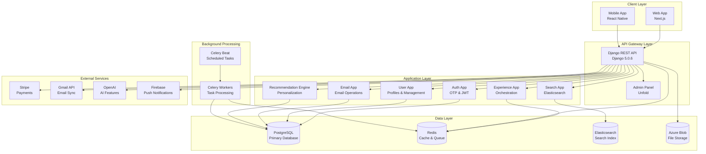

# System Architecture Overview

## Architecture Diagram



## System Components

### 1. API Layer (Django REST Framework)

The API layer provides RESTful endpoints for all client interactions:

- **Authentication**: JWT-based authentication with OTP verification
- **User Management**: Profile, inbox, device management
- **Email Operations**: CRUD operations, search, filtering
- **Search**: Full-text search across all content types
- **Recommendations**: Personalized content recommendations
- **Experience**: Dynamic UI orchestration
- **Subscriptions**: Payment and subscription management

### 2. Application Layer

#### Core Apps
- **core**: Base models and utilities
- **auth_app**: Authentication and authorization
- **user_app**: User management services
- **email_app**: Email operations
- **reading_app**: Reading statistics

#### Content Apps
- **directory_app**: Newsletter directory
- **newsletter_profile_app**: Newsletter subscriptions
- **search_app**: Search functionality
- **recommendation_engine**: Recommendation system
- **experience_app**: Experience orchestration

#### Integration Apps
- **gmail_app**: Gmail integration
- **integration_app**: Third-party integrations
- **subscription_app**: Subscriptions
- **ai_app**: AI features
- **azure_app**: Azure storage

### 3. Data Layer

#### PostgreSQL
Primary relational database storing:
- User accounts and profiles
- Emails and newsletters
- Subscriptions and payments
- Reading statistics
- Recommendations
- Experience data

#### Redis
Used for:
- **Caching**: Search results, user features, item features
- **Task Queue**: Celery task broker
- **Session Storage**: User sessions
- **Real-time State**: Experience orchestration state

#### Elasticsearch (Bonsai.io)
Search indexes:
- `newsletter_providers` - Global newsletter directory
- `emails` - User emails
- `newsletters` - User newsletter subscriptions
- `newsletter_posts` - Newsletter posts
- `inbox_emails` - Inbox email addresses

#### Azure Blob Storage
File storage for:
- Email attachments
- User uploads
- Newsletter images
- Profile pictures

### 4. Background Processing

#### Celery Workers
Process background tasks:
- Email processing
- Newsletter fetching
- Feature aggregation
- Recommendation computation
- Analytics aggregation
- Cache invalidation

#### Celery Beat
Scheduled tasks:
- Daily reading statistics
- Newsletter post fetching
- Feature updates
- Metrics aggregation
- Cache cleanup

### 5. External Services

#### Stripe
- Payment processing
- Subscription management
- Webhook handling

#### Gmail API
- Email synchronization
- OAuth authentication
- Email import

#### OpenAI
- Email summarization
- Content generation
- AI-powered features

#### Firebase
- Push notifications
- User messaging

## Data Flow

### 1. User Request Flow

```
Client Request
    ↓
Django Middleware (CORS, Auth, CSRF)
    ↓
URL Router
    ↓
View/ViewSet
    ↓
Service Layer
    ↓
Model Layer
    ↓
Database/External Service
    ↓
Response Serialization
    ↓
Client Response
```

### 2. Search Flow

```
Search Request
    ↓
Check Redis Cache
    ├─ Cache Hit → Return Results
    └─ Cache Miss → Query Elasticsearch
        ↓
    Format Results
    ↓
    Store in Redis
    ↓
    Return Results
```

### 3. Recommendation Flow

```
Recommendation Request
    ↓
Get User Features (Redis Cache)
    ↓
Generate Candidates
    ├─ From User Features
    ├─ From Search
    └─ From Popularity
    ↓
Score Candidates
    ├─ User Affinity
    ├─ Item Features
    └─ Context
    ↓
Apply Diversity & Fatigue
    ↓
Return Top N Recommendations
```

### 4. Experience Orchestration Flow

```
Experience Request
    ↓
Infer User Intent
    ↓
Generate Section Candidates
    ↓
Score Sections
    ├─ User Affinity
    ├─ Context Relevance
    ├─ Freshness
    └─ Popularity
    ↓
Apply Fatigue Control
    ↓
Populate Section Items
    ↓
Return Personalized Experience
```

## Security Architecture

### Authentication
- **OTP Verification**: Email-based one-time password
- **JWT Tokens**: Access and refresh tokens
- **Device Tracking**: Device-specific tokens
- **Session Management**: Secure session handling

### Authorization
- **Django Permissions**: Built-in permission system
- **Guardian**: Object-level permissions
- **Role-Based Access**: Staff and superuser roles

### Data Protection
- **CSRF Protection**: Cross-site request forgery protection
- **CORS Configuration**: Controlled cross-origin access
- **SQL Injection Prevention**: Django ORM protection
- **XSS Protection**: Input sanitization

## Scalability Considerations

### Horizontal Scaling
- **Stateless API**: All API servers are stateless
- **Load Balancing**: Can scale API servers horizontally
- **Database Connection Pooling**: PgBouncer for PostgreSQL
- **Redis Cluster**: Redis cluster for high availability

### Vertical Scaling
- **Database Optimization**: Indexes, query optimization
- **Caching Strategy**: Multi-layer caching
- **Background Processing**: Async task processing

### Performance Optimizations
- **Database Queries**: `select_related`, `prefetch_related`
- **Redis Caching**: Search results, user features
- **CDN**: Static file serving
- **Connection Pooling**: Database and Redis connections

## Monitoring & Observability

### Logging
- **Django Logging**: Application logs
- **Error Tracking**: Exception logging
- **Request Logging**: API request/response logs

### Metrics
- **Performance Metrics**: Response times, query times
- **Business Metrics**: User engagement, conversions
- **System Metrics**: CPU, memory, disk usage

### Health Checks
- **API Health**: `/health` endpoint
- **Database Health**: Connection checks
- **Redis Health**: Cache availability
- **Elasticsearch Health**: Search availability

## Next Steps

- [Search Architecture](/docs/backend/architecture/search-architecture) - Detailed search system architecture with Bonsai.io
- [Recommendation Engine Architecture](/docs/backend/architecture/recommendation-engine) - Recommendation system design with hybrid scoring
- [Experience Orchestration](/docs/backend/architecture/experience-orchestration) - Experience orchestration system for personalization
