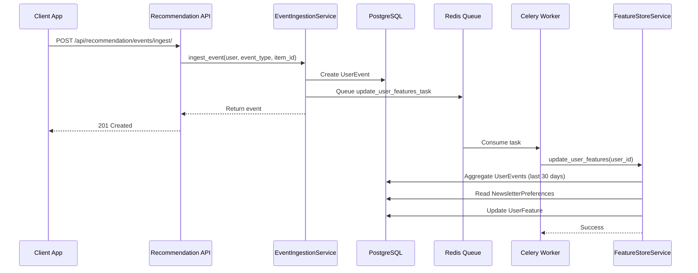
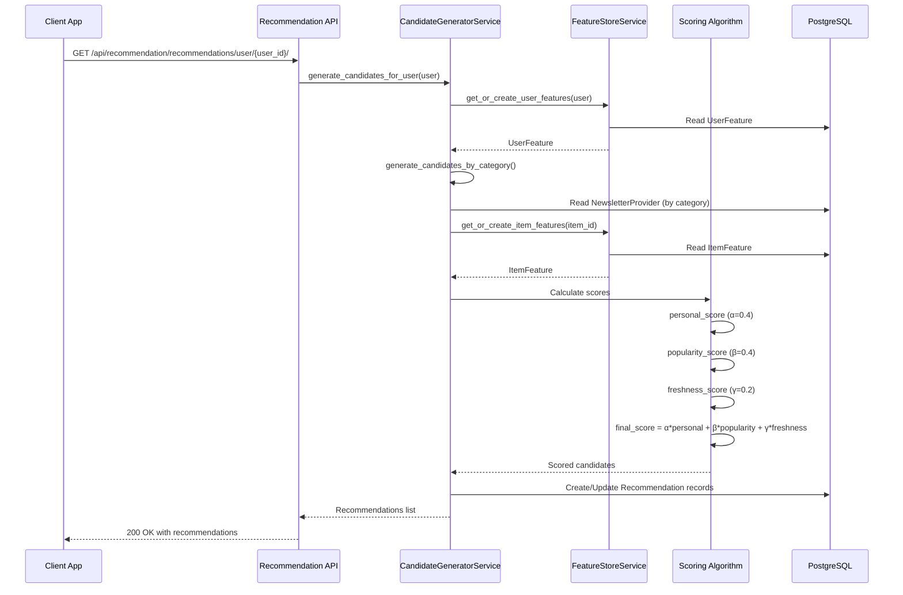
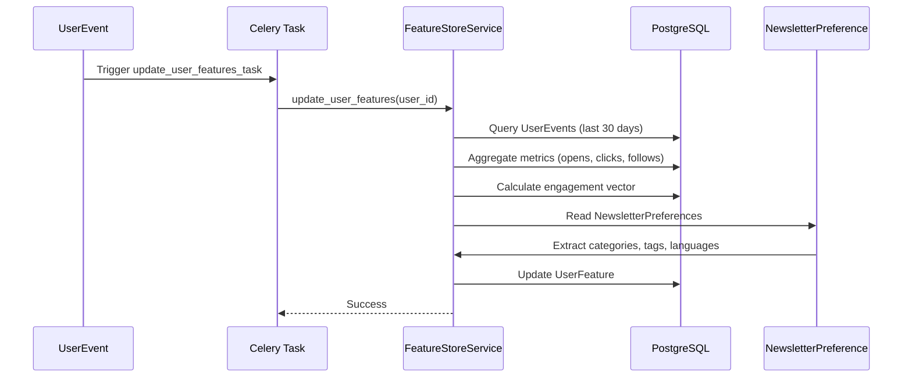

# Recommendation Engine Architecture

## Overview

The INBO Recommendation Engine provides personalized newsletter recommendations based on user behavior, preferences, and newsletter metadata. It uses a hybrid scoring algorithm combining personalization, popularity, and freshness signals.

## Architecture Diagram

```mermaid
graph TB
    subgraph "Client Layer"
        WebApp[Web Application]
        MobileApp[Mobile App]
        API[API Clients]
    end

    subgraph "API Gateway Layer"
        DRF[Django REST Framework]
        Auth[JWT Authentication]
    end

    subgraph "Recommendation Engine API Endpoints"
        EventAPI[POST /api/recommendation/events/ingest/<br/>POST /api/recommendation/events/batch/]
        RecAPI[GET /api/recommendation/recommendations/user/<br/>GET /api/recommendation/recommendations/trending/<br/>GET /api/recommendation/recommendations/category/]
        ExplainAPI[GET /api/recommendation/recommendations/explain/]
    end

    subgraph "Service Layer"
        EventService[EventIngestionService]
        FeatureService[FeatureStoreService]
        CandidateService[CandidateGeneratorService]
    end

    subgraph "Background Tasks (Celery)"
        UpdateUserTask[update_user_features_task]
        UpdateItemTask[update_item_features_task]
        PrecomputeTask[precompute_recommendations_task]
        BatchUpdateTask[batch_update_features_task]
        ProcessBatchTask[process_event_batch_task]
        RefreshTrendingTask[refresh_trending_recommendations_task]
    end

    subgraph "Data Models"
        UserEvent[(UserEvent<br/>Events: open, click, follow,<br/>unsubscribe, read_duration,<br/>share, dismiss, dwell_time)]
        UserFeature[(UserFeature<br/>Preferences, Engagement Vector,<br/>Metrics: opens, clicks, follows)]
        ItemFeature[(ItemFeature<br/>Embeddings, Metadata,<br/>Engagement Metrics,<br/>Reputation Score)]
        Recommendation[(Recommendation<br/>Precomputed Results,<br/>Scores, Rankings)]
        RecExplanation[(RecommendationExplanation<br/>Explanations,<br/>Contributing Factors)]
    end

    subgraph "External Data Sources"
        UserModel[(User Model<br/>core.models.User)]
        NewsletterProvider[(NewsletterProvider<br/>directory_app.models)]
        NewsletterPreference[(NewsletterPreference<br/>newsletter_profile_app.models)]
        NewsletterPost[(NewsletterPost<br/>newsletter_profile_app.models)]
    end

    subgraph "Storage Layer"
        PostgreSQL[(PostgreSQL<br/>Primary Database)]
        Redis[(Redis<br/>Cache & Queue)]
    end

    subgraph "Scoring Algorithm"
        PersonalScorer[Personal Score<br/>α = 0.4<br/>Category Match<br/>Engagement Vector]
        PopularityScorer[Popularity Score<br/>β = 0.4<br/>Reputation<br/>Subscribers]
        FreshnessScorer[Freshness Score<br/>γ = 0.2<br/>Time Decay]
        HybridScorer[Hybrid Scorer<br/>score = α*personal + β*popularity + γ*freshness]
    end

    %% Client to API Flow
    WebApp -->|HTTP Requests| DRF
    MobileApp -->|HTTP Requests| DRF
    API -->|HTTP Requests| DRF
    DRF -->|Authenticate| Auth
    Auth -->|Authorized| EventAPI
    Auth -->|Authorized| RecAPI
    Auth -->|Authorized| ExplainAPI

    %% API to Views
    EventAPI --> EventService
    RecAPI --> CandidateService
    ExplainAPI --> FeatureService

    %% Services to Models
    EventService -->|Create| UserEvent
    EventService -->|Trigger Async| UpdateUserTask
    FeatureService -->|Read/Write| UserFeature
    FeatureService -->|Read/Write| ItemFeature
    CandidateService -->|Read| UserFeature
    CandidateService -->|Read| ItemFeature
    CandidateService -->|Generate| Recommendation

    %% Services to External Models
    FeatureService -->|Read| NewsletterPreference
    FeatureService -->|Read| NewsletterProvider
    CandidateService -->|Read| NewsletterProvider
    EventService -->|Read| UserModel

    %% Background Tasks Flow
    UpdateUserTask -->|Update| UserFeature
    UpdateUserTask -->|Read| UserEvent
    UpdateUserTask -->|Read| NewsletterPreference
    UpdateItemTask -->|Update| ItemFeature
    UpdateItemTask -->|Read| UserEvent
    PrecomputeTask -->|Create| Recommendation
    PrecomputeTask -->|Read| CandidateService
    BatchUpdateTask -->|Queue| UpdateUserTask
    BatchUpdateTask -->|Queue| UpdateItemTask
    ProcessBatchTask -->|Process| EventService
    RefreshTrendingTask -->|Update| ItemFeature

    %% Models to Database
    UserEvent -->|Store| PostgreSQL
    UserFeature -->|Store| PostgreSQL
    ItemFeature -->|Store| PostgreSQL
    Recommendation -->|Store| PostgreSQL
    RecExplanation -->|Store| PostgreSQL

    %% Celery Queue
    EventService -.->|Queue Task| Redis
    UpdateUserTask -.->|Consume| Redis
    UpdateItemTask -.->|Consume| Redis
    PrecomputeTask -.->|Consume| Redis
    BatchUpdateTask -.->|Consume| Redis
    ProcessBatchTask -.->|Consume| Redis
    RefreshTrendingTask -.->|Consume| Redis

    %% Scoring Flow
    CandidateService --> PersonalScorer
    CandidateService --> PopularityScorer
    CandidateService --> FreshnessScorer
    PersonalScorer --> HybridScorer
    PopularityScorer --> HybridScorer
    FreshnessScorer --> HybridScorer
    HybridScorer --> Recommendation
```



## Core Components

### 1. Data Models

#### UserEvent
Tracks all user interactions with newsletters and posts.

**Event Types**:
- `open`: User opened a newsletter/post
- `click`: User clicked on a newsletter/post
- `follow`: User followed/subscribed to a newsletter
- `unsubscribe`: User unsubscribed from a newsletter
- `read_duration`: Time spent reading (seconds)
- `share`: User shared a newsletter/post
- `dismiss`: User dismissed a recommendation
- `dwell_time`: Time spent viewing (seconds)

**Fields**:
- `user`: ForeignKey to User
- `event_type`: Event type (CharField)
- `item_id`: Newsletter provider ID or post ID
- `item_type`: Item type (newsletter, post)
- `value`: Numeric value (for read_duration, dwell_time)
- `metadata`: Additional event data (JSONField)
- `device_type`: Device type (mobile, web, etc.)
- `app_section`: App section (home, category, search)
- `session_id`: Session identifier
- `created_at`: Event timestamp

#### UserFeature
Cached user preferences and engagement metrics.

**Fields**:
- `user`: OneToOneField to User
- `preferred_categories`: List of category IDs (JSONField)
- `preferred_tags`: List of tag IDs (JSONField)
- `preferred_languages`: List of language codes (JSONField)
- `engagement_vector`: Category engagement scores (JSONField)
- `total_opens`: Total opens count
- `total_clicks`: Total clicks count
- `total_follows`: Total follows count
- `avg_read_duration`: Average read duration (seconds)
- `last_active_ts`: Last active timestamp

**Update Sources**:
- UserEvent aggregation (last 30 days)
- NewsletterPreference extraction
- User behavior patterns

#### ItemFeature
Newsletter features and engagement metrics.

**Fields**:
- `item_id`: Newsletter provider ID (unique)
- `newsletter_provider`: ForeignKey to NewsletterProvider
- `topics_embedding`: 512d embedding vector (JSONField)
- `description_embedding`: Description embedding (JSONField)
- `tags`: List of tag IDs (JSONField)
- `categories`: List of category IDs (JSONField)
- `language`: Language code
- `avg_open_rate`: Average open rate (0-1)
- `avg_click_rate`: Average click rate (0-1)
- `total_subscribers`: Total subscriber count
- `total_opens`: Total opens count
- `total_clicks`: Total clicks count
- `provider_reputation_score`: Reputation score (0-1)
- `freshness_boost`: Freshness boost (0-1)

**Update Sources**:
- UserEvent aggregation
- NewsletterPreference subscriber count
- NewsletterProvider metadata

#### Recommendation
Precomputed recommendations with scoring breakdown.

**Fields**:
- `user`: ForeignKey to User
- `item_id`: Recommended item ID
- `item_type`: Item type (newsletter)
- `score`: Final recommendation score
- `rank`: Position in recommendation list
- `personal_score`: Personalization score component
- `similarity_score`: Similarity score (Phase B - embeddings)
- `popularity_score`: Popularity score component
- `freshness_score`: Freshness score component
- `reason`: Human-readable explanation
- `explanation_metadata`: Detailed explanation data
- `model_version`: Model version identifier
- `recommendation_mode`: Mode (personalized, trending, category, hybrid)
- `expires_at`: Cache expiration timestamp

#### RecommendationExplanation
Detailed explanations for recommendations (transparency/debugging).

**Fields**:
- `user`: ForeignKey to User
- `item_id`: Item identifier
- `explanation_text`: Human-readable explanation
- `contributing_factors`: Detailed breakdown (JSONField)
- `similar_items`: Items user interacted with (JSONField)
- `category_match`: Category preferences match (JSONField)
- `tag_match`: Tag preferences match (JSONField)
- `model_version`: Model version
- `recommendation_mode`: Recommendation mode

### 2. Service Layer

#### EventIngestionService
Handles user event ingestion and triggers async feature updates.

**Methods**:
- `ingest_event()`: Ingest a single user event
  - Creates UserEvent record
  - Triggers async user feature update via Celery
  - Returns created event

**Flow**:
```
User Action → API → EventIngestionService.ingest_event()
  → UserEvent.save()
  → Celery Task (update_user_features_task)
  → FeatureStoreService.update_user_features()
```

#### FeatureStoreService
Manages user and item feature store.

**Methods**:
- `get_or_create_user_features()`: Get or create user features
- `update_user_features()`: Update user features from events and preferences
  - Aggregates last 30 days of events
  - Calculates engagement metrics
  - Extracts preferences from NewsletterPreference
  - Builds engagement vector by category
- `get_or_create_item_features()`: Get or create item features
- `update_item_features()`: Update item features from events
  - Calculates engagement metrics (open rate, click rate)
  - Gets subscriber count from NewsletterPreference
  - Calculates provider reputation score
  - Updates freshness boost

**Update Triggers**:
- UserEvent creation (async via Celery)
- NewsletterPreference changes
- Periodic batch updates

#### CandidateGeneratorService
Generates recommendation candidates.

**Methods**:
- `generate_candidates_by_popularity()`: Generate candidates based on popularity
  - Sorts by provider_reputation_score, total_subscribers, avg_open_rate
  - Returns top N candidates
- `generate_candidates_by_category()`: Generate candidates for a specific category
  - Filters NewsletterProvider by category
  - Scores by reputation and subscribers
- `generate_candidates_for_user()`: Generate personalized candidates for a user
  - Uses user's preferred categories
  - Scores by category matches + engagement boost
  - Falls back to popular items if not enough candidates

### 3. Scoring Algorithm

#### Hybrid Scoring Formula

```
score = α * personal_score + β * popularity_score + γ * freshness_score
```

**Weights**:
- `α = 0.4` (Personalization weight)
- `β = 0.4` (Popularity weight)
- `γ = 0.2` (Freshness weight)

#### Personal Score (α = 0.4)

**Components**:
- Category matches from user preferences
- Engagement vector from last 30 days
- Tag preferences

**Calculation**:
```python
# Category match score
category_score = len(matching_categories) / len(user.preferred_categories)

# Engagement boost
engagement_boost = user.engagement_vector.get(category_id, 0) / max_engagement

# Tag match score
tag_score = len(matching_tags) / len(user.preferred_tags)

personal_score = (category_score * 0.5) + (engagement_boost * 0.3) + (tag_score * 0.2)
```

#### Popularity Score (β = 0.4)

**Components**:
- Provider reputation score
- Total subscribers
- Average open/click rates

**Calculation**:
```python
popularity_score = (
    item.provider_reputation_score * 0.5 +
    (min(item.total_subscribers / 1000.0, 1.0)) * 0.3 +
    ((item.avg_open_rate + item.avg_click_rate) / 2.0) * 0.2
)
```

#### Freshness Score (γ = 0.2)

**Components**:
- Time-decay boost for new items
- Decays from 1.0 to 0.5 over 60 days

**Calculation**:
```python
days_old = (now - item.published_ts).days
freshness_score = max(0.5, 1.0 - (days_old / 60.0))
```

## Workflows

### 1. Event Ingestion Workflow



**Steps**:
1. Client sends event (open, click, follow, etc.)
2. EventIngestionService creates UserEvent record
3. Async task queued to update user features
4. Celery worker processes task
5. FeatureStoreService aggregates events and updates UserFeature
6. UserFeature is ready for next recommendation request

### 2. Recommendation Generation Workflow



**Steps**:
1. Client requests personalized recommendations
2. CandidateGeneratorService gets user features
3. Generates candidates based on preferred categories
4. Gets item features for each candidate
5. Calculates hybrid scores (personal + popularity + freshness)
6. Creates/updates Recommendation records
7. Returns ranked recommendations to client

### 3. Feature Update Workflow



**Steps**:
1. UserEvent created triggers async task
2. FeatureStoreService aggregates last 30 days of events
3. Calculates engagement metrics (total_opens, total_clicks, etc.)
4. Builds engagement vector by category
5. Extracts preferences from NewsletterPreference
6. Updates UserFeature with all computed values

## API Endpoints

### Event Ingestion

#### Ingest Single Event
```
POST /api/recommendation/events/ingest/
```

**Request Body**:
```json
{
  "event_type": "open",
  "item_id": "newsletter_provider_id",
  "item_type": "newsletter",
  "value": null,
  "metadata": {},
  "device_type": "web",
  "app_section": "home",
  "session_id": "session_123"
}
```

**Response**: `201 Created` with event data

#### Ingest Batch Events
```
POST /api/recommendation/events/batch/
```

**Request Body**:
```json
{
  "events": [
    {
      "event_type": "open",
      "item_id": "newsletter_provider_id",
      ...
    },
    ...
  ]
}
```

**Response**: `201 Created` with batch processing result

### Recommendations

#### Get Personalized Recommendations
```
GET /api/recommendation/recommendations/user/{user_id}/?k=20&mode=personalized
```

**Query Parameters**:
- `k`: Number of recommendations (default: 20)
- `mode`: Recommendation mode (personalized, popularity)

**Response**:
```json
{
  "results": [
    {
      "id": "...",
      "item_id": "...",
      "item_type": "newsletter",
      "item_name": "Tech Newsletter",
      "item_url": "https://example.com",
      "score": 0.85,
      "rank": 1,
      "personal_score": 0.4,
      "popularity_score": 0.4,
      "freshness_score": 0.2,
      "reason": "Recommended based on personalized preferences",
      "model_version": "v1",
      "created_at": "2025-01-24T10:00:00Z"
    }
  ],
  "total": 20
}
```

#### Get Trending Recommendations
```
GET /api/recommendation/recommendations/trending/?k=20&period=7d
```

**Query Parameters**:
- `k`: Number of recommendations
- `period`: Time period (24h, 7d, 30d)

#### Get Category-Based Recommendations
```
GET /api/recommendation/recommendations/category/{category_id}/?k=20
```

#### Explain Recommendation
```
GET /api/recommendation/recommendations/explain/{user_id}/{item_id}/
```

**Response**:
```json
{
  "explanation_text": "Recommended because you follow similar newsletters in Technology category",
  "contributing_factors": {
    "category_match": 0.8,
    "engagement_boost": 0.6,
    "popularity": 0.7
  },
  "similar_items": ["item_1", "item_2"]
}
```

## Background Tasks (Celery)

### Feature Update Tasks

#### update_user_features_task
- **Trigger**: UserEvent creation
- **Purpose**: Update user features from events
- **Frequency**: On-demand (per event)

#### update_item_features_task
- **Trigger**: Item events or manual
- **Purpose**: Update item features from events
- **Frequency**: On-demand or periodic

#### batch_update_features_task
- **Trigger**: Periodic (daily/hourly)
- **Purpose**: Batch update all active users/items
- **Frequency**: Scheduled (Celery beat)

### Recommendation Tasks

#### precompute_recommendations_task
- **Trigger**: On-demand or periodic
- **Purpose**: Precompute recommendations for users
- **Frequency**: On-demand or scheduled

#### refresh_trending_recommendations_task
- **Trigger**: Periodic (hourly)
- **Purpose**: Refresh trending items
- **Frequency**: Scheduled

### Event Processing Tasks

#### process_event_batch_task
- **Trigger**: Batch event ingestion
- **Purpose**: Process batch of events asynchronously
- **Frequency**: On-demand

## Integration Points

### 1. Newsletter Profile Integration

**Connection**: NewsletterPreference feeds UserFeature

**Flow**:
1. User subscribes to newsletter via NewsletterPreference
2. FeatureStoreService extracts categories/tags from NewsletterProvider
3. Updates UserFeature.preferred_categories and preferred_tags
4. Recommendations use these preferences for personalization

**Benefits**:
- Recommendations reflect user's actual subscriptions
- Category preferences automatically extracted
- Engagement tracking per subscribed newsletter

### 2. Search Engine Integration

**Connection**: Search results can influence recommendations

**Flow**:
1. User searches for newsletters/posts
2. Search patterns can be tracked as events
3. Recommendation engine can use search history
4. Popular search terms influence trending recommendations

**Future Enhancement**:
- Search analytics → Recommendation signals
- Search history → User preference learning

### 3. Directory App Integration

**Connection**: NewsletterProvider metadata feeds ItemFeature

**Flow**:
1. NewsletterProvider has categories, tags, metadata
2. ItemFeature extracts this data on creation
3. Recommendations use provider metadata for scoring
4. Popularity scores based on provider reputation

## Performance Optimization

### Caching Strategy
- **UserFeature**: Cached in memory (updated async)
- **ItemFeature**: Cached in memory (updated async)
- **Recommendations**: Precomputed and cached (24h TTL)
- **Redis**: Used for Celery queue and optional result caching

### Database Optimization
- **Indexes**: On UserEvent (user_id, event_type, created_at)
- **Aggregations**: Precomputed in UserFeature/ItemFeature
- **Batch Updates**: Processed in background tasks

### Scalability
- **Async Processing**: All feature updates via Celery
- **Batch Operations**: Batch event processing
- **Horizontal Scaling**: Celery workers can scale independently

## Monitoring and Metrics

### Key Metrics

- **Event Ingestion Rate**: Events per second
- **Feature Update Latency**: Time to update features after event
- **Recommendation Generation Time**: Time to generate recommendations
- **Cache Hit Rate**: Precomputed recommendation usage
- **Recommendation CTR**: Click-through rate on recommendations
- **User Engagement**: Opens, clicks, follows from recommendations

### Monitoring Points

1. **Event Processing**:
   - Event ingestion rate
   - Failed event processing
   - Celery task queue depth

2. **Feature Updates**:
   - Feature update latency
   - Failed feature updates
   - Batch update performance

3. **Recommendation Quality**:
   - Recommendation diversity
   - User engagement with recommendations
   - A/B test results (future)

## Future Enhancements (Phase B+)

- [ ] **Embeddings**: Sentence-transformers for content similarity
- [ ] **Vector Search**: FAISS/Redis Vector DB for fast similarity
- [ ] **Collaborative Filtering**: Matrix factorization (ALS)
- [ ] **ML Reranker**: LightGBM/XGBoost for final ranking
- [ ] **A/B Testing**: Framework for algorithm testing
- [ ] **Real-time Recommendations**: Update recommendations based on live events
- [ ] **Cold-start Handling**: Better recommendations for new users/items
- [ ] **Explanation Generation**: AI-generated explanations for recommendations
