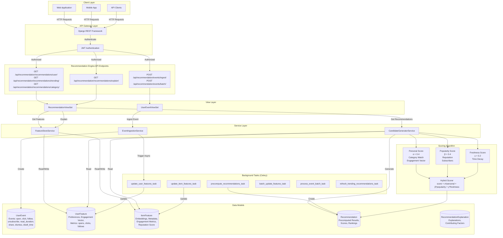

# Recommendation Engine Architecture

## Complete Backend Architecture Diagram



## Architecture Components

### 1. Client Layer
- **Web Application**: Browser-based frontend
- **Mobile App**: iOS/Android applications
- **API Clients**: Third-party integrations

### 2. API Gateway Layer
- **Django REST Framework**: RESTful API framework
- **JWT Authentication**: Token-based authentication

### 3. API Endpoints

#### Event Ingestion
- `POST /api/recommendation/events/ingest/` - Single event
- `POST /api/recommendation/events/batch/` - Batch events

#### Recommendations
- `GET /api/recommendation/recommendations/user/<user_id>/` - Personalized
- `GET /api/recommendation/recommendations/trending/` - Trending
- `GET /api/recommendation/recommendations/category/<category_id>/` - Category-based
- `GET /api/recommendation/recommendations/explain/<user_id>/<item_id>/` - Explanation

### 4. Service Layer

#### EventIngestionService
- Ingests user events (open, click, follow, etc.)
- Triggers async feature updates via Celery

#### FeatureStoreService
- Manages user features (preferences, engagement)
- Manages item features (embeddings, metrics)
- Updates features from events and preferences

#### CandidateGeneratorService
- Generates candidates by popularity
- Generates candidates by category
- Generates personalized candidates for users

### 5. Background Tasks (Celery)

#### Feature Updates
- `update_user_features_task` - Update user features from events
- `update_item_features_task` - Update item features from events
- `batch_update_features_task` - Batch update all features

#### Recommendation Generation
- `precompute_recommendations_task` - Precompute user recommendations
- `refresh_trending_recommendations_task` - Refresh trending items

#### Event Processing
- `process_event_batch_task` - Process batch of events

### 6. Data Models

#### UserEvent
- Tracks all user interactions
- Event types: open, click, follow, unsubscribe, read_duration, share, dismiss, dwell_time
- Includes context: device_type, app_section, session_id

#### UserFeature
- Cached user preferences (categories, tags, languages)
- Engagement vector (last 30 days)
- Metrics: total_opens, total_clicks, total_follows, avg_read_duration

#### ItemFeature
- Newsletter features and metadata
- Embeddings (topics, description)
- Engagement metrics (open_rate, click_rate, subscribers)
- Reputation score and freshness boost

#### Recommendation
- Precomputed recommendations
- Scoring breakdown (personal, similarity, popularity, freshness)
- Rankings and explanations

#### RecommendationExplanation
- Detailed explanations for recommendations
- Contributing factors and similar items

### 7. Scoring Algorithm

**Hybrid Scoring Formula:**
```
score = α * personal_score + β * popularity_score + γ * freshness_score
```

Where:
- `α = 0.4` (Personalization weight)
- `β = 0.4` (Popularity weight)
- `γ = 0.2` (Freshness weight)

**Personal Score:**
- Category matches from user preferences
- Engagement vector from last 30 days
- Tag preferences

**Popularity Score:**
- Provider reputation score
- Total subscribers
- Average open/click rates

**Freshness Score:**
- Time-decay boost for new items
- Decays from 1.0 to 0.5 over 60 days

### 8. Data Flow

1. **Event Ingestion Flow:**
   - Client → API → EventService → UserEvent (DB)
   - EventService → Queue → Celery Task → Update UserFeature

2. **Recommendation Flow:**
   - Client → API → CandidateService → Generate Candidates
   - CandidateService → Scoring Algorithm → Recommendation (DB)
   - Return recommendations to client

3. **Feature Update Flow:**
   - UserEvent → Aggregate → UserFeature
   - UserEvent → Aggregate → ItemFeature
   - NewsletterPreference → Extract → UserFeature

4. **Background Processing:**
   - Celery → Redis Queue → Tasks → Update Features
   - Periodic Tasks → Batch Updates → All Active Users/Items

### 9. External Dependencies

- **PostgreSQL**: Primary database for all models
- **Redis**: Celery message broker and cache
- **Celery**: Background task processing
- **Django**: Web framework
- **DRF**: REST API framework

### 10. Future Enhancements (Phase B+)

- **Embeddings**: Sentence-transformers for content similarity
- **Vector Search**: FAISS/Redis Vector DB for fast similarity
- **Collaborative Filtering**: Matrix factorization
- **ML Reranker**: LightGBM/XGBoost for final ranking
- **A/B Testing**: Framework for algorithm testing
- **Monitoring**: CTR, engagement lift tracking

## Related Documentation

- [Recommendation Engine App Documentation](/docs/backend/apps/recommendation-engine)
- [Experience Orchestration Architecture](/docs/backend/architecture/experience-orchestration)
- [Architecture Overview](/docs/backend/architecture/overview)
