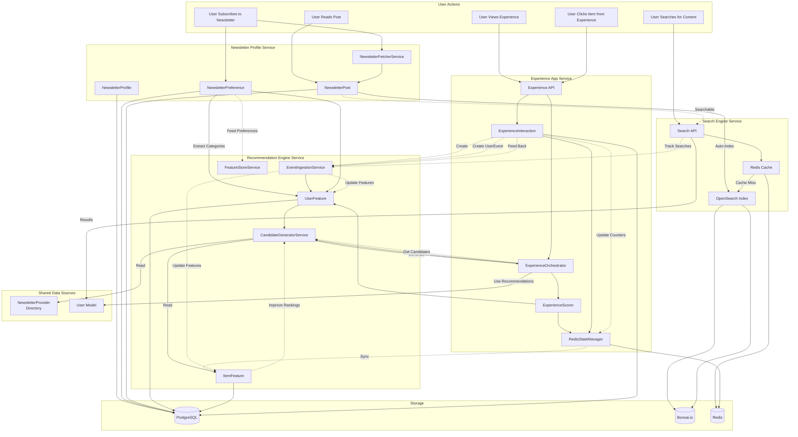
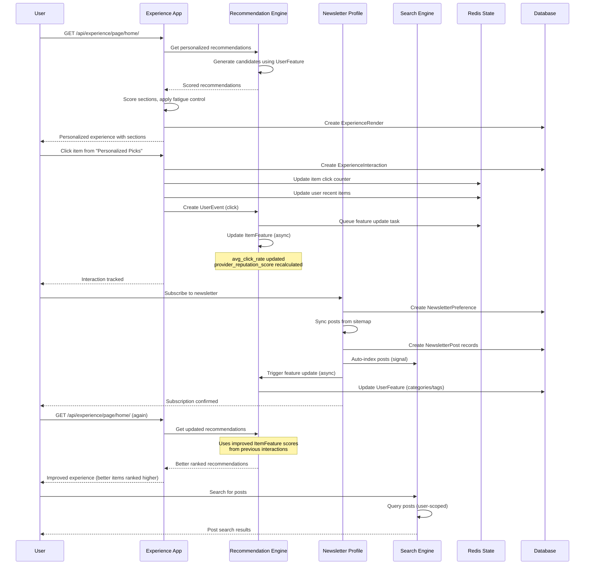

# Service Integration Architecture

## Overview

The INBO backend consists of four tightly integrated services: **Search Engine**, **Recommendation Engine**, **Newsletter Profile with Publication History**, and **Experience App**. This document explains how these services interact, share data, and enhance each other's functionality, with a special focus on how Experience App creates a feedback loop that continuously improves recommendation rankings.

## Integrated Architecture Diagram



## Integration Points

### 1. Experience App → Recommendation Engine (Feedback Loop)

**Integration Type**: Experience interactions feed back into recommendation rankings

**Flow**:
```
User clicks item from experience
  ↓
ExperienceInteraction created
  ↓
Redis state updated (item counters, recent items)
  ↓
UserEvent created (optional)
  ↓
FeatureStoreService.update_item_features()
  ↓
ItemFeature.avg_click_rate updated
  ↓
ItemFeature.provider_reputation_score recalculated
  ↓
Next recommendations use improved reputation scores
  ↓
Better items ranked higher in future experiences
```

**Implementation**:
- **Location**: `experience_app/views.py`, `experience_app/signals.py`
- **Trigger**: User interactions (click, view) from experience
- **Service**: `EventIngestionService`, `FeatureStoreService`
- **Models**: `ExperienceInteraction` → `UserEvent` → `ItemFeature`

**Benefits**:
- Real-time feedback loop improves recommendations
- Item popularity scores updated from actual user behavior
- Recommendation rankings improve continuously
- Better personalization over time

**Data Flow**:
1. User views personalized experience → ExperienceRender created
2. User clicks item from "Personalized Picks" section → ExperienceInteraction created
3. Redis state updated → Item click counter incremented
4. UserEvent created → Feeds into Recommendation Engine
5. ItemFeature updated → avg_click_rate, provider_reputation_score recalculated
6. Next recommendations use updated scores → Better items ranked higher

### 2. Recommendation Engine → Experience App

**Integration Type**: Experience App uses Recommendation Engine for item population

**Flow**:
```
Experience Orchestrator generates experience
  ↓
For "personalized_picks" section:
  → CandidateGeneratorService.generate_candidates_for_user()
  → Uses UserFeature for personalization
  → Returns scored candidates
  ↓
For "trending" section:
  → CandidateGeneratorService.generate_candidates_by_popularity()
  → Uses ItemFeature for popularity
  → Returns trending items
  ↓
Items populated in experience sections
```

**Implementation**:
- **Location**: `experience_app/orchestrator.py`
- **Methods**: `_get_personalized_picks()`, `_get_trending_items()`, `_get_similar_items()`
- **Service**: `CandidateGeneratorService`, `FeatureStoreService`

**Benefits**:
- Experience sections populated with high-quality recommendations
- Consistent personalization across app
- Leverages recommendation engine's scoring algorithms

### 3. Newsletter Profile → Search Engine

**Integration Type**: Auto-indexing of NewsletterPost

**Flow**:
```
NewsletterPost.save()
  ↓
Django Signal (post_save)
  ↓
CustomSignalProcessor.handle_save()
  ↓
OpenSearch Client.index()
  ↓
Bonsai.io (newsletter_posts index)
  ↓
Post is searchable via /api/search/posts/search/
```

**Implementation**:
- **Location**: `search_app/signals.py`
- **Processor**: `CustomSignalProcessor`
- **Trigger**: Automatic on NewsletterPost save/delete
- **Index**: `newsletter_posts`

**Benefits**:
- Posts automatically become searchable
- No manual indexing required
- Real-time search availability
- User-scoped search (only user's subscribed newsletters)

**Data Flow**:
1. User subscribes to newsletter → NewsletterPreference created
2. Posts are synced from sitemap → NewsletterPost created
3. Django signal triggers → Post indexed in Bonsai.io
4. Post becomes searchable → User can find it via search API

### 2. Newsletter Profile → Recommendation Engine

**Integration Type**: Preference extraction for UserFeature

**Flow**:
```
NewsletterPreference.create/update()
  ↓
Async: FeatureStoreService.update_user_features()
  ↓
Extract categories/tags from NewsletterProvider
  ↓
Update UserFeature.preferred_categories
  ↓
Recommendations use preferences for personalization
```

**Implementation**:
- **Location**: `recommendation_engine/services.py`
- **Service**: `FeatureStoreService.update_user_features()`
- **Trigger**: Async via Celery (on preference change or periodic)
- **Source**: `NewsletterPreference` → `NewsletterProvider` → categories/tags

**Benefits**:
- Recommendations reflect actual user subscriptions
- Category preferences automatically extracted
- No manual preference configuration needed
- Engagement tracking per subscribed newsletter

**Data Flow**:
1. User subscribes to newsletter → NewsletterPreference created
2. Async task triggered → `update_user_features_task`
3. FeatureStoreService reads NewsletterPreference
4. Extracts categories/tags from linked NewsletterProvider
5. Updates UserFeature.preferred_categories and preferred_tags
6. Recommendations use these preferences for scoring

### 3. Recommendation Engine → Search Engine

**Integration Type**: Search patterns can influence recommendations

**Flow**:
```
User searches for newsletters/posts
  ↓
Search API tracks search patterns (future)
  ↓
Search events sent to Recommendation Engine
  ↓
UserFeature updated with search preferences
  ↓
Recommendations influenced by search history
```

**Current State**: 
- Basic integration exists
- Full search analytics → recommendation signals (future enhancement)

**Future Enhancement**:
- Track search queries as events
- Use search patterns for preference learning
- Popular search terms influence trending recommendations

### 4. Experience App → Search Engine

**Integration Type**: Experience interactions can trigger search events

**Flow**:
```
User interacts with item from experience
  ↓
ExperienceInteraction created
  ↓
Optionally: Search query tracked
  ↓
Search trends updated in Redis
  ↓
Influences trending recommendations
```

**Benefits**:
- Search trends from experience interactions
- Popular items from experience feed into search popularity
- Better search result ranking

### 5. Search Engine → Recommendation Engine

**Integration Type**: Search results can feed recommendation signals

**Flow**:
```
User searches and clicks result
  ↓
Click event sent to Recommendation Engine
  ↓
UserEvent created (event_type: 'click')
  ↓
UserFeature updated with engagement
  ↓
Recommendations improve based on search behavior
```

**Implementation**:
- **Location**: Frontend/API integration
- **Event Type**: `click` events from search results
- **Service**: `EventIngestionService.ingest_event()`

**Benefits**:
- Search behavior improves recommendations
- Click-through data enhances personalization
- Search patterns inform user preferences

## Complete User Journey

### Scenario: User Discovers Newsletter via Experience, Subscribes, and Interactions Improve Recommendations



**Steps**:
1. **Discovery**: User searches or views recommendations
2. **Subscription**: User subscribes via Newsletter Profile API
3. **Post Sync**: Posts are automatically fetched and stored
4. **Auto-Indexing**: Posts are automatically indexed for search
5. **Feature Update**: User preferences are extracted for recommendations
6. **Search**: User can search across subscribed posts
7. **Reading**: User reads posts, tracking reading progress
8. **Engagement**: Read events improve recommendations

## Data Sharing Patterns

### 1. NewsletterProvider (Shared Data Source)

**Used By**:
- **Newsletter Profile**: Referenced by NewsletterPreference
- **Recommendation Engine**: Used for candidate generation and metadata
- **Search Engine**: Indexed as `newsletter_providers` (global search)

**Data Flow**:
```
NewsletterProvider (Directory)
  ↓
NewsletterPreference (Profile) → Links to provider
  ↓
NewsletterPost (Profile) → Linked via newsletter_url
  ↓
ItemFeature (Recommendation) → Extracts metadata
  ↓
Search Index (Search) → Indexed for global search
```

### 2. NewsletterPost (Shared Data)

**Created By**: Newsletter Profile Service
**Used By**: Search Engine (indexed), Recommendation Engine (freshness signals), Experience App (items)

**Data Flow**:
```
NewsletterPost created (Profile)
  ↓
Django Signal → Auto-index (Search)
  ↓
Searchable via /api/search/posts/search/
  ↓
ItemFeature.freshness_boost updated (Recommendation)
  ↓
Influences recommendation scores
  ↓
Used in Experience App sections
```

### 3. UserFeature (Recommendation Data)

**Created By**: Recommendation Engine
**Influenced By**: Newsletter Profile (preferences), Search (behavior), Experience App (interactions)

**Data Flow**:
```
NewsletterPreference (Profile)
  ↓
FeatureStoreService extracts categories/tags
  ↓
UserFeature.preferred_categories updated
  ↓
ExperienceInteraction (Experience App)
  ↓
UserEvent created → FeatureStoreService updates
  ↓
UserFeature.engagement_vector updated
  ↓
CandidateGeneratorService uses preferences + engagement
  ↓
Personalized recommendations generated
  ↓
Used by Experience App for section scoring
```

### 4. ItemFeature (Recommendation Data)

**Created By**: Recommendation Engine
**Influenced By**: Experience App (interactions), UserEvent (all sources)

**Data Flow**:
```
ExperienceInteraction (Experience App)
  ↓
UserEvent created (click/view)
  ↓
FeatureStoreService.update_item_features()
  ↓
ItemFeature.avg_click_rate updated
  ↓
ItemFeature.provider_reputation_score recalculated
  ↓
Used in recommendation scoring
  ↓
Better items ranked higher
  ↓
Experience App uses improved rankings
```

## Synchronization Patterns

### 1. Real-Time Synchronization

**NewsletterPost → Search Index**
- **Type**: Real-time (via Django signals)
- **Latency**: < 100ms
- **Trigger**: Post save/delete
- **Method**: Signal processor → OpenSearch client

### 2. Async Synchronization

**NewsletterPreference → UserFeature**
- **Type**: Async (via Celery)
- **Latency**: Seconds to minutes
- **Trigger**: Preference create/update or periodic batch
- **Method**: Celery task → FeatureStoreService

**NewsletterPost → ItemFeature**
- **Type**: Async (via Celery)
- **Latency**: Seconds to minutes
- **Trigger**: Post creation or periodic batch
- **Method**: Celery task → FeatureStoreService.update_item_features()

**ExperienceInteraction → ItemFeature**
- **Type**: Async (via Celery)
- **Latency**: Seconds to minutes
- **Trigger**: Experience interaction (click/view) → UserEvent → Celery task
- **Method**: Celery task → FeatureStoreService.update_item_features()
- **Impact**: Updates item popularity scores, improves recommendation rankings

### 3. Batch Synchronization

**Feature Updates**
- **Type**: Batch (periodic)
- **Frequency**: Daily/hourly
- **Method**: Celery beat → batch_update_features_task
- **Purpose**: Keep all user/item features fresh

**Post Sync**
- **Type**: Batch (on-demand or scheduled)
- **Frequency**: On subscription or scheduled
- **Method**: Management command or API endpoint
- **Purpose**: Fetch latest posts from newsletters

## Performance Optimizations

### 1. Caching Strategy

**Search Results**:
- **Cache**: Redis (5-minute TTL)
- **Hit Rate**: 60-80%
- **Benefit**: Reduces Bonsai.io API calls

**User Features**:
- **Cache**: In-memory (updated async)
- **Benefit**: Fast recommendation generation

**Item Features**:
- **Cache**: In-memory (updated async)
- **Benefit**: Fast candidate scoring

### 2. Async Processing

**Feature Updates**:
- All feature updates via Celery (non-blocking)
- User actions don't wait for feature updates
- Background processing keeps system responsive

**Post Indexing**:
- Indexing doesn't block post creation
- Errors logged but don't fail operations
- Graceful degradation if search unavailable

### 3. Database Optimization

**Indexes**:
- UserEvent: (user_id, event_type, created_at)
- NewsletterPost: (newsletter_url, published_at, is_read)
- NewsletterPreference: (profile_id, newsletter_id)

**Query Optimization**:
- select_related for ForeignKey relationships
- prefetch_related for Many-to-Many relationships
- Aggregations precomputed in feature models

## Monitoring Integration

### Cross-Service Metrics

**User Engagement**:
- Search queries per user
- Recommendations clicked
- Posts read from recommendations
- Subscriptions from search/recommendations

**System Health**:
- Search cache hit rate
- Recommendation generation latency
- Post sync success rate
- Feature update latency

**Data Quality**:
- Posts indexed vs. posts created
- UserFeatures updated vs. preferences created
- Search results relevance
- Recommendation CTR

### Monitoring Points

1. **Integration Health**:
   - Signal processing success rate
   - Async task completion rate
   - Data synchronization lag

2. **Performance**:
   - End-to-end latency (subscribe → searchable)
   - Feature update latency
   - Search result freshness

3. **Data Consistency**:
   - Posts in DB vs. posts in search index
   - UserFeatures vs. actual preferences
   - Recommendation accuracy

## Error Handling and Resilience

### Graceful Degradation

**Search Unavailable**:
- Posts still created in database
- Search falls back to database queries
- System continues to function

**Recommendation Engine Unavailable**:
- Posts still indexed for search
- Preferences still stored
- Recommendations can use fallback (popularity-based)

**Post Sync Failures**:
- Errors logged but don't block subscription
- Retry mechanism for failed syncs
- Manual sync available via API

### Error Recovery

**Failed Indexing**:
- Errors logged
- Manual rebuild available
- Periodic re-indexing tasks

**Failed Feature Updates**:
- Retry mechanism in Celery
- Batch updates catch missed updates
- Manual trigger available

## Best Practices

### 1. Data Consistency

- **Idempotency**: All operations are idempotent (safe to retry)
- **Transactions**: Use database transactions for critical operations
- **Validation**: Validate data before cross-service operations

### 2. Performance

- **Async First**: Use async processing for non-critical operations
- **Caching**: Cache frequently accessed data
- **Batch Operations**: Batch similar operations when possible

### 3. Monitoring

- **Logging**: Log all cross-service operations
- **Metrics**: Track integration health metrics
- **Alerts**: Set up alerts for integration failures

## Future Enhancements

### 1. Enhanced Integration

- [ ] **Search Analytics**: Track search patterns for recommendations
- [ ] **Real-time Recommendations**: Update recommendations based on live events
- [ ] **Cross-Service Caching**: Shared cache for common data
- [ ] **Event Streaming**: Use message queue for real-time events

### 2. Advanced Features

- [ ] **Semantic Search**: Vector search for content similarity
- [ ] **ML-Powered Recommendations**: Machine learning models for ranking
- [ ] **Personalized Search**: Search results personalized by user preferences
- [ ] **Recommendation Explanations**: AI-generated explanations

### 3. Performance Improvements

- [ ] **Distributed Caching**: Redis cluster for better cache performance
- [ ] **Read Replicas**: Database read replicas for better query performance
- [ ] **CDN Integration**: Cache search results at edge
- [ ] **Graph Database**: Use graph DB for relationship queries

## Summary

The four services (Search Engine, Recommendation Engine, Newsletter Profile, and Experience App) form an integrated ecosystem with a continuous feedback loop:

1. **Newsletter Profile** provides the foundation (subscriptions, posts)
2. **Search Engine** makes content discoverable (indexed posts, providers)
3. **Recommendation Engine** personalizes the experience (preferences, engagement)
4. **Experience App** orchestrates the UI and creates feedback loop

### Service Roles

- **Newsletter Profile**: Foundation (subscriptions, posts)
- **Search Engine**: Discovery (indexed content, full-text search)
- **Recommendation Engine**: Personalization (scoring, ranking)
- **Experience App**: UI Orchestration + Feedback Loop

### Integration Benefits

**Forward Flow** (Data → Experience):
- Profile → Search: Auto-indexing makes posts searchable
- Profile → Recommendation: Preferences feed personalization
- Recommendation → Experience: Recommendations populate experience sections
- Search → Experience: Search results can populate experience sections

**Feedback Loop** (Experience → Recommendations):
- Experience → Recommendation: Interactions update ItemFeature scores
- Experience → Recommendation: User behavior improves personalization
- Experience → Recommendation: Section metrics influence algorithm
- Experience → Recommendation: Real-time state feeds feature updates

**Continuous Improvement**:
- User interactions → Feature updates → Better recommendations → Better experience
- This creates a self-improving system where recommendations get better over time
- Each interaction makes the next experience more personalized

This integration creates a seamless, continuously improving user experience where discovery, subscription, reading, personalization, and UI orchestration all work together harmoniously with a real-time feedback loop.
