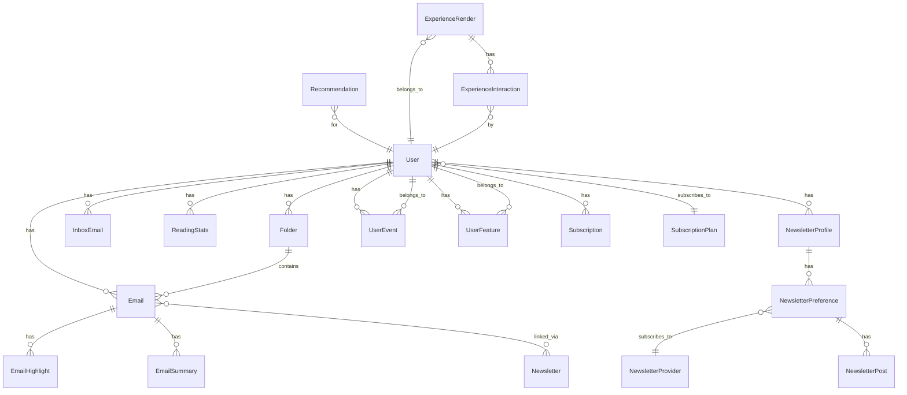

# Database Models Overview

The INBO Backend uses PostgreSQL as the primary database with Django ORM. This document provides an overview of all models and their relationships.

## Core Models

### User

**Table**: `users`

**Purpose**: Main user account model (extends Django's AbstractBaseUser and PermissionsMixin)

**Complete Field List**:
- `id` (UUIDField) - Primary key, auto-generated
- `email` (EmailField) - Unique email address, indexed
- `password` (CharField) - DEPRECATED: Legacy field (`null=True`, `blank=True`)
- `name` (CharField) - User's full name (`null=True`, `blank=True`)
- `created_at` (DateTimeField) - Account creation timestamp, indexed
- `updated_at` (DateTimeField) - Last update timestamp (auto_now=`True`)
- `storage_used` (BigIntegerField) - Storage used in bytes (default=0)
- `is_verified` (BooleanField) - Email verification status (default=`False`)
- `picture` (URLField) - Profile picture URL (`null=True`, `blank=True`)
- `primary_auth_method` (CharField) - Auth method: EMAIL or OAUTH (default=`EMAIL`)
- `summarization_used` (IntegerField) - AI summaries used count (default=0)
- `summarization_limit_reset` (DateTimeField) - Limit reset timestamp (default=timezone.now)
- `stripe_customer_id` (CharField) - Stripe customer ID (`null=True`, `blank=True`)
- `subscription_plan` (ForeignKey) - Current subscription plan → SubscriptionPlan (`null=True`)
- `subscription_status` (CharField) - Status: FREE, PENDING, ACTIVE, PAST_DUE, CANCELED, TRIALING (default=`FREE`)
- `subscription_end_date` (DateTimeField) - Subscription end date (`null=True`, `blank=True`)
- `streak_count` (IntegerField) - Current reading streak (default=0)
- `longest_streak` (IntegerField) - Longest streak achieved (default=0)
- `last_streak_date` (DateField) - Last streak date (`null=True`, `blank=True`)
- `streak_updated_at` (DateTimeField) - Streak last update (default=timezone.now)
- `fcm_token` (CharField) - FCM token for push notifications (`null=True`, `blank=True`)
- `is_staff` (BooleanField) - Django staff status (default=`False`)
- `is_active` (BooleanField) - Django active status (default=`True`)
- `date_joined` (DateTimeField) - Django date joined (default=timezone.now)
- `birth_year` (CharField) - Birth year (max_length=4, null=True, blank=True)
- `gender` (CharField) - Gender (max_length=50, null=True, blank=True)
- `inbox_username` (CharField) - @inbo.me username, unique, indexed (`null=True`, `blank=True`)
- `onboarding_completed` (BooleanField) - Onboarding completion status, indexed (default=`False`)
- `onboarding_completed_at` (DateTimeField) - Onboarding completion timestamp (`null=True`, `blank=True`)

**Model Methods**:
- `username` (property) - Returns inbox_username if set, otherwise email prefix
- `get_full_name()` - Returns name or email if name not set
- `get_short_name()` - Returns name or email if name not set

**Relationships**:
- One-to-Many: `inbox_emails`, `emails`, `folders`, `devices`, `sessions`, `reading_stats`, `verification_requests`, `newsletter_profiles`, `subscriptions`, `payment_transactions`, `gmail_accounts`, `integrations`, `experience_renders`, `experience_interactions`, `deletion_requests`, `auth_states`
- Foreign Key: `subscription_plan` → SubscriptionPlan (related_name='users')
- One-to-One: `user_feature` → UserFeature
- Many-to-Many: `groups`, `user_permissions` (Django auth)

**Indexes**:
- `email` - Unique index
- `inbox_username` - Unique index
- `created_at` - Index for sorting
- `onboarding_completed` - Index for filtering

**History Tracking**: Uses `simple_history` (excludes inbox_username, onboarding fields)

### Email

**Table**: `emails`

**Purpose**: Email messages received by users

**Complete Field List**:
- `id` (UUIDField) - Primary key, auto-generated
- `sender` (CharField) - Sender email address (max_length=255)
- `recipient` (ForeignKey) - Recipient inbox email → InboxEmail (`null=True`, `blank=True`, related_name='emails')
- `subject` (TextField) - Email subject (`null=True`, `blank=True`)
- `date_received` (DateTimeField) - Received timestamp, indexed (`null=True`, `blank=True`)
- `message_id` (CharField) - Email message ID (max_length=255, null=True, blank=True)
- `storage_path` (CharField) - Azure blob storage path (max_length=500, null=True, blank=True)
- `content_preview` (TextField) - Email content preview (`null=True`, `blank=True`)
- `is_read` (BooleanField) - Read status (default=`False`)
- `is_favorite` (BooleanField) - Favorite status (default=`False`)
- `is_read_later` (BooleanField) - Read later status (default=`False`)
- `reading_progress` (IntegerField) - Reading progress 0-100 (default=0)
- `created_at` (DateTimeField) - Creation timestamp, indexed (default=timezone.now)
- `content_size` (IntegerField) - Content size in bytes (default=1)
- `is_deleted` (BooleanField) - Soft delete flag (default=`False`)
- `deleted_at` (DateTimeField) - Deletion timestamp (`null=True`, `blank=True`)
- `permanent_delete_at` (DateTimeField) - Permanent deletion scheduled time (`null=True`, `blank=True`)
- `time_spent` (IntegerField) - Time spent reading in seconds (default=0)
- `words_count` (IntegerField) - Word count (default=0)
- `is_shared` (BooleanField) - Sharing status (default=`False`)
- `user` (ForeignKey) - Owner user → User (`null=True`, `blank=True`, related_name='emails')
- `folder` (ForeignKey) - Folder assignment → Folder (`null=True`, `blank=True`, `related_name='emails'`, `on_delete=SET_NULL`)
- `categories` (JSONField) - Email categories (default=`list`)

**Constraints**:
- `reading_progress` must be between 0 and 100
- `content_size` must be positive (> 0)
- `time_spent` must be non-negative (>= 0)
- `words_count` must be non-negative (>= 0)
- Unique together: `(recipient, message_id)`

**Model Methods**:
- `clean()` - Validates reading_progress, content_size, time_spent, words_count

**Relationships**:
- Many-to-One: `user` → User
- Many-to-One: `recipient` → InboxEmail
- Many-to-One: `folder` → Folder
- Many-to-Many: `newsletters` → Newsletter (via NewsletterEmail)
- One-to-Many: `highlights` → EmailHighlight
- One-to-One: `summary` → EmailSummary

**Indexes**:
- `user_id, is_deleted` - Composite index
- `created_at` - Index for sorting
- `user_id, is_deleted, -created_at` - Composite index for user queries
- `user_id, is_read, -date_received` - Composite index for unread emails

### Newsletter

**Table**: `newsletters`

**Purpose**: Newsletter subscriptions (inbox-based). Tracks newsletters that send emails to user's @inbo.me inbox.

**Important**: This is DIFFERENT from:
- `directory_app.NewsletterProvider`: Public newsletter directory
- `newsletter_profile_app.NewsletterPreference`: User preferences for newsletters

**Complete Field List**:
- `id` (UUIDField) - Primary key, auto-generated
- `recipient` (ForeignKey) - Recipient inbox email → InboxEmail (related_name='newsletters')
- `name` (CharField) - Newsletter name (max_length=255)
- `sender_email` (CharField) - Sender email address (max_length=255)
- `first_received` (DateTimeField) - First email received timestamp (`null=True`, `blank=True`)
- `last_received` (DateTimeField) - Last email received timestamp (`null=True`, `blank=True`)
- `email_count` (IntegerField) - Total emails received (default=0)
- `is_accepted` (BooleanField) - User acceptance status (default=`False`)

**Constraints**:
- `email_count` must be non-negative (>= 0)
- `last_received` cannot be before `first_received`
- Unique together: `(recipient, sender_email)`

**Model Methods**:
- `clean()` - Validates email_count and date ordering

**Relationships**:
- Many-to-One: `recipient` → InboxEmail
- Many-to-Many: `emails` → Email (via NewsletterEmail)

### Folder

**Table**: `folders`

**Purpose**: User email folders for organization

**Complete Field List**:
- `id` (UUIDField) - Primary key, auto-generated
- `name` (CharField) - Folder name (max_length=255)
- `user` (ForeignKey) - Owner user → User (related_name='folders')
- `created_at` (DateTimeField) - Creation timestamp (default=timezone.now)

**Constraints**:
- Unique together: `(user, name)` - One folder per name per user

**Relationships**:
- Many-to-One: `user` → User
- One-to-Many: `emails` → Email

### InboxEmail

**Table**: `inbox_emails`

**Purpose**: @inbo.me email addresses for users

**Complete Field List**:
- `id` (UUIDField) - Primary key, auto-generated
- `email` (CharField) - Username part (e.g., "john" for "john@inbo.me"), unique, indexed (max_length=255, unique=True)
- `user` (ForeignKey) - Owner user → User (related_name='inbox_emails')
- `created_at` (DateTimeField) - Creation timestamp (default=timezone.now)

**Relationships**:
- Many-to-One: `user` → User
- One-to-Many: `emails` → Email
- One-to-Many: `newsletters` → Newsletter

### ReadingStats

**Table**: `reading_stats`

**Purpose**: Daily reading statistics for users

**Complete Field List**:
- `id` (UUIDField) - Primary key, auto-generated
- `user` (ForeignKey) - Owner user → User (related_name='reading_stats')
- `total_emails` (IntegerField) - Total emails count (default=0)
- `today_read` (IntegerField) - Emails read today (default=0)
- `previous_read` (IntegerField) - Emails read previously (default=0)
- `created_at` (DateTimeField) - Statistics date/timestamp, indexed (default=timezone.now)
- `total_time_spent` (IntegerField) - Total time spent reading in seconds (default=0)
- `total_words_read` (IntegerField) - Total words read (default=0)

**Constraints**:
- All integer fields must be non-negative (>= 0)
- Unique together: `(user, created_at)` - One record per user per day

**Model Methods**:
- `clean()` - Validates all fields are non-negative

**Relationships**:
- Many-to-One: `user` → User

### VerificationRequest

**Table**: `verification_requests`

**Purpose**: Verification requests for email, OTP, password reset, etc.

**Complete Field List**:
- `id` (UUIDField) - Primary key, auto-generated
- `user` (ForeignKey) - Associated user → User (`null=True`, `blank=True`, related_name='verification_requests')
- `token` (CharField) - Hashed verification token (max_length=255)
- `created_at` (DateTimeField) - Request creation timestamp, indexed (default=timezone.now)
- `type` (CharField) - Verification type: EMAIL, FOGET_PASSWORD, OTP (max_length=20, default=EMAIL)
- `email` (EmailField) - Email address for OTP requests without user (`null=True`, `blank=True`)

**Constraints**:
- Unique together: `(user, type)` - One active request per type per user
- Index: `(email, type)` - For OTP lookups

**Relationships**:
- Many-to-One: `user` → User (optional)

### UserDevice

**Table**: `user_devices`

**Purpose**: Device tracking for user authentication and sessions

**Complete Field List**:
- `id` (UUIDField) - Primary key, auto-generated
- `user` (ForeignKey) - Owner user → User (related_name='devices')
- `device_id` (CharField) - Unique device identifier, indexed (max_length=255, unique=True)
- `device_name` (CharField) - Device name/description (max_length=255)
- `device_info` (JSONField) - Device information (`null=True`, `blank=True`)
- `ip_address` (GenericIPAddressField) - IP address (`null=True`, `blank=True`)
- `is_active` (BooleanField) - Active status (default=`True`)
- `last_active_at` (DateTimeField) - Last active timestamp (default=timezone.now)
- `created_at` (DateTimeField) - Device registration timestamp (default=timezone.now)

**Constraints**:
- Unique together: `(user, device_id)` - One device record per user per device

**Relationships**:
- Many-to-One: `user` → User
- One-to-Many: `sessions` → UserSession

**Indexes**:
- `device_id` - Unique index
- `user_id, is_active` - Composite index for active devices

### UserSession

**Table**: `user_sessions`

**Purpose**: User sessions with refresh token hashes

**Complete Field List**:
- `id` (UUIDField) - Primary key, auto-generated
- `user` (ForeignKey) - Owner user → User (related_name='sessions')
- `device` (ForeignKey) - Associated device → UserDevice (related_name='sessions')
- `refresh_token_hash` (CharField) - Hashed refresh token, unique, indexed (max_length=255, unique=True)
- `is_valid` (BooleanField) - Session validity status (default=`True`)
- `expires_at` (DateTimeField) - Expiration timestamp, indexed
- `last_used_at` (DateTimeField) - Last token usage timestamp (default=timezone.now)
- `created_at` (DateTimeField) - Session creation timestamp (default=timezone.now)

**Relationships**:
- Many-to-One: `user` → User
- Many-to-One: `device` → UserDevice

**Indexes**:
- `refresh_token_hash` - Unique index
- `user_id, is_valid` - Composite index for valid sessions
- `expires_at` - Index for expiration queries

### NewsletterEmail

**Table**: `newsletter_emails`

**Purpose**: Many-to-many relationship between newsletters and emails

**Complete Field List**:
- `newsletter` (ForeignKey) - Newsletter → Newsletter (related_name='newsletter_emails')
- `email` (ForeignKey) - Email → Email (related_name='newsletter_emails')

**Constraints**:
- Unique together: `(newsletter, email)` - One relationship per newsletter-email pair

**Relationships**:
- Many-to-One: `newsletter` → Newsletter
- Many-to-One: `email` → Email

### EmailSummary

**Table**: `email_summaries`

**Purpose**: AI-generated email summaries

**Complete Field List**:
- `email` (OneToOneField) - Email → Email (primary_key=True, related_name='summary')
- `summary` (TextField) - AI-generated summary text
- `created_at` (DateTimeField) - Summary creation timestamp (default=timezone.now)

**Relationships**:
- One-to-One: `email` → Email

### EmailHighlight

**Table**: `email_highlights`

**Purpose**: Email highlights/annotations

**Complete Field List**:
- `id` (UUIDField) - Primary key, auto-generated
- `email` (ForeignKey) - Email → Email (related_name='highlights')
- `text` (TextField) - Highlighted text
- `color` (CharField) - Highlight color (max_length=50, default='yellow')
- `note` (TextField) - User note (`null=True`, `blank=True`)
- `selection_info` (JSONField) - Selection metadata (position, range, etc.)
- `created_at` (DateTimeField) - Creation timestamp (default=timezone.now)
- `updated_at` (DateTimeField) - Last update timestamp (auto_now=`True`)

**Relationships**:
- Many-to-One: `email` → Email

### Waitlist

**Table**: `waitlist`

**Purpose**: Waitlist for early access

**Complete Field List**:
- `id` (UUIDField) - Primary key, auto-generated
- `email` (EmailField) - Email address, unique
- `username` (CharField) - Requested username, unique (max_length=255, null=True, blank=True)
- `location` (CharField) - User location (max_length=255, null=True, blank=True)
- `created_at` (DateTimeField) - Waitlist entry timestamp (default=timezone.now)

**Relationships**: None (standalone model)

## Directory Models

### NewsletterProvider

**Table**: `newsletter_providers`

**Purpose**: Newsletter provider directory (public directory of available newsletters)

**Important**: This is DIFFERENT from:
- `core.Newsletter`: User's inbox newsletter subscriptions
- `newsletter_profile_app.NewsletterPreference`: User preferences

**Complete Field List**:
- `id` (CharField) - Primary key (cuid format, max_length=255)
- `mongo_id` (CharField) - Legacy MongoDB ID, unique (max_length=255, unique=True)
- `url` (URLField) - Newsletter provider URL
- `domain` (CharField) - Domain name (max_length=255)
- `name` (CharField) - Provider name (max_length=255)
- `description` (TextField) - Description (`null=True`, `blank=True`)
- `author` (CharField) - Author name (max_length=255, null=True, blank=True)
- `target_audience` (TextField) - Target audience description (`null=True`, `blank=True`)
- `value_proposition` (TextField) - Value proposition (`null=True`, `blank=True`)
- `language` (CharField) - Language code (max_length=50, null=True, blank=True)
- `content_frequency` (CharField) - Content frequency (max_length=100, null=True, blank=True)
- `location` (CharField) - Location (max_length=255, null=True, blank=True)
- `icon_url` (URLField) - Newsletter icon/logo URL (max_length=500, null=True, blank=True)
- `normalized_domain` (CharField) - Normalized domain for search, indexed (max_length=255, null=True, blank=True)
- `platform_name` (CharField) - Platform name (Substack, ConvertKit, etc.), indexed (max_length=50, null=True, blank=True)
- `search_vector` (SearchVectorField) - Full-text search vector (`null=True`, `blank=True`)
- `created_at` (DateTimeField) - Creation timestamp (default=timezone.now)
- `updated_at` (DateTimeField) - Last update timestamp (auto_now=`True`)

**Constraints**:
- Unique constraint: `(domain, name)` (case-insensitive, when both not null)

**Relationships**:
- Many-to-Many: `categories` → NewsletterCategory (via NewsletterProviderCategory)
- Many-to-Many: `tags` → NewsletterTag (via NewsletterProviderTag)
- Many-to-Many: `cross_tags` → NewsletterCrossTag (via NewsletterProviderCrossTag)
- Many-to-Many: `tones` → NewsletterTone (via NewsletterProviderTone)
- Many-to-Many: `audience_levels` → NewsletterAudienceLevel (via NewsletterProviderAudienceLevel)
- Many-to-Many: `content_intents` → NewsletterContentIntent (via NewsletterProviderContentIntent)
- Many-to-Many: `content_formats` → NewsletterContentFormat (via NewsletterProviderContentFormat)

**Indexes**:
- `normalized_domain` - Index for domain lookups
- `platform_name` - Index for platform filtering
- `search_vector` - GIN index for full-text search
- Trigram GIN indexes on `target_audience` and `description` for fuzzy search

### NewsletterCategory

**Table**: `newsletter_categories`

**Purpose**: Newsletter categories (hierarchical)

**Complete Field List**:
- `id` (CharField) - Primary key (cuid format, max_length=255)
- `name` (CharField) - Category name (max_length=255)
- `level` (IntegerField) - Hierarchy level: 1, 2, 3, or 4
- `created_at` (DateTimeField) - Creation timestamp (default=timezone.now)

**Constraints**:
- Unique together: `(name, level)` - One category per name per level

**Relationships**:
- Many-to-Many: `newsletters` → NewsletterProvider (via NewsletterProviderCategory)

### Directory Metadata Models

All metadata models follow similar patterns with M2M relationship tables:

#### NewsletterTag
**Table**: `newsletter_tags`
- `id` (CharField) - Primary key (cuid)
- `name` (CharField) - Tag name, unique
- `slug` (SlugField) - URL slug, unique
- `description` (TextField) - Description
- `color` (CharField) - Hex color code
- `created_at` (DateTimeField)

#### NewsletterCrossTag
**Table**: `newsletter_cross_tags`
- `id` (CharField) - Primary key (cuid)
- `name` (CharField) - Cross tag name, unique
- `slug` (SlugField) - URL slug, unique
- `description` (TextField) - Description
- `color` (CharField) - Hex color code
- `icon` (CharField) - Icon identifier
- `created_at` (DateTimeField)

#### NewsletterTone
**Table**: `newsletter_tones`
- `id` (CharField) - Primary key (cuid)
- `name` (CharField) - Tone name, unique
- `description` (TextField) - Description
- `created_at` (DateTimeField)

#### NewsletterAudienceLevel
**Table**: `newsletter_audience_levels`
- `id` (CharField) - Primary key (cuid)
- `name` (CharField) - Level name, unique (Beginner, Intermediate, Advanced)
- `description` (TextField) - Description
- `order` (IntegerField) - Display order
- `created_at` (DateTimeField)

#### NewsletterContentIntent
**Table**: `newsletter_content_intents`
- `id` (CharField) - Primary key (cuid)
- `name` (CharField) - Intent name, unique
- `description` (TextField) - Description
- `created_at` (DateTimeField)

#### NewsletterContentFormat
**Table**: `newsletter_content_formats`
- `id` (CharField) - Primary key (cuid)
- `name` (CharField) - Format name, unique
- `description` (TextField) - Description
- `created_at` (DateTimeField)

#### M2M Relationship Tables
- `NewsletterProviderCategory` - Links providers to categories
- `NewsletterProviderTag` - Links providers to tags
- `NewsletterProviderCrossTag` - Links providers to cross tags
- `NewsletterProviderTone` - Links providers to tones
- `NewsletterProviderAudienceLevel` - Links providers to audience levels
- `NewsletterProviderContentIntent` - Links providers to content intents
- `NewsletterProviderContentFormat` - Links providers to content formats

All M2M tables have:
- `id` (CharField) - Primary key (cuid)
- `newsletter_provider` (ForeignKey) → NewsletterProvider
- Related model ForeignKey
- Unique together: `(newsletter_provider, related_model)`

## Additional Core Models

### VerificationRequest

**Table**: `verification_requests`

**Purpose**: Verification requests for email, OTP, password reset, etc.

**Complete Field List**:
- `id` (UUIDField) - Primary key, auto-generated
- `user` (ForeignKey) - Associated user → User (`null=True`, `blank=True`, related_name='verification_requests')
- `token` (CharField) - Hashed verification token (max_length=255)
- `created_at` (DateTimeField) - Request creation timestamp, indexed (default=timezone.now)
- `type` (CharField) - Verification type: EMAIL, FOGET_PASSWORD, OTP (max_length=20, default=EMAIL)
- `email` (EmailField) - Email address for OTP requests without user (`null=True`, `blank=True`)

**Constraints**:
- Unique together: `(user, type)` - One active request per type per user
- Index: `(email, type)` - For OTP lookups

**Relationships**:
- Many-to-One: `user` → User (optional)

### NewsletterEmail

**Table**: `newsletter_emails`

**Purpose**: Many-to-many relationship between newsletters and emails

**Complete Field List**:
- `newsletter` (ForeignKey) - Newsletter → Newsletter (related_name='newsletter_emails')
- `email` (ForeignKey) - Email → Email (related_name='newsletter_emails')

**Constraints**:
- Unique together: `(newsletter, email)` - One relationship per newsletter-email pair

**Relationships**:
- Many-to-One: `newsletter` → Newsletter
- Many-to-One: `email` → Email

### EmailSummary

**Table**: `email_summaries`

**Purpose**: AI-generated email summaries

**Complete Field List**:
- `email` (OneToOneField) - Email → Email (primary_key=True, related_name='summary')
- `summary` (TextField) - AI-generated summary text
- `created_at` (DateTimeField) - Summary creation timestamp (default=timezone.now)

**Relationships**:
- One-to-One: `email` → Email

### EmailHighlight

**Table**: `email_highlights`

**Purpose**: Email highlights/annotations

**Complete Field List**:
- `id` (UUIDField) - Primary key, auto-generated
- `email` (ForeignKey) - Email → Email (related_name='highlights')
- `text` (TextField) - Highlighted text
- `color` (CharField) - Highlight color (max_length=50, default='yellow')
- `note` (TextField) - User note (`null=True`, `blank=True`)
- `selection_info` (JSONField) - Selection metadata (position, range, etc.)
- `created_at` (DateTimeField) - Creation timestamp (default=timezone.now)
- `updated_at` (DateTimeField) - Last update timestamp (auto_now=`True`)

**Relationships**:
- Many-to-One: `email` → Email

### Waitlist

**Table**: `waitlist`

**Purpose**: Waitlist for early access

**Complete Field List**:
- `id` (UUIDField) - Primary key, auto-generated
- `email` (EmailField) - Email address, unique
- `username` (CharField) - Requested username, unique (max_length=255, null=True, blank=True)
- `location` (CharField) - User location (max_length=255, null=True, blank=True)
- `created_at` (DateTimeField) - Waitlist entry timestamp (default=timezone.now)

**Relationships**: None (standalone model)

## Newsletter Profile Models

### NewsletterProfile

**Table**: `newsletter_profile_app_newsletterprofile`

**Purpose**: User newsletter profile with preferences and settings

**Complete Field List**:
- `id` (UUIDField) - Primary key, auto-generated
- `user` (ForeignKey) - Owner user → User (related_name='newsletter_profiles', indexed)
- `email` (EmailField) - Profile email, indexed (max_length=255)
- `display_name` (CharField) - Display name (max_length=255, null=True, blank=True)
- `bio` (TextField) - Bio/description (`null=True`, `blank=True`)
- `avatar_url` (URLField) - Avatar URL (max_length=500, null=True, blank=True)
- `preferred_categories` (JSONField) - Preferred category IDs list (default=`list`)
- `preferred_frequency` (CharField) - Preferred frequency: daily, weekly, bi-weekly, monthly (max_length=50, default='weekly')
- `preferred_language` (CharField) - Preferred language code (max_length=10, default='en')
- `timezone_field` (CharField) - Timezone (db_column='timezone', max_length=100, null=True, blank=True)
- `email_notifications` (BooleanField) - Email notifications enabled (default=`True`)
- `push_notifications` (BooleanField) - Push notifications enabled (default=`True`)
- `digest_enabled` (BooleanField) - Digest enabled (default=`True`)
- `created_at` (DateTimeField) - Creation timestamp (default=timezone.now)
- `updated_at` (DateTimeField) - Last update timestamp (auto_now=`True`)

**Relationships**:
- Many-to-One: `user` → User
- One-to-Many: `preferences` → NewsletterPreference

### NewsletterPreference

**Table**: `newsletter_profile_app_newsletterpreference`

**Purpose**: User preferences for specific newsletters

**Complete Field List**:
- `id` (UUIDField) - Primary key, auto-generated
- `profile` (ForeignKey) - Newsletter profile → NewsletterProfile (related_name='preferences')
- `provider` (ForeignKey) - Newsletter provider → NewsletterProvider (from directory_app)
- `is_subscribed` (BooleanField) - Subscription status (default=`True`)
- `notification_enabled` (BooleanField) - Notification preference (default=`True`)
- `created_at` (DateTimeField) - Creation timestamp (default=timezone.now)
- `updated_at` (DateTimeField) - Last update timestamp (auto_now=`True`)

**Relationships**:
- Many-to-One: `profile` → NewsletterProfile
- Many-to-One: `provider` → NewsletterProvider
- One-to-Many: `posts` → NewsletterPost

### NewsletterPost

**Table**: `newsletter_profile_app_newsletterpost`

**Purpose**: Individual newsletter posts/articles

**Complete Field List**:
- `id` (UUIDField) - Primary key, auto-generated
- `preference` (ForeignKey) - Newsletter preference → NewsletterPreference (related_name='posts')
- `title` (CharField) - Post title (max_length=500)
- `description` (TextField) - Post description/summary
- `content` (TextField) - Full post content
- `post_url` (URLField) - Original post URL (max_length=500)
- `published_at` (DateTimeField) - Publication date, indexed
- `is_read` (BooleanField) - Read status (default=`False`)
- `reading_progress` (IntegerField) - Reading progress 0-100 (default=0)
- `word_count` (IntegerField) - Word count (default=0)
- `read_time_minutes` (IntegerField) - Estimated read time in minutes (default=0)
- `created_at` (DateTimeField) - Creation timestamp (default=timezone.now)
- `updated_at` (DateTimeField) - Last update timestamp (auto_now=`True`)

**Relationships**:
- Many-to-One: `preference` → NewsletterPreference

## Recommendation Models

### UserEvent

**Table**: `recommendation_user_events`

**Purpose**: User interaction events for recommendation learning

**Complete Field List**:
- `id` (UUIDField) - Primary key, auto-generated
- `user` (ForeignKey) - User → User (related_name='recommendation_events', indexed)
- `event_type` (CharField) - Event type: open, click, follow, unsubscribe, read_duration, share, dismiss, dwell_time (max_length=50, indexed)
- `item_id` (CharField) - Item identifier (newsletter provider ID or post ID), indexed (max_length=255)
- `item_type` (CharField) - Item type: newsletter, post, etc. (max_length=50, default='newsletter')
- `value` (FloatField) - Event value for read_duration, dwell_time (`null=True`, `blank=True`)
- `metadata` (JSONField) - Additional event data (default=`dict`)
- `device_type` (CharField) - Device type (max_length=50, null=True, blank=True)
- `app_section` (CharField) - App section: home, category, search, etc. (max_length=100, null=True, blank=True)
- `session_id` (CharField) - Session identifier, indexed (max_length=255, null=True, blank=True)
- `created_at` (DateTimeField) - Event timestamp, indexed (default=timezone.now)

**Relationships**:
- Many-to-One: `user` → User

**Indexes**:
- `user_id, event_type, -created_at` - Composite index
- `item_id, event_type, -created_at` - Composite index
- `created_at` - Index for time-based queries

### UserFeature

**Table**: `recommendation_user_features`

**Purpose**: User features for recommendation (cached/aggregated)

**Complete Field List**:
- `id` (UUIDField) - Primary key, auto-generated
- `user` (OneToOneField) - User → User (related_name='recommendation_features', indexed)
- `preferred_categories` (JSONField) - Preferred category IDs list (default=`list`)
- `preferred_tags` (JSONField) - Preferred tag IDs list (default=`list`)
- `preferred_languages` (JSONField) - Preferred languages list: `['en', 'es', etc.]` (default=`list`)
- `engagement_vector` (JSONField) - Engagement vector: `{category_id: engagement_score}` (default=`dict`)
- `total_opens` (IntegerField) - Total opens count (default=0)
- `total_clicks` (IntegerField) - Total clicks count (default=0)
- `total_follows` (IntegerField) - Total follows count (default=0)
- `avg_read_duration` (FloatField) - Average read duration in seconds (default=0.0)
- `signup_ts` (DateTimeField) - Signup timestamp (`null=True`, `blank=True`)
- `last_active_ts` (DateTimeField) - Last active timestamp, indexed (`null=True`, `blank=True`)
- `locale` (CharField) - User locale (max_length=10, default='en')
- `device_type` (CharField) - Device type (max_length=50, null=True, blank=True)
- `created_at` (DateTimeField) - Creation timestamp (default=timezone.now)
- `updated_at` (DateTimeField) - Last update timestamp (auto_now=`True`)

**Relationships**:
- One-to-One: `user` → User

### ItemFeature

**Table**: `recommendation_item_features`

**Purpose**: Item (newsletter) features for recommendation

**Complete Field List**:
- `id` (UUIDField) - Primary key, auto-generated
- `item_id` (CharField) - Item identifier (newsletter provider ID), unique, indexed (max_length=255, unique=True)
- `item_type` (CharField) - Item type: newsletter (max_length=50, default='newsletter')
- `newsletter_provider` (ForeignKey) - Newsletter provider → NewsletterProvider (`null=True`, `blank=True`, related_name='recommendation_features', to_field='id', indexed)
- `topics_embedding` (JSONField) - 512d embedding vector (`null=True`, `blank=True`)
- `description_embedding` (JSONField) - Description embedding vector (`null=True`, `blank=True`)
- `published_ts` (DateTimeField) - Publication timestamp, indexed (`null=True`, `blank=True`)
- `tags` (JSONField) - Tag IDs list (default=`list`)
- `categories` (JSONField) - Category IDs list (default=`list`)
- `language` (CharField) - Language code (max_length=10, null=True, blank=True)
- `avg_open_rate` (FloatField) - Average open rate 0-1 (default=0.0)
- `avg_click_rate` (FloatField) - Average click rate 0-1 (default=0.0)
- `total_subscribers` (IntegerField) - Total subscribers count (default=0)
- `total_opens` (IntegerField) - Total opens count (default=0)
- `total_clicks` (IntegerField) - Total clicks count (default=0)
- `length_minutes` (IntegerField) - Average read time in minutes (`null=True`, `blank=True`)
- `paid_flag` (BooleanField) - Paid newsletter flag (default=`False`)
- `provider_reputation_score` (FloatField) - Provider reputation score 0-1 (default=0.0)
- `freshness_boost` (FloatField) - Freshness boost 0-1 (default=1.0)
- `created_at` (DateTimeField) - Creation timestamp, indexed (default=timezone.now)
- `updated_at` (DateTimeField) - Last update timestamp (auto_now=`True`)
- `embedding_updated_at` (DateTimeField) - Embedding update timestamp (`null=True`, `blank=True`)

**Constraints**:
- `avg_open_rate` must be between 0 and 1
- `avg_click_rate` must be between 0 and 1
- `total_subscribers` must be non-negative (>= 0)
- `total_opens` must be non-negative (>= 0)
- `total_clicks` must be non-negative (>= 0)
- `provider_reputation_score` must be between 0 and 1
- `freshness_boost` must be between 0 and 1

**Model Methods**:
- `clean()` - Validates all constraint fields

**Relationships**:
- Many-to-One: `newsletter_provider` → NewsletterProvider (optional)

**Indexes**:
- `item_id` - Unique index
- `published_ts` - Index for time-based queries
- `avg_open_rate` - Index for sorting
- `newsletter_provider_id, provider_reputation_score` - Composite index

### Recommendation

**Table**: `recommendation_recommendations`

**Purpose**: Precomputed or cached recommendations

**Complete Field List**:
- `id` (UUIDField) - Primary key, auto-generated
- `user` (ForeignKey) - User → User (related_name='recommendations', indexed)
- `item_id` (CharField) - Recommended item identifier, indexed (max_length=255)
- `item_type` (CharField) - Item type: newsletter (max_length=50, default='newsletter')
- `score` (FloatField) - Final recommendation score, indexed
- `rank` (IntegerField) - Position in recommendation list
- `personal_score` (FloatField) - Personalization score component (default=0.0)
- `similarity_score` (FloatField) - Similarity score component (default=0.0)
- `popularity_score` (FloatField) - Popularity score component (default=0.0)
- `freshness_score` (FloatField) - Freshness score component (default=0.0)
- `reason` (TextField) - Human-readable explanation (`null=True`, `blank=True`)
- `explanation_metadata` (JSONField) - Detailed explanation data (default=`dict`)
- `model_version` (CharField) - Model version identifier (max_length=50, default='v1')
- `recommendation_mode` (CharField) - Mode: personalized, trending, category, hybrid (max_length=50, default='hybrid')
- `context_features` (JSONField) - Context features: time_of_day, day_of_week, etc. (default=`dict`)
- `created_at` (DateTimeField) - Creation timestamp, indexed (default=timezone.now)
- `expires_at` (DateTimeField) - Cache expiration timestamp, indexed (`null=True`, `blank=True`)

**Constraints**:
- Unique together: `(user, item_id, recommendation_mode, created_at)` - One recommendation per user/item/mode/time

**Relationships**:
- Many-to-One: `user` → User

**Indexes**:
- `user_id, -score, -created_at` - Composite index for user recommendations
- `user_id, recommendation_mode, -created_at` - Composite index for mode filtering
- `expires_at` - Index for cache expiration queries

### RecommendationExplanation

**Table**: `recommendation_explanations`

**Purpose**: Detailed explanations for recommendations (for debugging/transparency)

**Complete Field List**:
- `id` (UUIDField) - Primary key, auto-generated
- `user` (ForeignKey) - User → User (related_name='recommendation_explanations', indexed)
- `item_id` (CharField) - Item identifier, indexed (max_length=255)
- `explanation_text` (TextField) - Human-readable explanation
- `contributing_factors` (JSONField) - Detailed breakdown dictionary (default=`dict`)
- `similar_items` (JSONField) - Items user interacted with that led to this (default=`list`)
- `category_match` (JSONField) - Category preferences match (default=`dict`)
- `tag_match` (JSONField) - Tag preferences match (default=`dict`)
- `model_version` (CharField) - Model version (max_length=50)
- `recommendation_mode` (CharField) - Recommendation mode (max_length=50)
- `created_at` (DateTimeField) - Creation timestamp, indexed (default=timezone.now)

**Relationships**:
- Many-to-One: `user` → User

**Indexes**:
- `user_id, item_id, -created_at` - Composite index

## Integration Models

### GmailAccount

**Table**: `gmail_accounts`

**Purpose**: Connected Gmail accounts

**Complete Field List**:
- `id` (UUIDField) - Primary key, auto-generated
- `user` (ForeignKey) - User → User (related_name='gmail_accounts')
- `email` (EmailField) - Gmail email address
- `access_token` (TextField) - Encrypted access token
- `refresh_token` (TextField) - Encrypted refresh token
- `expiry` (DateTimeField) - Token expiry timestamp (`null=True`, `blank=True`)
- `needs_reauth` (BooleanField) - Re-authentication needed (default=`False`)
- `last_sync_time` (DateTimeField) - Last sync timestamp (`null=True`, `blank=True`)
- `created_at` (DateTimeField) - Connection timestamp (default=timezone.now)
- `updated_at` (DateTimeField) - Last update timestamp (auto_now=`True`)

**Constraints**:
- Unique together: `(user, email)` - One Gmail account per email per user

**Relationships**:
- Many-to-One: `user` → User
- One-to-Many: `allowed_senders` → AllowedSender
- One-to-Many: `sync_controls` → SyncControl

### AllowedSender

**Table**: `allowed_senders`

**Purpose**: Allowed senders for Gmail accounts

**Complete Field List**:
- `id` (UUIDField) - Primary key, auto-generated
- `gmail_account` (ForeignKey) - Gmail account → GmailAccount (related_name='allowed_senders')
- `sender_email` (EmailField) - Allowed sender email
- `sender_name` (CharField) - Sender name (max_length=255)
- `created_at` (DateTimeField) - Creation timestamp (default=timezone.now)

**Constraints**:
- Unique together: `(gmail_account, sender_email)` - One record per sender per account

**Relationships**:
- Many-to-One: `gmail_account` → GmailAccount

### SyncControl

**Table**: `sync_control`

**Purpose**: Gmail sync control (singleton pattern)

**Complete Field List**:
- `id` (CharField) - Primary key (default='main', max_length=50)
- `last_offset` (IntegerField) - Last sync offset (default=0)
- `batch_size` (IntegerField) - Batch size for syncing (default=500)
- `last_run_at` (DateTimeField) - Last sync run timestamp (default=timezone.now)
- `is_running` (BooleanField) - Sync in progress flag (default=`False`)
- `updated_at` (DateTimeField) - Last update timestamp (auto_now=`True`)

**Relationships**: None (singleton model)

### Integration

**Table**: `integrations`

**Purpose**: User integrations with external services (Pocket, Notion, Evernote)

**Complete Field List**:
- `id` (UUIDField) - Primary key, auto-generated
- `user` (ForeignKey) - User → User (related_name='integrations')
- `type` (CharField) - Integration type: POCKET, NOTION, EVERNOTE (max_length=20)
- `access_token` (TextField) - Encrypted access token
- `refresh_token` (TextField) - Encrypted refresh token (`null=True`, `blank=True`)
- `token_expiry` (DateTimeField) - Token expiry timestamp (`null=True`, `blank=True`)
- `username` (CharField) - Service username (max_length=255, null=True, blank=True)
- `connected_at` (DateTimeField) - Connection timestamp (default=timezone.now)
- `last_used_at` (DateTimeField) - Last usage timestamp (`null=True`, `blank=True`)
- `is_active` (BooleanField) - Active status (default=`True`)
- `metadata` (JSONField) - Additional metadata (`null=True`, `blank=True`)

**Constraints**:
- Unique together: `(user, type)` - One integration per type per user

**Relationships**:
- Many-to-One: `user` → User

### AuthState

**Table**: `auth_states`

**Purpose**: OAuth state tracking for integrations

**Complete Field List**:
- `id` (UUIDField) - Primary key, auto-generated
- `state` (CharField) - OAuth state string, unique, indexed (max_length=255, unique=True)
- `user` (ForeignKey) - User → User (related_name='auth_states')
- `service_type` (CharField) - Service type: POCKET, NOTION, EVERNOTE (max_length=20)
- `request_token` (CharField) - OAuth request token (max_length=255, null=True, blank=True)
- `created_at` (DateTimeField) - Creation timestamp (default=timezone.now)
- `expires_at` (DateTimeField) - Expiration timestamp
- `is_used` (BooleanField) - State used flag (default=`False`)

**Constraints**:
- Unique together: `(user, service_type)` - One active state per service per user

**Relationships**:
- Many-to-One: `user` → User

## Experience Models

### ExperienceRender

**Table**: `experience_renders`

**Purpose**: Experience rendering tracking for analytics

**Complete Field List**:
- `id` (UUIDField) - Primary key, auto-generated
- `user` (ForeignKey) - User → User (related_name='experience_renders', indexed)
- `session_id` (CharField) - Session identifier, indexed (max_length=255, null=True, blank=True)
- `page` (CharField) - Page name: home, search, category, reading, profile (max_length=100, indexed)
- `intent` (CharField) - User intent: discovery, task_driven, consumption (max_length=50)
- `sections` (JSONField) - List of section types rendered (default=`list`)
- `context` (JSONField) - Context metadata: time_of_day, device, location (default=`dict`)
- `created_at` (DateTimeField) - Render timestamp, indexed (default=timezone.now)

**Relationships**:
- Many-to-One: `user` → User
- One-to-Many: `interactions` → ExperienceInteraction

**Indexes**:
- `user_id, -created_at` - Composite index for user queries
- `page, -created_at` - Composite index for page queries
- `session_id, -created_at` - Composite index for session queries

### ExperienceInteraction

**Table**: `experience_interactions`

**Purpose**: User interactions with experience elements

**Complete Field List**:
- `id` (UUIDField) - Primary key, auto-generated
- `user` (ForeignKey) - User → User (related_name='experience_interactions', indexed)
- `session_id` (CharField) - Session identifier, indexed (max_length=255, null=True, blank=True)
- `render` (ForeignKey) - Experience render → ExperienceRender (`null=True`, `blank=True`, related_name='interactions', on_delete=SET_NULL)
- `interaction_type` (CharField) - Type: view, click, scroll, dwell, dismiss (max_length=50, indexed)
- `section_type` (CharField) - Section type (max_length=100, null=True, blank=True)
- `item_id` (CharField) - Item identifier, indexed (max_length=255, null=True, blank=True)
- `position` (IntegerField) - Position in section list (`null=True`, `blank=True`)
- `dwell_time` (FloatField) - Dwell time in seconds (`null=True`, `blank=True`)
- `scroll_depth` (FloatField) - Scroll depth percentage (`null=True`, `blank=True`)
- `metadata` (JSONField) - Additional interaction metadata (default=`dict`)
- `created_at` (DateTimeField) - Interaction timestamp, indexed (default=timezone.now)

**Relationships**:
- Many-to-One: `user` → User
- Many-to-One: `render` → ExperienceRender (optional)

**Indexes**:
- `user_id, interaction_type, -created_at` - Composite index
- `section_type, -created_at` - Composite index
- `item_id, -created_at` - Composite index
- `render_id, -created_at` - Composite index

### ExperienceSectionMetrics

**Table**: `experience_section_metrics`

**Purpose**: Aggregated metrics for section performance (updated by Celery tasks)

**Complete Field List**:
- `id` (UUIDField) - Primary key, auto-generated
- `section_type` (CharField) - Section type identifier, indexed (max_length=100)
- `page` (CharField) - Page name, indexed (max_length=100)
- `period_start` (DateTimeField) - Period start timestamp, indexed
- `period_end` (DateTimeField) - Period end timestamp, indexed
- `total_renders` (IntegerField) - Total renders count (default=0)
- `total_interactions` (IntegerField) - Total interactions count (default=0)
- `total_clicks` (IntegerField) - Total clicks count (default=0)
- `total_views` (IntegerField) - Total views count (default=0)
- `click_through_rate` (FloatField) - CTR: clicks / views (default=0.0)
- `avg_dwell_time` (FloatField) - Average dwell time in seconds (default=0.0)
- `avg_position` (FloatField) - Average position when clicked (default=0.0)
- `engagement_score` (FloatField) - Calculated engagement score, indexed (default=0.0)
- `created_at` (DateTimeField) - Creation timestamp (default=timezone.now)
- `updated_at` (DateTimeField) - Last update timestamp (auto_now=`True`)

**Constraints**:
- Unique together: `(section_type, page, period_start, period_end)` - One metric per section/page/period

**Relationships**: None (aggregated data)

**Indexes**:
- `section_type, page, -period_end` - Composite index
- `-engagement_score` - Index for sorting by engagement

## Subscription Models

### SubscriptionPlan

**Table**: `subscription_plans`

**Purpose**: Subscription plan definitions

**Complete Field List**:
- `id` (UUIDField) - Primary key, auto-generated
- `name` (CharField) - Plan name, unique (max_length=255, unique=True)
- `description` (TextField) - Plan description
- `price` (MoneyField) - Price (max_digits=10, decimal_places=2, default_currency='USD')
- `currency` (CharField) - Currency code (max_length=3, default='USD')
- `billing_interval` (CharField) - Billing interval: MONTHLY or ANNUAL (max_length=20)
- `features` (JSONField) - Plan features dictionary (default=`dict`)
- `is_active` (BooleanField) - Active status (default=`True`)
- `created_at` (DateTimeField) - Creation timestamp (default=timezone.now)
- `updated_at` (DateTimeField) - Last update timestamp (auto_now=`True`)
- `stripe_product_id` (CharField) - Stripe product ID (max_length=255, null=True, blank=True)
- `stripe_price_id` (CharField) - Stripe price ID (max_length=255, null=True, blank=True)
- `storage_limit` (BigIntegerField) - Storage limit in bytes (default=268435456 = 256 MB)
- `summarization_limit` (IntegerField) - AI summarization limit (default=50)

**History Tracking**: Uses `simple_history`

**Relationships**:
- One-to-Many: `subscriptions` → Subscription
- One-to-Many: `users` → User (via User.subscription_plan)

### Subscription

**Table**: `subscriptions`

**Purpose**: User subscriptions

**Complete Field List**:
- `id` (UUIDField) - Primary key, auto-generated
- `user` (ForeignKey) - User → User (related_name='subscriptions')
- `subscription_plan` (ForeignKey) - Subscription plan → SubscriptionPlan (related_name='subscriptions', on_delete=PROTECT)
- `stripe_subscription_id` (CharField) - Stripe subscription ID (max_length=255, null=True, blank=True)
- `status` (CharField) - Status: FREE, PENDING, ACTIVE, PAST_DUE, CANCELED, TRIALING (max_length=20, default=FREE)
- `current_period_start` (DateTimeField) - Current billing period start
- `current_period_end` (DateTimeField) - Current billing period end
- `cancel_at_period_end` (BooleanField) - Cancel at period end flag (default=`False`)
- `canceled_at` (DateTimeField) - Cancellation timestamp (`null=True`, `blank=True`)
- `created_at` (DateTimeField) - Creation timestamp (default=timezone.now)
- `updated_at` (DateTimeField) - Last update timestamp (auto_now=`True`)

**History Tracking**: Uses `simple_history`

**Relationships**:
- Many-to-One: `user` → User
- Many-to-One: `subscription_plan` → SubscriptionPlan
- One-to-Many: `transactions` → PaymentTransaction
- One-to-Many: `subscription_events` → SubscriptionEvent

### PaymentTransaction

**Table**: `payment_transactions`

**Purpose**: Payment transactions

**Complete Field List**:
- `id` (UUIDField) - Primary key, auto-generated
- `user` (ForeignKey) - User → User (related_name='payment_transactions')
- `amount` (MoneyField) - Payment amount (max_digits=10, decimal_places=2, default_currency='USD')
- `currency` (CharField) - Currency code (max_length=3, default='USD')
- `status` (CharField) - Status: PENDING, SUCCEEDED, FAILED, REFUNDED (max_length=20, default=PENDING)
- `stripe_payment_intent_id` (CharField) - Stripe payment intent ID (max_length=255, null=True, blank=True)
- `subscription` (ForeignKey) - Associated subscription → Subscription (`null=True`, `blank=True`, related_name='transactions', on_delete=SET_NULL)
- `description` (TextField) - Transaction description (`null=True`, `blank=True`)
- `payment_method` (CharField) - Payment method (max_length=255, null=True, blank=True)
- `metadata` (JSONField) - Additional metadata (`null=True`, `blank=True`)
- `created_at` (DateTimeField) - Creation timestamp (default=timezone.now)
- `updated_at` (DateTimeField) - Last update timestamp (auto_now=`True`)

**Relationships**:
- Many-to-One: `user` → User
- Many-to-One: `subscription` → Subscription (optional)

### SubscriptionEvent

**Table**: `subscription_events`

**Purpose**: Subscription lifecycle events

**Complete Field List**:
- `id` (UUIDField) - Primary key, auto-generated
- `subscription` (ForeignKey) - Subscription → Subscription (related_name='subscription_events')
- `event_type` (CharField) - Event type: CREATED, RENEWED, CANCELED, PAYMENT_FAILED, PLAN_CHANGED, TRIAL_STARTED, TRIAL_ENDED (max_length=30)
- `metadata` (JSONField) - Event metadata (`null=True`, `blank=True`)
- `created_at` (DateTimeField) - Event timestamp (default=timezone.now)

**Relationships**:
- Many-to-One: `subscription` → Subscription

## Account Deletion Models

### AccountDeletionRequest

**Table**: `account_deletion_requests`

**Purpose**: GDPR-compliant account deletion requests

**Complete Field List**:
- `id` (UUIDField) - Primary key, auto-generated
- `user` (ForeignKey) - User → User (`null=True`, `blank=True`, related_name='deletion_requests')
- `email` (EmailField) - Email used during signup, indexed (`null=True`, `blank=True`)
- `reason` (TextField) - Deletion reason (`null=True`, `blank=True`)
- `status` (CharField) - Status: PENDING, SCHEDULED, PROCESSING, COMPLETED, CANCELLED, FAILED (max_length=20, default=PENDING, indexed)
- `requested_at` (DateTimeField) - Request timestamp, indexed (default=timezone.now)
- `scheduled_deletion_at` (DateTimeField) - Scheduled deletion time (30 days from request), indexed
- `processed_at` (DateTimeField) - Processing completion timestamp (`null=True`, `blank=True`)
- `cancelled_at` (DateTimeField) - Cancellation timestamp (`null=True`, `blank=True`)
- `ip_address` (GenericIPAddressField) - Request IP address (`null=True`, `blank=True`)
- `user_agent` (TextField) - User agent string (`null=True`, `blank=True`)

**Constraints**:
- Unique together: `(email, status)` - One active deletion request per email

**Relationships**:
- Many-to-One: `user` → User (optional)

**Indexes**:
- `scheduled_deletion_at` - Index for scheduled deletions
- `status` - Index for status filtering
- `email` - Index for email lookups

## Model Relationships Diagram



## Complete Model Index Reference

### User Model Indexes
- `email` - Unique index
- `inbox_username` - Unique index
- `created_at` - Index for sorting
- `onboarding_completed` - Index for filtering

### Email Model Indexes
- `user_id, is_deleted` - Composite index
- `created_at` - Index for sorting
- `user_id, is_deleted, -created_at` - Composite index for user queries
- `user_id, is_read, -date_received` - Composite index for unread emails
- `date_received` - Index for date queries

### Newsletter Model Indexes
- `recipient_id` - Foreign key index
- `sender_email` - Index for lookup
- Unique: `(recipient_id, sender_email)`

### VerificationRequest Indexes
- `created_at` - Index for expiration queries
- `email, type` - Composite index for OTP lookups
- Unique: `(user_id, type)`

### UserDevice Indexes
- `device_id` - Unique index
- `user_id, is_active` - Composite index

### UserSession Indexes
- `refresh_token_hash` - Unique index
- `user_id, is_valid` - Composite index
- `expires_at` - Index for expiration queries

### ReadingStats Indexes
- `created_at` - Index for date queries
- Unique: `(user_id, created_at)`

### NewsletterProvider Indexes
- `normalized_domain` - Index for domain lookups
- `platform_name` - Index for platform filtering
- `search_vector` - GIN index for full-text search
- Trigram GIN indexes on `target_audience` and `description`

### ExperienceRender Indexes
- `user_id, -created_at` - Composite index
- `page, -created_at` - Composite index
- `session_id, -created_at` - Composite index

### ExperienceInteraction Indexes
- `user_id, interaction_type, -created_at` - Composite index
- `section_type, -created_at` - Composite index
- `item_id, -created_at` - Composite index
- `render_id, -created_at` - Composite index

### ExperienceSectionMetrics Indexes
- `section_type, page, -period_end` - Composite index
- `-engagement_score` - Index for sorting

### AccountDeletionRequest Indexes
- `scheduled_deletion_at` - Index for scheduled deletions
- `status` - Index for status filtering
- `email` - Index for email lookups

## Model Constraints and Validations

### Check Constraints

#### Email Model
- `reading_progress` must be between 0 and 100
- `content_size` must be positive (> 0)
- `time_spent` must be non-negative (>= 0)
- `words_count` must be non-negative (>= 0)

#### Newsletter Model
- `email_count` must be non-negative (>= 0)
- `last_received` cannot be before `first_received`

#### ReadingStats Model
- All integer fields must be non-negative (>= 0)

### Unique Constraints

- `User.email` - Unique email address
- `User.inbox_username` - Unique inbox username
- `Email(recipient, message_id)` - Unique email per recipient
- `Newsletter(recipient, sender_email)` - Unique newsletter per recipient
- `Folder(user, name)` - Unique folder name per user
- `UserDevice(user, device_id)` - Unique device per user
- `UserSession.refresh_token_hash` - Unique refresh token hash
- `VerificationRequest(user, type)` - One request per type per user
- `GmailAccount(user, email)` - One Gmail account per email per user
- `Integration(user, type)` - One integration per type per user
- `NewsletterProfile.user` - One profile per user
- `NewsletterPreference(profile, provider)` - One preference per provider per profile
- `ReadingStats(user, created_at)` - One stat per user per day

### Model Validation Methods

All models with constraints implement `clean()` method for validation:
- `Email.clean()` - Validates reading_progress, content_size, time_spent, words_count
- `Newsletter.clean()` - Validates email_count and date ordering
- `ReadingStats.clean()` - Validates all fields are non-negative

## Database Migrations

Migrations are managed through Django's migration system:

```bash
# Create migrations
python manage.py makemigrations

# Apply migrations
python manage.py migrate

# Show migration status
python manage.py showmigrations

# Rollback last migration
python manage.py migrate <app_name> <previous_migration_number>
```

### Migration Best Practices

1. **Always test migrations** on a copy of production data
2. **Use data migrations** for complex data transformations
3. **Add indexes in separate migrations** for large tables
4. **Use `RunPython`** for custom migration logic
5. **Test rollback procedures** before deploying

## Common Query Patterns

### User Queries

```python
from core.models import User, Email, Folder

# Get user with related data
user = User.objects.select_related('subscription_plan').prefetch_related(
    'emails', 'folders', 'devices'
).get(email='user@example.com')

# Get user's unread emails
unread_emails = Email.objects.filter(
    user=user,
    is_read=False
).order_by('-date_received')

# Get user's reading streak
user = User.objects.get(email='user@example.com')
current_streak = user.streak_count
longest_streak = user.longest_streak
```

### Email Queries

```python
from core.models import Email, Folder

# Get emails in folder
folder_emails = Email.objects.filter(
    user=user,
    folder__name='Work'
).select_related('folder')

# Get favorite emails
favorites = Email.objects.filter(
    user=user,
    is_favorite=True
).order_by('-date_received')

# Get emails by date range
from django.utils import timezone
from datetime import timedelta

week_ago = timezone.now() - timedelta(days=7)
recent_emails = Email.objects.filter(
    user=user,
    date_received__gte=week_ago
)

# Get unread count
unread_count = Email.objects.filter(
    user=user,
    is_read=False
).count()
```

### Newsletter Queries

```python
from django.db.models import Count
from core.models import Newsletter, NewsletterEmail

# Get user's newsletters
newsletters = Newsletter.objects.filter(
    user=user,
    is_accepted=True
).prefetch_related('emails')

# Get newsletter with email count
newsletter = Newsletter.objects.annotate(
    email_count=Count('emails')
).get(id=newsletter_id)
```

### Folder Queries

```python
from django.db.models import Count
from core.models import Folder

# Get folders with email counts
folders = Folder.objects.filter(
    user=user
).annotate(
    email_count=Count('emails')
).order_by('name')

# Search folder by name
folders = Folder.objects.filter(
    user=user,
    name__icontains='work'
)
```

### Aggregation Queries

```python
from django.db.models import Count, Sum, Avg, Q
from core.models import Email, ReadingStats

# Get email statistics
stats = Email.objects.filter(user=user).aggregate(
    total=Count('id'),
    unread=Count('id', filter=Q(is_read=False)),
    favorites=Count('id', filter=Q(is_favorite=True))
)

# Get reading statistics
reading_stats = ReadingStats.objects.filter(
    user=user
).aggregate(
    total_time=Sum('time_spent'),
    total_words=Sum('words_read'),
    avg_time=Avg('time_spent')
)
```

## Database Optimization

### Query Optimization
- Use `select_related()` for ForeignKey relationships
- Use `prefetch_related()` for Many-to-Many relationships
- Use `only()` and `defer()` to limit fields
- Use `annotate()` and `aggregate()` for calculations

**Example**:
```python
# Efficient: Uses select_related
emails = Email.objects.select_related('user', 'folder').all()

# Efficient: Uses prefetch_related for M2M
providers = NewsletterProvider.objects.prefetch_related('categories', 'tags').all()

# Efficient: Only fetch needed fields
users = User.objects.only('id', 'email', 'name').all()
```

### Indexing Strategy
- Index frequently queried fields
- Index foreign keys
- Create composite indexes for common query patterns
- Monitor slow queries and add indexes as needed

**Current Indexes**:
- `User.email` - Unique index
- `User.inbox_username` - Unique index
- `User.created_at` - Index for sorting
- `Email.user_id` - Foreign key index
- `Email.date_received` - Index for sorting
- `Email.folder_id` - Foreign key index
- Composite: `(Email.user_id, Email.date_received)` - For user email queries

## Model Methods and Properties

### User Model Methods

```python
# Properties
user.username  # Returns inbox_username or email prefix

# Methods
user.get_full_name()  # Returns name or email
user.get_short_name()  # Returns name or email
```

### Email Model Methods

```python
# Validation
email.clean()  # Validates constraints before save
```

### Newsletter Model Methods

```python
# Validation
newsletter.clean()  # Validates email_count and dates
```

### ReadingStats Model Methods

```python
# Validation
stats.clean()  # Validates all fields are non-negative
```

## Model Usage Patterns

### Creating Records

```python
# Create user
user = User.objects.create_user(
    email='user@example.com',
    name='John Doe'
)

# Create email
email = Email.objects.create(
    user=user,
    sender='newsletter@example.com',
    subject='Newsletter Title',
    recipient=inbox_email
)

# Create folder
folder = Folder.objects.create(
    user=user,
    name='Work'
)
```

### Querying with Relationships

```python
# Get user with all related data
user = User.objects.select_related(
    'subscription_plan'
).prefetch_related(
    'inbox_emails',
    'folders',
    'devices',
    'sessions',
    'emails',
    'reading_stats'
).get(email='user@example.com')

# Get emails with highlights and summary
emails = Email.objects.select_related(
    'user', 'folder', 'recipient'
).prefetch_related(
    'highlights', 'summary'
).filter(user=user)
```

### Bulk Operations

```python
# Bulk create
emails = [Email(...) for _ in range(100)]
Email.objects.bulk_create(emails)

# Bulk update
Email.objects.filter(user=user, is_read=False).update(is_read=True)

# Bulk delete
Email.objects.filter(user=user, is_deleted=True).delete()
```

## Model Field Types Reference

### Common Field Types

- **UUIDField** - UUID primary keys (auto-generated)
- **CharField** - Short text (requires max_length)
- **TextField** - Long text (unlimited length)
- **EmailField** - Email address (validates format)
- **URLField** - URL (validates format)
- **IntegerField** - Integer numbers
- **BigIntegerField** - Large integers (for storage, etc.)
- **FloatField** - Floating point numbers
- **BooleanField** - True/False values
- **DateTimeField** - Date and time
- **DateField** - Date only
- **JSONField** - JSON data (PostgreSQL)
- **MoneyField** - Money amounts (djmoney)
- **GenericIPAddressField** - IP addresses
- **SearchVectorField** - Full-text search vector (PostgreSQL)

### Field Options

- `null=True` - Allows NULL in database
- `blank=True` - Allows empty in forms
- `default=value` - Default value
- `unique=True` - Unique constraint
- `db_index=True` - Creates database index
- `db_column='name'` - Custom column name
- `related_name='name'` - Reverse relation name
- `on_delete` - Deletion behavior: CASCADE, SET_NULL, PROTECT, etc.

## Complete Model Inventory

### Core App Models (13 models)
1. ✅ **User** - Main user account
2. ✅ **VerificationRequest** - Email/OTP verification
3. ✅ **UserDevice** - Device tracking
4. ✅ **UserSession** - Session management
5. ✅ **InboxEmail** - @inbo.me email addresses
6. ✅ **Folder** - Email folders
7. ✅ **Email** - Email messages
8. ✅ **Newsletter** - Newsletter subscriptions (inbox-based)
9. ✅ **NewsletterEmail** - M2M: Newsletters ↔ Emails
10. ✅ **EmailSummary** - AI-generated summaries
11. ✅ **EmailHighlight** - Email highlights/annotations
12. ✅ **ReadingStats** - Daily reading statistics
13. ✅ **Waitlist** - Waitlist entries

### Directory App Models (15 models)
1. ✅ **NewsletterProvider** - Newsletter directory
2. ✅ **NewsletterCategory** - Categories
3. ✅ **NewsletterProviderCategory** - M2M: Providers ↔ Categories
4. ✅ **NewsletterTag** - Tags
5. ✅ **NewsletterProviderTag** - M2M: Providers ↔ Tags
6. ✅ **NewsletterCrossTag** - Cross tags
7. ✅ **NewsletterProviderCrossTag** - M2M: Providers ↔ Cross Tags
8. ✅ **NewsletterTone** - Tones
9. ✅ **NewsletterProviderTone** - M2M: Providers ↔ Tones
10. ✅ **NewsletterAudienceLevel** - Audience levels
11. ✅ **NewsletterProviderAudienceLevel** - M2M: Providers ↔ Audience Levels
12. ✅ **NewsletterContentIntent** - Content intents
13. ✅ **NewsletterProviderContentIntent** - M2M: Providers ↔ Content Intents
14. ✅ **NewsletterContentFormat** - Content formats
15. ✅ **NewsletterProviderContentFormat** - M2M: Providers ↔ Content Formats

### Newsletter Profile App Models (3 models)
1. ✅ **NewsletterProfile** - User newsletter profile
2. ✅ **NewsletterPreference** - User preferences for newsletters
3. ✅ **NewsletterPost** - Individual newsletter posts

### Recommendation Engine Models (5 models)
1. ✅ **UserEvent** - User interaction events
2. ✅ **UserFeature** - User features
3. ✅ **ItemFeature** - Item features
4. ✅ **Recommendation** - Precomputed recommendations
5. ✅ **RecommendationExplanation** - Recommendation explanations

### Experience App Models (3 models)
1. ✅ **ExperienceRender** - Experience rendering tracking
2. ✅ **ExperienceInteraction** - User interactions
3. ✅ **ExperienceSectionMetrics** - Aggregated section metrics

### Subscription App Models (4 models)
1. ✅ **SubscriptionPlan** - Subscription plans
2. ✅ **Subscription** - User subscriptions
3. ✅ **PaymentTransaction** - Payment transactions
4. ✅ **SubscriptionEvent** - Subscription lifecycle events

### Integration App Models (2 models)
1. ✅ **Integration** - External service integrations
2. ✅ **AuthState** - OAuth state tracking

### Gmail App Models (3 models)
1. ✅ **GmailAccount** - Connected Gmail accounts
2. ✅ **AllowedSender** - Allowed senders
3. ✅ **SyncControl** - Gmail sync control

### Account Deletion App Models (1 model)
1. ✅ **AccountDeletionRequest** - Account deletion requests

### Total Model Count: **49 Models**

## Model Relationships Summary

### One-to-One Relationships
- `User` ↔ `UserFeature` (recommendation features)
- `Email` ↔ `EmailSummary` (AI summary)

### One-to-Many Relationships
- `User` → `Email`, `Folder`, `InboxEmail`, `UserDevice`, `UserSession`, `ReadingStats`, `VerificationRequest`, `NewsletterProfile`, `Subscription`, `PaymentTransaction`, `GmailAccount`, `Integration`, `ExperienceRender`, `ExperienceInteraction`, `AccountDeletionRequest`, `UserEvent`, `Recommendation`, `RecommendationExplanation`, `AuthState`
- `InboxEmail` → `Email`, `Newsletter`
- `Folder` → `Email`
- `Email` → `EmailHighlight`
- `Newsletter` → `NewsletterEmail`
- `NewsletterProfile` → `NewsletterPreference`
- `NewsletterPreference` → `NewsletterPost`
- `Subscription` → `PaymentTransaction`, `SubscriptionEvent`
- `GmailAccount` → `AllowedSender`
- `ExperienceRender` → `ExperienceInteraction`

### Many-to-Many Relationships
- `Newsletter` ↔ `Email` (via NewsletterEmail)
- `NewsletterProvider` ↔ `NewsletterCategory` (via NewsletterProviderCategory)
- `NewsletterProvider` ↔ `NewsletterTag` (via NewsletterProviderTag)
- `NewsletterProvider` ↔ `NewsletterCrossTag` (via NewsletterProviderCrossTag)
- `NewsletterProvider` ↔ `NewsletterTone` (via NewsletterProviderTone)
- `NewsletterProvider` ↔ `NewsletterAudienceLevel` (via NewsletterProviderAudienceLevel)
- `NewsletterProvider` ↔ `NewsletterContentIntent` (via NewsletterProviderContentIntent)
- `NewsletterProvider` ↔ `NewsletterContentFormat` (via NewsletterProviderContentFormat)

## Field Type Reference

### Text Fields
- **CharField**: Short text (requires `max_length`)
- **TextField**: Long text (unlimited)
- **EmailField**: Email addresses (validates format)
- **URLField**: URLs (validates format)
- **SlugField**: URL-friendly slugs

### Numeric Fields
- **IntegerField**: 32-bit integers
- **BigIntegerField**: 64-bit integers (for storage, etc.)
- **FloatField**: Floating point numbers
- **MoneyField**: Money amounts (djmoney package)

### Date/Time Fields
- **DateTimeField**: Date and time
- **DateField**: Date only
- **TimeField**: Time only

### Boolean Fields
- **BooleanField**: True/False values

### Special Fields
- **UUIDField**: UUID primary keys
- **JSONField**: JSON data (PostgreSQL)
- **GenericIPAddressField**: IP addresses (IPv4/IPv6)
- **SearchVectorField**: Full-text search vectors (PostgreSQL)
- **FlexibleJSONField**: Custom JSON field with flexible validation

### Relationship Fields
- **ForeignKey**: Many-to-one relationship
- **OneToOneField**: One-to-one relationship
- **ManyToManyField**: Many-to-many relationship (or via intermediate model)

## Model Validation

### Built-in Validations
- EmailField validates email format
- URLField validates URL format
- Unique constraints prevent duplicates
- Check constraints enforce business rules

### Custom Validations
Models implement `clean()` method for:
- Range validations (0-100 for progress, 0-1 for scores)
- Non-negative validations (counts, sizes)
- Date ordering validations
- Business logic validations

## Database Constraints

### Check Constraints
- Email: `reading_progress` (0-100), `content_size` (> 0), `time_spent` (>= 0), `words_count` (>= 0)
- Newsletter: `email_count` (>= 0)
- ReadingStats: All integer fields (>= 0)
- ItemFeature: `avg_open_rate` (0-1), `avg_click_rate` (0-1), `provider_reputation_score` (0-1), `freshness_boost` (0-1), all counts (>= 0)

### Unique Constraints
- Single field: `User.email`, `User.inbox_username`, `UserDevice.device_id`, `UserSession.refresh_token_hash`
- Composite: `(user, type)`, `(user, device_id)`, `(user, name)` for folders, `(recipient, message_id)` for emails, etc.

## Related Documentation

- [Core App Documentation](/docs/backend/apps/core-app) - Core app details
- [Directory App Documentation](/docs/backend/apps/directory-app) - Directory models
- [Newsletter Profile App Documentation](/docs/backend/apps/newsletter-profile-app) - Newsletter profile models
- [Recommendation Engine Documentation](/docs/backend/apps/recommendation-engine) - Recommendation models
- [Experience App Documentation](/docs/backend/apps/experience-app) - Experience models
- [Subscription App Documentation](/docs/backend/apps/subscription-app) - Subscription models
- [Gmail App Documentation](/docs/backend/apps/gmail-app) - Gmail integration models
- [Integration App Documentation](/docs/backend/apps/integration-app) - Integration models
