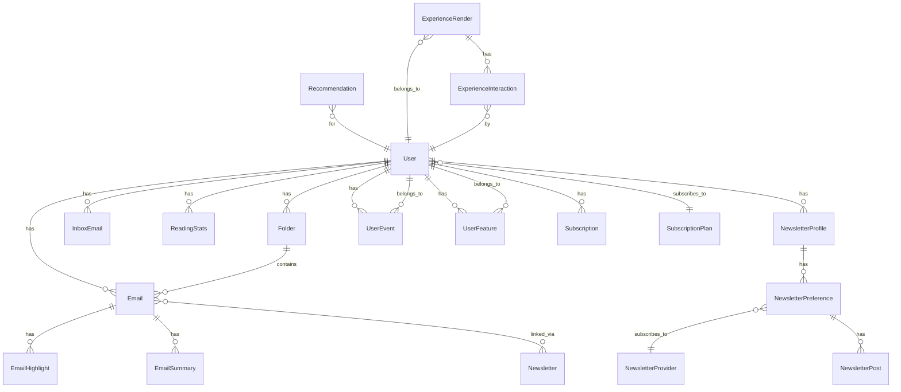

# Database Models Overview

The INBO Backend uses PostgreSQL as the primary database with Django ORM. This document provides an overview of all models and their relationships.

## Core Models

### User

**Table**: `core_user`

**Purpose**: Main user account model (extends Django's AbstractBaseUser)

**Key Fields**:
- `id` (UUID) - Primary key
- `email` (EmailField) - Unique email address
- `name` (CharField) - User's name
- `is_verified` (Boolean) - Email verification status
- `onboarding_completed` (Boolean) - Onboarding completion
- `inbox_username` (CharField) - @inbo.me username
- `subscription_status` (CharField) - Subscription status
- `streak_count` (Integer) - Current reading streak
- `longest_streak` (Integer) - Longest streak achieved

**Relationships**:
- One-to-Many: `inbox_emails`, `emails`, `folders`, `devices`, `sessions`
- Foreign Key: `subscription_plan` → SubscriptionPlan
- Many-to-Many: `groups`, `user_permissions`

### Email

**Table**: `core_email`

**Purpose**: Email messages

**Key Fields**:
- `id` (UUID) - Primary key
- `user` (ForeignKey) - Owner user
- `sender` (EmailField) - Sender email
- `subject` (TextField) - Email subject
- `content` (TextField) - Email content
- `date_received` (DateTime) - Received timestamp
- `is_read` (Boolean) - Read status
- `is_favorite` (Boolean) - Favorite status
- `is_read_later` (Boolean) - Read later status
- `folder` (ForeignKey) - Folder assignment
- `reading_progress` (Integer) - Reading progress (0-100)
- `time_spent` (Integer) - Time spent reading (seconds)

**Relationships**:
- Many-to-One: `user` → User
- Many-to-One: `folder` → Folder
- Many-to-Many: `newsletters` → Newsletter (via NewsletterEmail)
- One-to-Many: `highlights` → EmailHighlight
- One-to-One: `summary` → EmailSummary

### Newsletter

**Table**: `core_newsletter`

**Purpose**: Newsletter subscriptions (inbox-based)

**Key Fields**:
- `id` (UUID) - Primary key
- `user` (ForeignKey) - Owner user
- `name` (CharField) - Newsletter name
- `sender_email` (EmailField) - Sender email
- `recipient_email` (EmailField) - Recipient (@inbo.me)
- `first_received` (DateTime) - First email received
- `last_received` (DateTime) - Last email received
- `email_count` (Integer) - Total emails
- `is_accepted` (Boolean) - Acceptance status

**Relationships**:
- Many-to-One: `user` → User
- Many-to-Many: `emails` → Email (via NewsletterEmail)

### Folder

**Table**: `core_folder`

**Purpose**: Email folders

**Key Fields**:
- `id` (UUID) - Primary key
- `user` (ForeignKey) - Owner user
- `name` (CharField) - Folder name
- `created_at` (DateTime) - Creation timestamp

**Relationships**:
- Many-to-One: `user` → User
- One-to-Many: `emails` → Email

### InboxEmail

**Table**: `core_inboxemail`

**Purpose**: @inbo.me email addresses

**Key Fields**:
- `id` (UUID) - Primary key
- `user` (ForeignKey) - Owner user
- `email` (CharField) - Username part (e.g., "john" for "john@inbo.me")
- `created_at` (DateTime) - Creation timestamp

**Relationships**:
- Many-to-One: `user` → User

### ReadingStats

**Table**: `core_readingstats`

**Purpose**: Daily reading statistics

**Key Fields**:
- `id` (UUID) - Primary key
- `user` (ForeignKey) - Owner user
- `date` (Date) - Statistics date
- `emails_read` (Integer) - Emails read
- `time_spent` (Integer) - Time spent (seconds)
- `words_read` (Integer) - Words read
- `streak_count` (Integer) - Streak on this date

**Relationships**:
- Many-to-One: `user` → User

### UserDevice

**Table**: `core_userdevice`

**Purpose**: Device tracking

**Key Fields**:
- `id` (UUID) - Primary key
- `user` (ForeignKey) - Owner user
- `device_id` (CharField) - Device identifier
- `device_type` (CharField) - Device type (ios, android, web)
- `fcm_token` (CharField) - FCM token for push notifications
- `last_active` (DateTime) - Last active timestamp

**Relationships**:
- Many-to-One: `user` → User

### UserSession

**Table**: `core_usersession`

**Purpose**: User sessions with refresh tokens

**Key Fields**:
- `id` (UUID) - Primary key
- `user` (ForeignKey) - Owner user
- `device` (ForeignKey) - Associated device
- `refresh_token` (CharField) - Refresh token
- `expires_at` (DateTime) - Expiration timestamp
- `created_at` (DateTime) - Creation timestamp

**Relationships**:
- Many-to-One: `user` → User
- Many-to-One: `device` → UserDevice

## Directory Models

### NewsletterProvider

**Table**: `directory_app_newsletterprovider`

**Purpose**: Newsletter provider directory

**Key Fields**:
- `id` (UUID) - Primary key
- `name` (CharField) - Provider name
- `description` (TextField) - Description
- `url` (URLField) - Provider URL
- `domain` (CharField) - Domain
- `author` (CharField) - Author name
- `language` (CharField) - Language
- `content_frequency` (CharField) - Frequency

**Relationships**:
- Many-to-Many: `categories` → NewsletterCategory
- Many-to-Many: `tags` → NewsletterTag
- Many-to-Many: `tones` → NewsletterTone
- Many-to-Many: `audience_levels` → NewsletterAudienceLevel
- Many-to-Many: `content_intents` → NewsletterContentIntent
- Many-to-Many: `content_formats` → NewsletterContentFormat

### NewsletterCategory

**Table**: `directory_app_newslettercategory`

**Purpose**: Newsletter categories

**Key Fields**:
- `id` (UUID) - Primary key
- `name` (CharField) - Category name
- `description` (TextField) - Description
- `slug` (SlugField) - URL slug

**Relationships**:
- Many-to-Many: `providers` → NewsletterProvider

## Newsletter Profile Models

### NewsletterProfile

**Table**: `newsletter_profile_app_newsletterprofile`

**Purpose**: User newsletter profile

**Key Fields**:
- `id` (UUID) - Primary key
- `user` (ForeignKey) - Owner user
- `created_at` (DateTime) - Creation timestamp
- `updated_at` (DateTime) - Last update

**Relationships**:
- Many-to-One: `user` → User
- One-to-Many: `preferences` → NewsletterPreference

### NewsletterPreference

**Table**: `newsletter_profile_app_newsletterpreference`

**Purpose**: User preferences for specific newsletters

**Key Fields**:
- `id` (UUID) - Primary key
- `profile` (ForeignKey) - Newsletter profile
- `provider` (ForeignKey) - Newsletter provider
- `is_subscribed` (Boolean) - Subscription status
- `notification_enabled` (Boolean) - Notification preference
- `created_at` (DateTime) - Creation timestamp

**Relationships**:
- Many-to-One: `profile` → NewsletterProfile
- Many-to-One: `provider` → NewsletterProvider
- One-to-Many: `posts` → NewsletterPost

### NewsletterPost

**Table**: `newsletter_profile_app_newsletterpost`

**Purpose**: Individual newsletter posts/articles

**Key Fields**:
- `id` (UUID) - Primary key
- `preference` (ForeignKey) - Newsletter preference
- `title` (CharField) - Post title
- `description` (TextField) - Description
- `content` (TextField) - Post content
- `post_url` (URLField) - Post URL
- `published_at` (DateTime) - Publication date
- `is_read` (Boolean) - Read status
- `reading_progress` (Integer) - Reading progress
- `word_count` (Integer) - Word count
- `read_time_minutes` (Integer) - Estimated read time

**Relationships**:
- Many-to-One: `preference` → NewsletterPreference

## Recommendation Models

### UserEvent

**Table**: `recommendation_engine_userevent`

**Purpose**: User interaction events

**Key Fields**:
- `id` (UUID) - Primary key
- `user` (ForeignKey) - User
- `event_type` (CharField) - Event type (open, click, follow, etc.)
- `item_id` (UUID) - Item ID
- `item_type` (CharField) - Item type (email, post, provider)
- `metadata` (JSONField) - Additional metadata
- `created_at` (DateTime) - Event timestamp

**Relationships**:
- Many-to-One: `user` → User

### UserFeature

**Table**: `recommendation_engine_userfeature`

**Purpose**: User features for recommendations

**Key Fields**:
- `id` (UUID) - Primary key
- `user` (ForeignKey) - User
- `category_preferences` (JSONField) - Category preferences
- `engagement_score` (Float) - Engagement score
- `last_updated` (DateTime) - Last update timestamp

**Relationships**:
- One-to-One: `user` → User

### ItemFeature

**Table**: `recommendation_engine_itemfeature`

**Purpose**: Item features for recommendations

**Key Fields**:
- `id` (UUID) - Primary key
- `item_id` (UUID) - Item ID
- `item_type` (CharField) - Item type
- `popularity_score` (Float) - Popularity score
- `category_tags` (JSONField) - Category tags
- `last_updated` (DateTime) - Last update timestamp

### Recommendation

**Table**: `recommendation_engine_recommendation`

**Purpose**: Precomputed recommendations

**Key Fields**:
- `id` (UUID) - Primary key
- `user` (ForeignKey) - User
- `item_id` (UUID) - Recommended item ID
- `item_type` (CharField) - Item type
- `score` (Float) - Recommendation score
- `explanation` (TextField) - Explanation
- `created_at` (DateTime) - Creation timestamp

**Relationships**:
- Many-to-One: `user` → User

## Experience Models

### ExperienceRender

**Table**: `experience_app_experiencerender`

**Purpose**: Experience rendering tracking

**Key Fields**:
- `id` (UUID) - Primary key
- `user` (ForeignKey) - User
- `session_id` (CharField) - Session ID
- `page` (CharField) - Page name
- `intent` (CharField) - User intent
- `sections` (JSONField) - Rendered sections
- `context` (JSONField) - Context data
- `created_at` (DateTime) - Render timestamp

**Relationships**:
- Many-to-One: `user` → User
- One-to-Many: `interactions` → ExperienceInteraction

### ExperienceInteraction

**Table**: `experience_app_experienceinteraction`

**Purpose**: User interactions with experience elements

**Key Fields**:
- `id` (UUID) - Primary key
- `user` (ForeignKey) - User
- `render` (ForeignKey) - Experience render
- `interaction_type` (CharField) - Interaction type (click, view, scroll)
- `section_type` (CharField) - Section type
- `item_id` (UUID) - Item ID
- `position` (Integer) - Position in list
- `dwell_time` (Integer) - Dwell time (seconds)
- `scroll_depth` (Integer) - Scroll depth (percentage)
- `created_at` (DateTime) - Interaction timestamp

**Relationships**:
- Many-to-One: `user` → User
- Many-to-One: `render` → ExperienceRender

## Subscription Models

### SubscriptionPlan

**Table**: `subscription_app_subscriptionplan`

**Purpose**: Subscription plans

**Key Fields**:
- `id` (UUID) - Primary key
- `name` (CharField) - Plan name
- `description` (TextField) - Description
- `price` (MoneyField) - Price
- `billing_period` (CharField) - Billing period (monthly, yearly)
- `features` (JSONField) - Plan features
- `is_active` (Boolean) - Active status

**Relationships**:
- One-to-Many: `subscriptions` → Subscription
- One-to-Many: `users` → User

### Subscription

**Table**: `subscription_app_subscription`

**Purpose**: User subscriptions

**Key Fields**:
- `id` (UUID) - Primary key
- `user` (ForeignKey) - User
- `plan` (ForeignKey) - Subscription plan
- `stripe_subscription_id` (CharField) - Stripe subscription ID
- `status` (CharField) - Subscription status
- `current_period_start` (DateTime) - Current period start
- `current_period_end` (DateTime) - Current period end
- `cancel_at_period_end` (Boolean) - Cancel at period end

**Relationships**:
- Many-to-One: `user` → User
- Many-to-One: `plan` → SubscriptionPlan
- One-to-Many: `transactions` → PaymentTransaction

## Model Relationships Diagram



## Indexes

### User Model Indexes
- `email` - Unique index
- `created_at` - Index for sorting
- `inbox_username` - Index for lookup

### Email Model Indexes
- `user_id` - Foreign key index
- `date_received` - Index for sorting
- `folder_id` - Foreign key index
- Composite: `(user_id, date_received)` - For user email queries

### Newsletter Model Indexes
- `user_id` - Foreign key index
- `sender_email` - Index for lookup
- `recipient_email` - Index for lookup

## Database Migrations

Migrations are managed through Django's migration system:

```bash
# Create migrations
python manage.py makemigrations

# Apply migrations
python manage.py migrate

# Show migration status
python manage.py showmigrations
```

## Common Query Patterns

### User Queries

```python
from core.models import User, Email, Folder

# Get user with related data
user = User.objects.select_related('subscription_plan').prefetch_related(
    'emails', 'folders', 'devices'
).get(email='user@example.com')

# Get user's unread emails
unread_emails = Email.objects.filter(
    user=user,
    is_read=False
).order_by('-date_received')

# Get user's reading streak
user = User.objects.get(email='user@example.com')
current_streak = user.streak_count
longest_streak = user.longest_streak
```

### Email Queries

```python
from core.models import Email, Folder

# Get emails in folder
folder_emails = Email.objects.filter(
    user=user,
    folder__name='Work'
).select_related('folder')

# Get favorite emails
favorites = Email.objects.filter(
    user=user,
    is_favorite=True
).order_by('-date_received')

# Get emails by date range
from django.utils import timezone
from datetime import timedelta

week_ago = timezone.now() - timedelta(days=7)
recent_emails = Email.objects.filter(
    user=user,
    date_received__gte=week_ago
)

# Get unread count
unread_count = Email.objects.filter(
    user=user,
    is_read=False
).count()
```

### Newsletter Queries

```python
from core.models import Newsletter, NewsletterEmail

# Get user's newsletters
newsletters = Newsletter.objects.filter(
    user=user,
    is_accepted=True
).prefetch_related('emails')

# Get newsletter with email count
newsletter = Newsletter.objects.annotate(
    email_count=models.Count('emails')
).get(id=newsletter_id)
```

### Folder Queries

```python
from core.models import Folder

# Get folders with email counts
folders = Folder.objects.filter(
    user=user
).annotate(
    email_count=models.Count('emails')
).order_by('name')

# Search folder by name
folders = Folder.objects.filter(
    user=user,
    name__icontains='work'
)
```

### Aggregation Queries

```python
from django.db.models import Count, Sum, Avg
from core.models import Email, ReadingStats

# Get email statistics
stats = Email.objects.filter(user=user).aggregate(
    total=Count('id'),
    unread=Count('id', filter=models.Q(is_read=False)),
    favorites=Count('id', filter=models.Q(is_favorite=True))
)

# Get reading statistics
reading_stats = ReadingStats.objects.filter(
    user=user
).aggregate(
    total_time=Sum('time_spent'),
    total_words=Sum('words_read'),
    avg_time=Avg('time_spent')
)
```

## Database Optimization

### Query Optimization
- Use `select_related()` for ForeignKey relationships
- Use `prefetch_related()` for Many-to-Many relationships
- Use `only()` and `defer()` to limit fields
- Use `annotate()` and `aggregate()` for calculations

**Example**:
```python
# Efficient: Uses select_related
emails = Email.objects.select_related('user', 'folder').all()

# Efficient: Uses prefetch_related for M2M
providers = NewsletterProvider.objects.prefetch_related('categories', 'tags').all()

# Efficient: Only fetch needed fields
users = User.objects.only('id', 'email', 'name').all()
```

### Indexing Strategy
- Index frequently queried fields
- Index foreign keys
- Create composite indexes for common query patterns
- Monitor slow queries and add indexes as needed

**Current Indexes**:
- `User.email` - Unique index
- `User.inbox_username` - Unique index
- `User.created_at` - Index for sorting
- `Email.user_id` - Foreign key index
- `Email.date_received` - Index for sorting
- `Email.folder_id` - Foreign key index
- Composite: `(Email.user_id, Email.date_received)` - For user email queries

## Next Steps

- [Core Models Details](/docs/backend/models/core) - Detailed core models documentation
- [Directory Models](/docs/backend/models/directory) - Directory models documentation
- [Recommendation Models](/docs/backend/models/recommendation) - Recommendation models documentation
