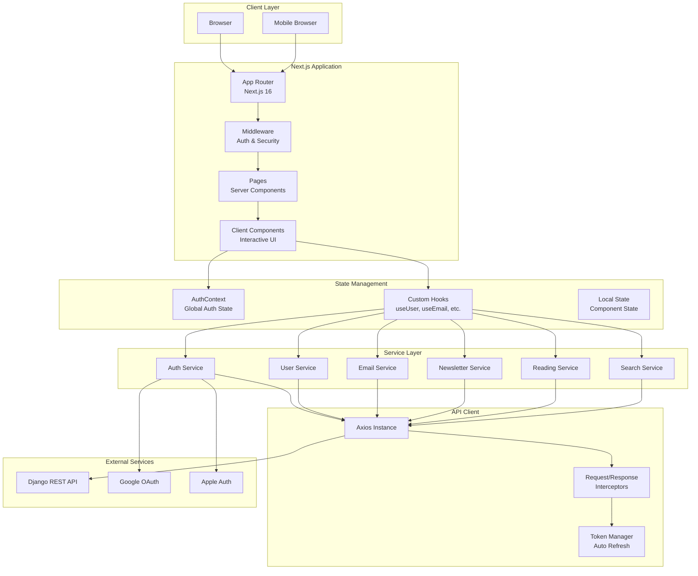

# Frontend Architecture

## Architecture Overview

The INBO Frontend follows a modern Next.js App Router architecture with a clear separation of concerns, service-oriented API integration, and responsive design patterns.

## System Architecture Diagram



## Architecture Layers

### 1. Presentation Layer

#### App Router (Next.js 16)
- **Server Components**: Default rendering on server
- **Client Components**: Interactive components with `'use client'`
- **Route Groups**: Organized routes `(dashboard)`, `(auth)`
- **Layouts**: Nested layouts for shared UI
- **Loading States**: Built-in loading states
- **Error Boundaries**: Error handling

#### Pages Structure
```
app/
├── (dashboard)/          # Protected dashboard routes
│   ├── layout.tsx       # Dashboard layout
│   ├── page.tsx         # Dashboard home
│   ├── inbox/           # Inbox page
│   ├── discover/        # Discovery page
│   ├── subscriptions/   # Subscriptions page
│   ├── analytics/       # Analytics page
│   ├── profile/         # Profile page
│   └── delete/          # Account deletion
├── auth/                # Authentication routes
│   ├── login/          # Login page
│   ├── register/       # Registration page
│   ├── verify/         # OTP verification
│   └── verify-magic-link/  # Magic link verification
└── reading/             # Reading routes
    └── [slug]/         # Dynamic reading page
```

### 2. Component Layer

#### Component Organization
- **Layout Components**: Navigation, headers, footers
- **Feature Components**: Domain-specific components
- **Shared Components**: Reusable UI components
- **Auth Components**: Authentication UI

#### Component Patterns
- **Server Components**: Default (no 'use client')
- **Client Components**: Interactive features
- **Composition**: Component composition over inheritance
- **Props Interface**: TypeScript interfaces for props

### 3. State Management Layer

#### Global State (Context)
- **AuthContext**: Global authentication state
  - User information
  - Authentication status
  - Auth methods (login, logout, etc.)

#### Local State (Hooks)
- **useUser**: User data management
- **useEmail**: Email list and actions
- **useNewsletter**: Newsletter operations
- **useTTS**: Text-to-speech functionality
- **useMediaQuery**: Responsive design

#### State Flow
```
User Action
    ↓
Component Event Handler
    ↓
Custom Hook / Service Call
    ↓
API Request (via Service)
    ↓
State Update (Context / Local)
    ↓
UI Re-render
```

### 4. Service Layer

#### Service Architecture
All API interactions go through service layer:

```typescript
// Service pattern
class EmailService {
  async getInboxEmails(params): Promise<EmailListResponse> {
    return apiClient.get('/email/inbox/', { params });
  }
  
  async toggleFavorite(emailId): Promise<void> {
    return apiClient.post(`/email/${emailId}/favorite/`);
  }
}
```

#### Service Responsibilities
- **API Abstraction**: Hide API implementation details
- **Data Transformation**: Map API responses to app types
- **Error Handling**: Consistent error handling
- **Type Safety**: TypeScript interfaces

### 5. API Client Layer

#### Axios Configuration
- **Base URL**: Configurable via environment
- **Interceptors**: Request/response interceptors
- **Token Management**: Automatic token injection
- **Token Refresh**: Automatic refresh on 401
- **Error Formatting**: Consistent error responses

#### Request Flow
```
Component/Hook
    ↓
Service Method
    ↓
Axios Instance
    ↓
Request Interceptor (Add Token)
    ↓
Django API
    ↓
Response Interceptor (Handle Errors)
    ↓
Token Refresh (if 401)
    ↓
Return Response
```

## Design Patterns

### 1. Service-Oriented Architecture
- **Separation of Concerns**: Services handle API logic
- **Reusability**: Services used across components
- **Testability**: Easy to mock services

### 2. Custom Hooks Pattern
- **Data Fetching**: `useEmail`, `useUser`
- **State Management**: Encapsulate state logic
- **Side Effects**: Handle loading, errors, refetching

### 3. Context Pattern
- **Global State**: AuthContext for authentication
- **Provider Pattern**: Wrap app with providers
- **Consumption**: `useAuth()` hook for access

### 4. Component Composition
- **Layout Components**: Compose layouts
- **Feature Components**: Build features from smaller components
- **Shared Components**: Reusable UI elements

## Responsive Design

### Mobile-First Approach
- **Breakpoints**: Tailwind CSS breakpoints
- **Mobile Layout**: Bottom navigation, mobile headers
- **Desktop Layout**: Sidebar, navbar, full-width content

### Layout Strategy
```typescript
// Detect mobile
const isMobile = useMedia({ maxWidth: 768 });

// Conditional rendering
if (isMobile) {
  return <MobileLayout />;
}
return <DesktopLayout />;
```

## Authentication Flow

### 1. Initial Load
```
Page Load
    ↓
AuthContext Initialization
    ↓
Check Cookies for Tokens
    ↓
Validate Session (if tokens exist)
    ↓
Set Auth State
```

### 2. Login Flow
```
User Login
    ↓
AuthService.login()
    ↓
API Request
    ↓
Store Tokens (Cookies)
    ↓
Update AuthContext
    ↓
Redirect to Dashboard
```

### 3. Token Refresh Flow
```
API Request
    ↓
401 Unauthorized
    ↓
Response Interceptor
    ↓
Refresh Token Request
    ↓
Update Tokens
    ↓
Retry Original Request
```

## Error Handling

### Error Hierarchy
1. **Network Errors**: Connection failures
2. **API Errors**: 4xx, 5xx responses
3. **Validation Errors**: Form validation
4. **Auth Errors**: Token expiration

### Error Handling Strategy
- **Service Layer**: Catch and format errors
- **Hooks**: Handle errors in state
- **Components**: Display user-friendly messages
- **Toast Notifications**: Show error toasts

## Performance Optimizations

### 1. Code Splitting
- **Route-based**: Automatic per-route splitting
- **Component-based**: Dynamic imports for heavy components
- **Lazy Loading**: Load components on demand

### 2. Image Optimization
- **Next.js Image**: Automatic image optimization
- **Lazy Loading**: Images load on scroll
- **Responsive Images**: Different sizes for devices

### 3. Caching Strategy
- **Static Generation**: Pre-render static pages
- **ISR**: Incremental Static Regeneration
- **Client-side Caching**: React Query (future)

### 4. Bundle Optimization
- **Tree Shaking**: Remove unused code
- **Minification**: Minify JavaScript/CSS
- **Compression**: Gzip/Brotli compression

## Security

### 1. Authentication Security
- **Token Storage**: HttpOnly cookies (recommended)
- **Token Refresh**: Automatic refresh before expiration
- **Session Validation**: Validate sessions on load

### 2. XSS Protection
- **React Escaping**: Automatic XSS protection
- **Sanitization**: Sanitize user input
- **Content Security Policy**: CSP headers

### 3. CSRF Protection
- **SameSite Cookies**: Strict same-site policy
- **Token Validation**: Validate tokens on requests

## Internationalization

### i18n Architecture
- **next-i18next**: i18n framework
- **Translation Files**: JSON translation files
- **Locale Detection**: Automatic locale detection
- **Language Switching**: Dynamic language switching

### Supported Languages
- English (en)
- Spanish (es)
- French (fr)
- German (de)
- Hindi (hi)
- Chinese (zh)

## SEO Optimization

### SEO Strategy
- **Dynamic Meta Tags**: Per-page meta tags
- **Open Graph**: Social media sharing
- **Twitter Cards**: Twitter sharing
- **Structured Data**: Schema.org markup (ready)

### SEO Components
- **SEOHead**: SEO component for pages
- **useSEO**: Hook for SEO configuration
- **Dynamic Titles**: Page-specific titles

## Related Documentation

- [Components](/docs/frontend/components) - Component documentation
- [API Integration](/docs/frontend/api-integration) - API integration details
- [Services](/docs/frontend/services) - Service layer documentation
- [Hooks](/docs/frontend/hooks) - Custom hooks documentation
